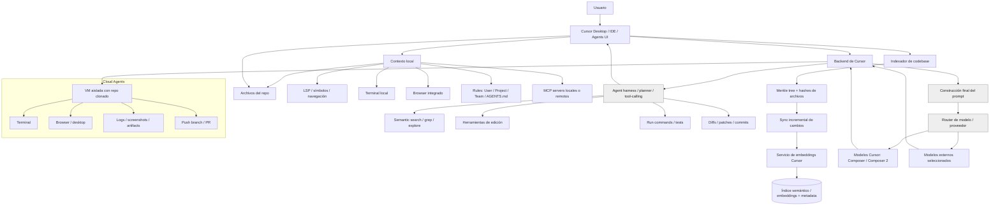
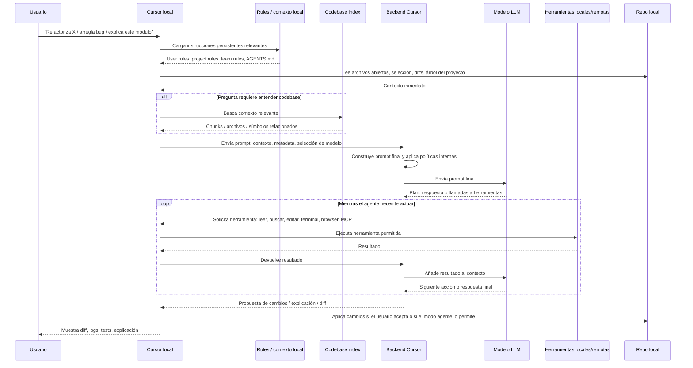
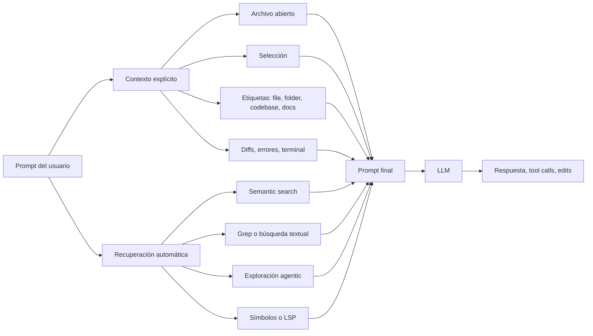
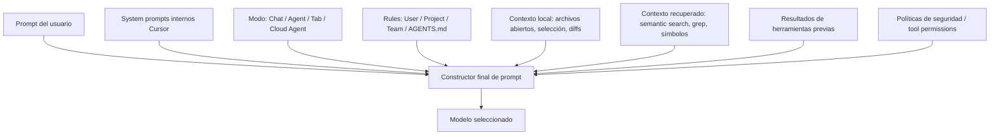
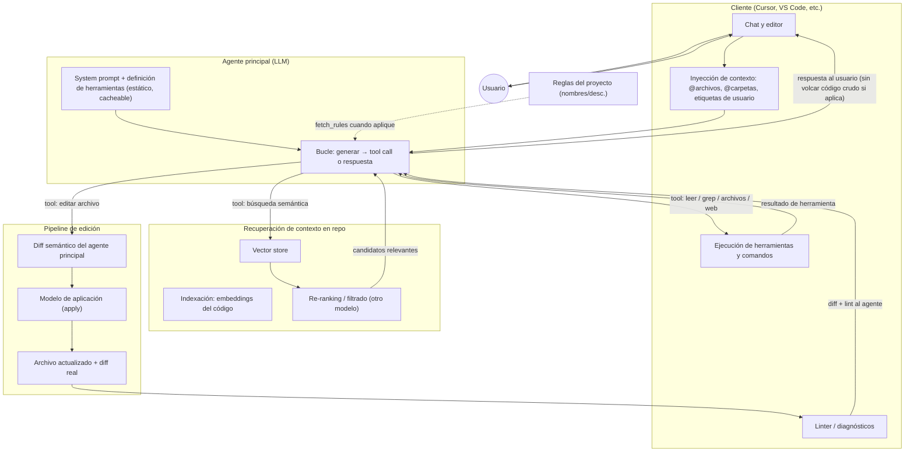
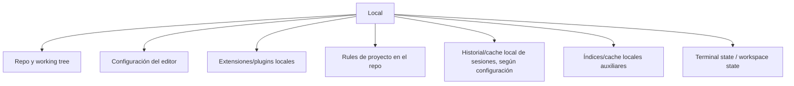
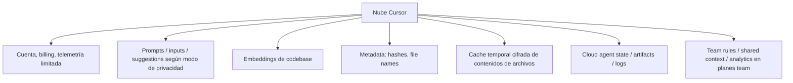
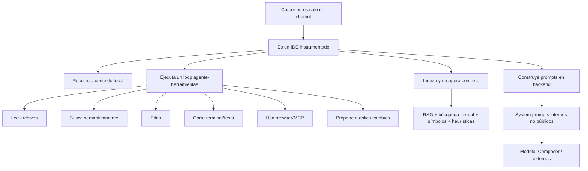
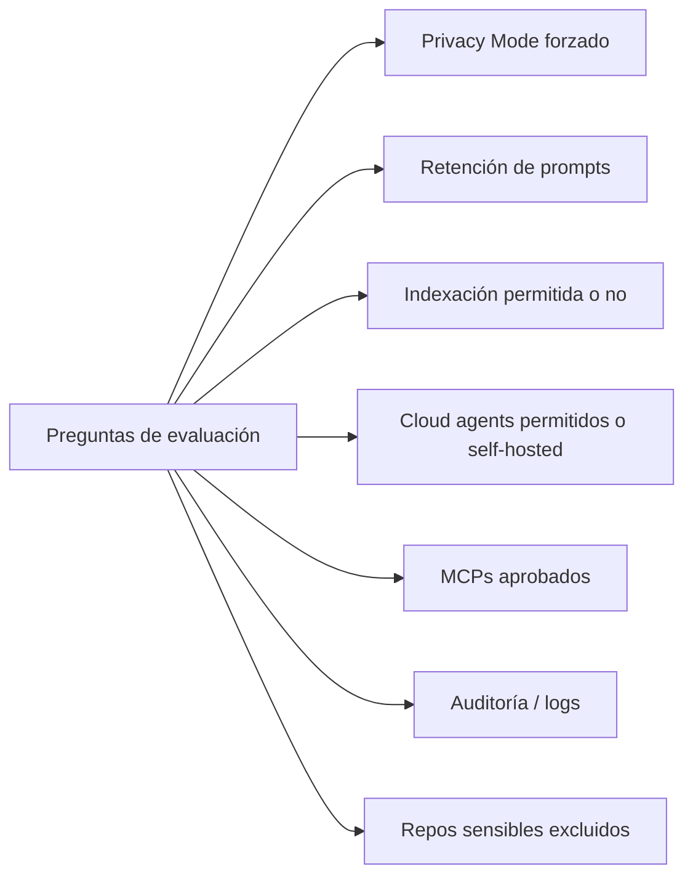

# Laboratorio extra: Desarrollo asistido por IA y Agent Loop

## Objetivo

Comprender cómo Cursor orquesta un **bucle agente–herramientas** sobre tu repositorio local: qué contexto recoge, qué envía al backend, cómo recupera código relevante y por qué una petición en modo Agent no se resuelve en una sola llamada al modelo.

Al final del laboratorio podrás:

1. Describir el flujo desde tu prompt hasta la ejecución de herramientas (lectura, búsqueda, edición, terminal).
2. Diferenciar contexto local, indexación semántica, reglas del proyecto y prompts internos no públicos.
3. Evaluar implicaciones de privacidad, retención de datos y uso de cloud agents en un entorno real.

**Prerrequisitos:**

- Tener este repositorio abierto como **workspace** en Cursor.
- Familiaridad básica con un IDE y con el chat o modo Agent de Cursor.

**Referencias recomendadas (documentación pública):**

- [Meet the new Cursor](https://cursor.com/blog/cursor-3) — visión de producto, agentes locales y cloud.
- [Cursor · Data Use & Privacy](https://cursor.com/data-use) — indexación, backend, Privacy Mode.
- [Securely indexing large codebases](https://cursor.com/blog/secure-codebase-indexing) — Merkle tree y sync incremental.
- [Semantic & Agentic Search](https://cursor.com/docs/agent/tools/search) — búsqueda en el agente.
- [Rules](https://cursor.com/docs/rules) — reglas de usuario, proyecto y equipo.
- [How Cursor (AI IDE) Works](https://blog.sshh.io/p/how-cursor-ai-ide-works) — Shrivu Shankar (marzo 2025): bucle agente, diff semántico, reglas bajo demanda.

> **Nota:** Cursor no publica todo su diseño interno. Los diagramas siguientes combinan lo documentado explícitamente, inferencias razonables y zonas opacas (constructor de prompt, router de modelos, system prompts internos).

---

## Marco teórico

### Cursor no es solo un chatbot

Cursor combina **IDE + runtime de agentes + backend de orquestación + indexación semántica del código**. El modelo no “piensa” en el sentido clásico: **predice el siguiente token** de forma repetida. Los agentes amplían ese mecanismo: el modelo puede solicitar **herramientas**; el **cliente** (el IDE, no el modelo) las ejecuta, devuelve el resultado al contexto y el modelo **continúa** generando. Ese ciclo es el **agent loop** ([How Cursor (AI IDE) Works](https://blog.sshh.io/p/how-cursor-ai-ide-works)).

| Capa | Rol principal |
|------|----------------|
| **UI local** | Chat, editor, Agents UI, aceptación de diffs |
| **Contexto local** | Archivos, LSP, terminal, browser, reglas, MCP |
| **Indexador** | Embeddings, Merkle tree, sync incremental |
| **Backend Cursor** | Construcción del prompt final, router de modelos |
| **Agent harness** | Planificación, tool-calling, validación |
| **Cloud agents** (opcional) | VM aislada, repo clonado, PR/artifacts |

### De una petición a una respuesta

Cuando pides refactorizar un módulo o corregir un bug, ocurre algo parecido a esto:

1. Cursor carga **reglas** relevantes (User / Project / Team / `AGENTS.md`).
2. Lee **contexto inmediato**: archivos abiertos, selección, diffs, árbol del proyecto.
3. Si hace falta entender el codebase, consulta el **índice** (búsqueda semántica, grep, exploración agentic, símbolos LSP).
4. Envía al **backend** prompt, contexto, metadata y modelo elegido.
5. El backend **construye el prompt final** (zona opaca: prompts internos, políticas, ranking de contexto).
6. Entra un **bucle**: el modelo pide herramientas → el IDE las ejecuta → los resultados vuelven al modelo → siguiente acción o respuesta final.
7. Cursor muestra **diff**, logs o explicación; los cambios se aplican según modo y permisos.

No asumas que **todo** el repositorio viaja al modelo en cada turno. Normalmente se seleccionan fragmentos: archivos abiertos, `@file` / `@folder` / `@codebase`, resultados de búsqueda y salidas de herramientas.

En Agent mode, el loop suele repetir: entender intención → decidir contexto faltante → buscar/leer → actualizar prompt → llamar al modelo → tool call → ejecutar herramientas → reinyectar resultados → editar → validar → mostrar diff o PR.

### Recuperación de contexto (RAG integrado)

En la práctica Cursor usa **recuperación sobre el codebase**, pero no como un único “chat con documentos”. Combina contexto explícito (`@`, selección, diffs), semantic search, grep, exploración agentic y LSP ([Semantic & Agentic Search](https://cursor.com/docs/agent/tools/search), [Composer](https://cursor.com/blog/composer)).

Las reglas de proyecto (`.cursor/rules`) **no se pegan todas** al system prompt: el modelo ve nombres y descripciones y puede cargar el cuerpo con `fetch_rules(...)` cuando lo considera relevante ([Rules](https://cursor.com/docs/rules), [artículo sshh.io](https://blog.sshh.io/p/how-cursor-ai-ide-works)).

### Pipeline de edición (diff semántico)

Según el análisis público del artículo de Shrivu Shankar, escribir código carácter a carácter con el modelo principal es caro y frágil. A menudo el agente principal emite un **diff semántico**; un **modelo de aplicación** más rápido aplica los cambios al archivo real; un **linter** devuelve diagnósticos para autocorrección acotada. Ver el diagrama *Bucle agente, búsqueda y edición* más abajo.

### Dónde está tu código y qué se persiste

| Escenario | Dónde “vive” el trabajo |
|-----------|-------------------------|
| **Editor local** | Repo en tu máquina; el agente lee/edita/ejecuta localmente |
| **Indexación de codebase** | Chunks suben a servidores de Cursor para embeddings; pueden quedar embeddings y metadata (hashes, nombres de archivo) ([Data Use](https://cursor.com/data-use), [indexación segura](https://cursor.com/blog/secure-codebase-indexing)) |
| **Cloud agents** | VM aislada con repo clonado; no opera directamente sobre tu carpeta local ([self-hosted cloud agents](https://cursor.com/blog/self-hosted-cloud-agents)) |

**Privacy Mode** reduce retención y uso para entrenamiento, pero **no** convierte Cursor en un sistema 100 % local: las peticiones siguen pasando por el backend y la indexación puede enviar fragmentos según configuración ([Data Use](https://cursor.com/data-use)).

---

## Componentes del laboratorio

Este laboratorio es **teórico**: no requiere scripts ni configuración adicional. Los diagramas resumen arquitectura documentada e inferida; úsalos al responder las preguntas de reflexión.

### Arquitectura general

Los nodos en gris representan componentes **opacos** (no auditables por el usuario).

### Qué pasa paso a paso cuando le pides algo

### Recuperación de contexto hacia el prompt final

### Capas del constructor de prompt (zona opaca parcial)

Cursor indica que las requests pasan por su backend para la **construcción final del prompt**, incluso con API key propia ([Data Use](https://cursor.com/data-use)). Los system prompts internos exactos **no están publicados**.

### Bucle agente, búsqueda y edición

Visión conceptual del artículo [How Cursor (AI IDE) Works](https://blog.sshh.io/p/how-cursor-ai-ide-works):

### Persistencia local vs nube

**Localmente** (alto nivel; rutas de cache no son contrato estable):

**En la nube de Cursor** (según documentación pública):

### Modelo mental del agent loop

### Preguntas de evaluación (equipos y seguridad)

Controles adicionales en planes Teams/Enterprise: [Cursor · Pricing](https://cursor.com/pricing).

---

## Pasos

> Este laboratorio sustituye ejercicios prácticos por **preguntas de reflexión**. Léelas en orden; anota respuestas breves o discútalas en grupo. Usa los diagramas de la sección anterior como apoyo.

### Preparación

1. Abre este repositorio como **workspace** en Cursor.
2. Recorre los diagramas *Arquitectura general*, *Qué pasa paso a paso* y *Modelo mental del agent loop*.
3. Opcional: lee el apartado introductorio de [How Cursor (AI IDE) Works](https://blog.sshh.io/p/how-cursor-ai-ide-works) y la sección de privacidad en [Data Use & Privacy](https://cursor.com/data-use).

---

### Fase A — El bucle agente–herramientas

**Meta:** internalizar que el agente no “resuelve” en un solo turno y quién ejecuta cada herramienta.

1. **Pregunta:** Si el modelo “pide” leer un archivo, ¿qué componente lo lee realmente: el LLM, el backend o el IDE local? ¿Por qué importa esa distinción para seguridad y permisos?

2. **Pregunta:** Enumera al menos **cuatro** tipos de herramientas que el harness puede solicitar en un mismo flujo (p. ej. búsqueda, edición, terminal). ¿Cuál de ellas tendría mayor impacto si se ejecutara sin supervisión?

3. **Pregunta:** En el diagrama de secuencia, ¿en qué momento se “cierra” el loop y se muestra algo al usuario sin otra tool call? ¿Qué señales en la UI de Cursor te indican que el agente sigue en el bucle?

4. **Pregunta:** Compara el agent loop con un chat clásico sin herramientas. ¿Qué problemas del desarrollo asistido (alucinaciones, código desactualizado, archivos equivocados) mitiga el bucle y cuáles **no** mitiga por sí solo?

---

### Fase B — Contexto, RAG y prompts

**Meta:** distinguir lo que tú controlas (reglas, `@`, archivos abiertos) de lo que es opaco (system prompts internos, ranking en backend).

1. **Pregunta:** ¿Qué aporta el contexto explícito (`@archivo`, selección, diffs) frente a la recuperación automática (semantic search, grep, LSP)? ¿Cuándo priorizarías ser explícito con `@` en un proyecto real?

2. **Pregunta:** Si indexas el codebase, ¿qué datos pueden persistir en la nube según [Data Use & Privacy](https://cursor.com/data-use)? ¿Qué **no** deberías asumir que ocurre aunque actives Privacy Mode?

3. **Pregunta:** Las reglas de proyecto no se cargan todas al system prompt. ¿Cómo encaja el patrón “nombre + descripción + `fetch_rules`” con el objetivo de no saturar el contexto? ([Rules](https://cursor.com/docs/rules))

4. **Pregunta:** El diagrama *Capas del constructor de prompt* muestra varias entradas al prompt final. ¿Qué capas controlas tú desde el repo y cuáles no puedes auditar?

---

### Fase C — Local, nube y decisiones de equipo

**Meta:** aplicar el modelo mental a políticas de seguridad y gobernanza.

1. **Pregunta:** Contrasta **editor local** vs **cloud agents** (diagrama *Arquitectura general*). ¿En qué casos tendría sentido cada uno? ¿Qué riesgos introduce la VM en la nube?

2. **Pregunta:** Revisa el diagrama *Preguntas de evaluación*. Elige **tres** que harías antes de permitir Cursor en un repositorio con datos sensibles.

3. **Pregunta:** ¿Por qué “¿usa RAG?” suele ser la pregunta equivocada frente a “¿qué fragmentos de mi código pueden salir de la máquina y con qué retención?” Reformula esa segunda pregunta para tu contexto.

4. **Pregunta (opcional, profundización):** En el diagrama *Bucle agente, búsqueda y edición*, ¿qué papel cumplen el diff semántico, el modelo de aplicación y el linter? Consulta [How Cursor (AI IDE) Works](https://blog.sshh.io/p/how-cursor-ai-ide-works) para el detalle.

---

## Conclusiones del laboratorio

- Cursor es un **IDE instrumentado**: recolecta contexto local, recupera código, construye prompts en backend y ejecuta un **loop agente–herramientas** hasta completar la tarea.
- El modelo **no ejecuta** herramientas; el **cliente** las ejecuta y devuelve resultados — base para permisos, hooks y sandboxing en laboratorios posteriores ([agent sandboxing](https://cursor.com/blog/agent-sandboxing)).
- La recuperación de contexto combina **RAG, grep, LSP y contexto explícito**; no es una única consulta vectorial.
- Tu código **permanece local** en el flujo habitual, pero prompts, indexación y cloud agents pueden **enviar o clonar** fragmentos según configuración.
- **Privacy Mode** limita retención y entrenamiento, pero no elimina el paso por backend ni todas las transferencias.
- Los **system prompts internos** y parte del ranking de contexto son **opacos**; las reglas y el `@` son las palancas principales que sí controlas desde el repo.

Si aún no lo hiciste, recorre antes la secuencia numerada empezando por [Laboratorio 1: Agentes y subagentes](../agents/README.md), donde se aplica este bucle con delegación y subagentes en la práctica.

---

## Referencias

| Tema | Fuente |
|------|--------|
| Producto y agentes | [Meet the new Cursor](https://cursor.com/blog/cursor-3) |
| Privacidad, indexación, backend | [Data Use & Privacy](https://cursor.com/data-use) |
| Indexación Merkle | [Securely indexing large codebases](https://cursor.com/blog/secure-codebase-indexing) |
| Cloud agents | [Self-hosted cloud agents](https://cursor.com/blog/self-hosted-cloud-agents) |
| Búsqueda del agente | [Semantic & Agentic Search](https://cursor.com/docs/agent/tools/search) |
| Modelos Composer | [Composer](https://cursor.com/blog/composer), [Composer 2 technical report](https://cursor.com/blog/composer-2-technical-report) |
| Reglas | [Rules](https://cursor.com/docs/rules) |
| MCP | [Model Context Protocol](https://cursor.com/docs/mcp) |
| Sandbox local | [Agent sandboxing](https://cursor.com/blog/agent-sandboxing) |
| Planes empresa | [Pricing](https://cursor.com/pricing) |
| Arquitectura conceptual (artículo) | [How Cursor (AI IDE) Works](https://blog.sshh.io/p/how-cursor-ai-ide-works) — Shrivu Shankar |
