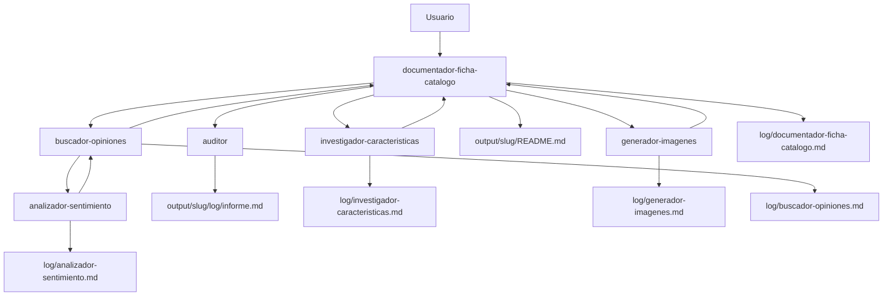

# Laboratorio 1: Agentes y subagentes

## Objetivo

Practicar **orquestación multiagente** en Cursor mediante un generador de **fichas de catálogo**: agente coordinador, subagentes en paralelo, subagente anidado y trazabilidad por logs — **sin usar skills**, solo definiciones en `.cursor/agents/` y políticas en `AGENTS.md`.

Al final del laboratorio podrás:

1. Diferenciar **agente formal** (`.cursor/agents/*.md` + `Task` con `subagent_type` nombrado) y **Task genérico** (`generalPurpose` que lee un `.md`).
2. Diseñar un flujo con **tres subagentes en paralelo** y un **subagente hijo** (`buscador-opiniones` → `analizador-sentimiento`).
3. Interpretar la salida en `output/<slug>/` (ficha consolidada, imagen, logs e informe del auditor).

**Prerrequisitos:**

- Carpeta `etapa-1/laboratorios/agents` abierta como **workspace** en Cursor.
- Familiaridad básica con el modo **Agent** de Cursor (el [Laboratorio extra: Agent Loop](../agent-loop/README.md) profundiza en el bucle agente–herramientas).
- Modo **Agent** con permiso para lanzar subagentes (`Task`) y aprobar herramientas cuando Cursor lo solicite.

**Material técnico del laboratorio:** políticas en [`AGENTS.md`](./AGENTS.md) (permisos, logging, estándares de salida) y definiciones de agentes en [`.cursor/agents/`](./.cursor/agents/).

> Este laboratorio **no usa skills**. Contrasta con [Laboratorio 2: Prompts y skills](../skills/README.md), centrado en comandos reutilizables en Claude Code.

---

## Marco teórico

### Agente principal vs subagentes

En Cursor, un **agente** puede delegar trabajo lanzando **subagentes** con la herramienta `Task`. Cada subagente corre en su propio contexto (o con instrucciones acotadas) y devuelve un resultado al padre. El **agent loop** sigue aplicando: el modelo pide `Task`; Cursor ejecuta el subagente; el resultado vuelve al coordinador (marco teórico en el [Laboratorio extra](../agent-loop/README.md)).

Este lab modela un equipo de catálogo:

| Sección de la ficha | Agente responsable |
|---------------------|-------------------|
| Descripción y características | `investigador-caracteristicas` |
| Imagen del producto | `generador-imagenes` |
| Opiniones (+ sentimiento) | `buscador-opiniones` → `analizador-sentimiento` |
| Trazabilidad (diagrama de secuencia) | `auditor` |

**Entregables:**

- `output/<slug-producto>/README.md` — ficha consolidada (`documentador-ficha-catalogo`)
- `output/<slug-producto>/imagen-producto.png` — asset de imagen
- `output/<slug-producto>/log/<nombre-agente>.md` — un log por instancia (fecha/hora, input, actividades, output)
- `output/<slug-producto>/log/informe.md` — informe del `auditor` tras consolidar

### Forma 1 — Agente formal

Archivo en `.cursor/agents/<nombre>.md` con **frontmatter YAML** (`name`, `description`, `model`, etc.). Cursor lo invoca con:

```typescript
Task({ subagent_type: "nombre-agente", prompt: "..." })
```

Usado por: `investigador-caracteristicas`, `generador-imagenes`, `buscador-opiniones`, `documentador-ficha-catalogo`, `auditor`.

### Forma 2 — Task genérico + archivo de agente

```typescript
Task({
  subagent_type: "generalPurpose",
  prompt: "Lee .cursor/agents/analizador-sentimiento.md y ejecuta sus instrucciones. Producto: ..."
})
```

El subagente hace `Read` del archivo — visible en la UI. **No es un skill**: es la misma convención de agente en `.cursor/agents/`, invocada mediante `generalPurpose`.

Usado por: `analizador-sentimiento` (hijo de `buscador-opiniones`).

### Mínimo privilegio y profundidad

[`AGENTS.md`](./AGENTS.md) fija una **matriz de permisos** (lectura, escritura, WebSearch, GenerateImage, Task). Reglas clave:

- Solo `documentador-ficha-catalogo` lanza los **tres Task en paralelo** y el `auditor` al final.
- Solo `buscador-opiniones` puede lanzar un subagente hijo en fase 1.
- **Profundidad máxima:** 2 (`documentador` → `buscador` → `analizador-sentimiento`).
- **Shell** permitido únicamente para obtener **fecha/hora** en los logs (no listar archivos ni instalar paquetes).

Referencia conceptual: **[Cursor — Subagents](https://cursor.com/docs/agent/subagents)** y **[AGENTS.md](https://cursor.com/docs/agent/AGENTS.md)** en la documentación del producto.

---

## Componentes del laboratorio

Diagrama de componentes del laboratorio:



Flujo resumido (paralelo + anidado + auditoría):

```
[Usuario: "Genera ficha de catálogo para Cafetera X"]
                    │
                    ▼
   documentador-ficha-catalogo
                    │
    ┌───────────────┼───────────────┐
    │  PARALELO (mismo bloque Task) │
    ▼               ▼               ▼
investigador-   generador-     buscador-
caracteristicas imagenes       opiniones
   (Forma 1)      (Forma 1)         │
                                      │ Task generalPurpose
                                      ▼
                              analizador-sentimiento
                                   (Forma 2)
                    │
                    ▼
         README.md + logs + imagen
                    │
                    ▼ (secuencial)
                 auditor → log/informe.md
```

Estructura del proyecto:

```
agents/
├── README.md                           # Este archivo
├── AGENTS.md                           # Políticas: activación, permisos, logs, salida
├── .cursor/
│   └── agents/
│       ├── documentador-ficha-catalogo.md
│       ├── investigador-caracteristicas.md
│       ├── generador-imagenes.md
│       ├── buscador-opiniones.md       # Lanza subagente hijo
│       ├── analizador-sentimiento.md   # Subagente anidado (Forma 2)
│       └── auditor.md
└── output/                             # Generado al ejecutar (gitignored)
    └── <slug-producto>/
        ├── README.md
        ├── imagen-producto.png
        └── log/
            ├── *.md                    # Un log por agente
            └── informe.md              # Auditor
```

---

## Pasos

### Preparación

1. Abre `etapa-1/laboratorios/agents` como **workspace** en Cursor.
2. Lee [`AGENTS.md`](./AGENTS.md): activación de fichas de catálogo, **Agent Permissions**, **Logging Standards** y **Output Standards**.
3. Recorre los seis archivos en [`.cursor/agents/`](./.cursor/agents/) y localiza en cada uno: rol, límites y si lanzan `Task`.
4. Confirma que existe `output/` (o se creará en la primera ejecución; ver [`.gitignore`](./.gitignore)).

---

### Fase A — Entender la arquitectura

**Meta:** saber quién orquesta, quién trabaja en paralelo y dónde está el subagente anidado.

1. Identifica el **punto de entrada**: ante peticiones de ficha de catálogo, `AGENTS.md` obliga a seguir [`documentador-ficha-catalogo.md`](./.cursor/agents/documentador-ficha-catalogo.md).

2. Clasifica cada agente:

   | Agente | Forma | ¿Lanza Task? |
   |--------|-------|--------------|
   | `documentador-ficha-catalogo` | 1 | Sí (3 paralelo + auditor) |
   | `investigador-caracteristicas` | 1 | No |
   | `generador-imagenes` | 1 | No |
   | `buscador-opiniones` | 1 | Sí (1 hijo) |
   | `analizador-sentimiento` | 2 | No |
   | `auditor` | 1 | No |

3. Anota el **slug** que usarías para el producto de prueba (minúsculas, guiones, sin caracteres especiales). Ejemplo: `iphone-15-pro`.

---

### Fase B — Generar una ficha de catálogo

**Meta:** ejecutar el flujo completo y observar subagentes en la UI de Cursor.

1. En el chat del **Agent**, usa un prompt como:

   ```prompt
   Genera una ficha de catálogo para el iPhone 15 Pro
   ```

   También puedes invocar directamente: `/documentador-ficha-catalogo`

2. Durante la ejecución, observa:
   - `AGENTS.md` orienta al agente principal hacia el documentador.
   - **Tres subagentes en paralelo** en un mismo bloque de `Task` (investigador, generador, buscador).
   - `buscador-opiniones` lanza **`analizador-sentimiento`** vía `generalPurpose` (Forma 2).
   - Cada agente escribe su log bajo `output/<slug>/log/` con timestamps obtenidos por Shell (solo hora).
   - El documentador consolida `output/<slug>/README.md`.
   - El `auditor` genera `log/informe.md` con diagrama de secuencia.

3. Aprueba herramientas cuando Cursor lo pida (`Task`, `WebSearch`, `GenerateImage`, escritura en `output/`, etc.) según las políticas del lab.

---

### Fase C — Validar salida y trazabilidad

**Meta:** comprobar que la ficha y los logs cumplen los estándares del proyecto.

1. Revisa la estructura generada (ejemplo):

   ```
   output/iphone-15-pro/
   ├── README.md
   ├── imagen-producto.png
   ├── caracteristicas.json    # opcional
   ├── opiniones.json          # opcional
   └── log/
       ├── documentador-ficha-catalogo.md
       ├── investigador-caracteristicas.md
       ├── generador-imagenes.md
       ├── buscador-opiniones.md
       ├── analizador-sentimiento.md
       ├── auditor.md
       └── informe.md
   ```

2. Abre `README.md` y verifica secciones: descripción, imagen (`./imagen-producto.png`), opiniones con resumen de sentimiento, metadatos.

3. Abre al menos **dos logs** de agentes distintos y comprueba la plantilla obligatoria de `AGENTS.md`: **Inicio**, **Input**, **Actividades** (con hora), **Output**, **Fin**.

4. Abre `log/informe.md` del auditor y contrasta el diagrama de secuencia con lo que viste en la UI.

---

### Fase D — Reflexión (opcional)

**Meta:** relacionar patrones del lab con diseño de equipos reales.

1. ¿Por qué lanzar tres `Task` en **un mismo bloque** en lugar de tres turnos secuenciales? ¿Qué trade-off hay en tokens y latencia?

2. ¿Cuándo usarías **Forma 2** (`generalPurpose` + `.md`) frente a registrar otro agente formal en `.cursor/agents/`?

3. ¿Cómo ayuda la matriz de permisos en `AGENTS.md` frente a un único agente con todas las herramientas habilitadas?

4. Propón un quinto subagente hipotético (p. ej. verificador de precios). ¿Quién debería lanzarlo y qué permisos tendría?

---

## Conclusiones del laboratorio

- La **orquestación** separa coordinación (`documentador-ficha-catalogo`) de especialistas; el paralelismo reduce tiempo cuando las tareas son independientes.
- **Forma 1** (agente formal) y **Forma 2** (`generalPurpose` + `.md`) son dos maneras de reutilizar instrucciones versionadas sin confundirlas con skills.
- Un **subagente anidado** (`buscador-opiniones` → `analizador-sentimiento`) modela pipelines de dos fases con profundidad acotada.
- Los **logs por instancia** en `output/<slug>/log/` hacen auditable el flujo multiagente (quién hizo qué y cuándo).
- **`AGENTS.md`** centraliza activación, mínimo privilegio y formatos de salida — patrón escalable antes de añadir MCP u hooks.
- Este lab es la versión **mínima solo agentes**; el [Laboratorio 2](../skills/README.md) cubre skills reutilizables en otro runtime (Claude Code).

Tras el taller, continúa con [Laboratorio 2: Prompts y skills](../skills/README.md) para comparar skills vs agentes, o con [Laboratorio 3: Ventana de contexto](../context/README.md) para entender límites de contexto cuando orquestas varios subagentes.

---

## Referencias

| Tema | Fuente |
|------|--------|
| Subagentes en Cursor | [Cursor — Subagents](https://cursor.com/docs/agent/subagents) |
| AGENTS.md en proyectos | [Cursor — AGENTS.md](https://cursor.com/docs/agent/AGENTS.md) |
| Agent loop (contexto) | [Laboratorio extra: Agent Loop](../agent-loop/README.md) |
| Skills (contraste) | [Laboratorio 2: Prompts y skills](../skills/README.md) |
| Hooks (control posterior) | [Laboratorio 5: Hooks](../hooks/README.md) |
| Políticas del lab | [`AGENTS.md`](./AGENTS.md) |
