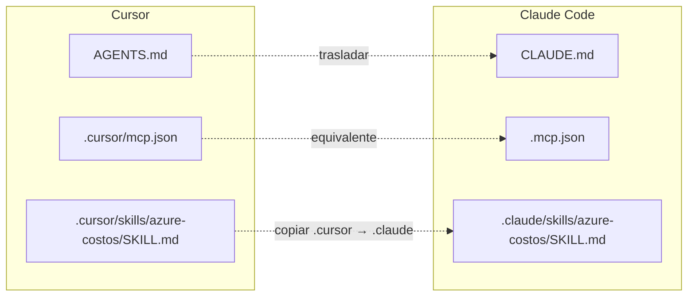

# Laboratorio 7: Compatibilidad de configuración entre agentes

## Objetivo

Mostrar, con un flujo práctico, cómo trasladar configuración de proyecto desde Cursor hacia Claude Code:

1. Reglas/skills del proyecto visibles en Cursor.
2. Configuración MCP visible en Cursor (`Tool & MCPs` y `.cursor/mcp.json`).
3. Migración equivalente en Claude con `CLAUDE.md` y `.mcp.json` (o comando `claude mcp add` con alcance de proyecto).

Al final del laboratorio podrás:

1. Puedes mantener instrucciones de proyecto con contenido equivalente para dos agentes distintos.
2. Puedes registrar el mismo servidor MCP inseguro de laboratorio en ambos clientes cambiando solo la ruta de configuración.
3. La skill `azure-costos` puede trasladarse de Cursor a Claude copiando el directorio `.cursor` y renombrándolo a `.claude` (mismo `SKILL.md`, sin reescribir reglas).

**Prerrequisitos:**

- Tener este repositorio abierto como workspace.
- Cursor
- Claude Code

---

## Marco teórico

### Azure MCP Server (referencia del laboratorio)

En este laboratorio la referencia es el servidor **Azure MCP Server** con namespace `pricing`.

### Mapa de equivalencias

| Concepto | Cursor | Claude |
|---|---|---|
| Instrucciones de proyecto | `AGENTS.md` | `CLAUDE.md` |
| Configuración MCP | `.cursor/mcp.json` | `.mcp.json` (proyecto) o `.claude.json` (local usuario) |
| Skill personalizada | `.cursor/skills/azure-costos/SKILL.md` | `.claude/skills/azure-costos/SKILL.md` (copiar `.cursor` → `.claude`) |

---

## Componentes del laboratorio

Diagrama de componentes del laboratorio:



---

## Pasos

### Preparación

1. Tener este repositorio abierto como workspace.
2. Tener Cursor instalado y disponible.
3. Tener Claude Code instalado y disponible.

---

### Fase A — Instrucciones de proyecto equivalentes

#### 1) Crear archivo AGENTS.md para Cursor

En la raíz de este laboratorio (etapa-1/laboratorios/config), crea `AGENTS.md` con reglas simples y observables:

```md
# Reglas del proyecto

- Responde en español.
- Si es necesario crear archivos su nombre debe tener al menos 2 palabras y usar kebab-case.
- Antes de editar, explica en una frase qué vas a cambiar.
- Al final de cada respuesta incluye el emoji 👍 para saber que estas considerando estas instrucciones.
```

#### 2) Abrir el mismo workspace con Claude Code

```powershell
claude
```

#### 3) Interacturar con ambos agentes

Ingresar el siguiente prompt en ambos agentes:

```prompt
Genera un archivo .txt en el directorio actual y escribe 'Hola, mundo!' en el archivo.
```

Comportamiento esperado:

|Cursor|Claude|
|---|---|
|Responde en español.|Comportamiento estándar de Claude.|
|Usa la convención de nombres de archivos.|-|
|Explica la intención antes de editar.|-|
|Incluye el emoji 👍 al final de la respuesta.|-|

#### 4) Trasladar el comportamient de Cursor a Claude

- Genera un copia de AGENTS.md y renombralo a CLAUDE.md

- Reinicia el agente en Claude.

- Vuelve a interactuar con claude con el mismo prompt anterior.

- Comportamiento esperado: El comportamiento de Claude Code debe ser equivalente al de Cursor.

---

### Fase B — MCP Azure equivalente en Cursor y Claude

#### 1) Verificar MCP en Cursor

En Cursor puedes verlo en:
- `Tool & MCPs > Installed MCP Server > Azure MCP Server`
- archivo `.cursor/mcp.json`

Contenido esperado en `.cursor/mcp.json`:

```json
{
  "mcpServers": {
    "Azure MCP Server": {
      "command": "npx",
      "args": [
        "-y",
        "@azure/mcp@latest",
        "server",
        "start",
        "--namespace",
        "pricing"
      ]
    }
  }
}
```

#### 2) Llevarlo a Claude con archivo `.mcp.json`

En la raíz del proyecto **crea o actualiza `.mcp.json`** con una definición equivalente:

```json
{
  "mcpServers": {
    "azure-mcp-server": {
      "command": "npx",
      "args": [
        "-y",
        "@azure/mcp@latest",
        "server",
        "start",
        "--namespace",
        "pricing"
      ]
    }
  }
}
```

#### 3) Alternativa por comando en Claude CLI

También puedes registrar el MCP sin editar manualmente el archivo:

```powershell
claude mcp add --transport stdio "azure-mcp-server" -- npx -y @azure/mcp@latest server start --namespace pricing --scope project
```

Importante:
- Con `--scope project` la configuración queda en el proyecto actual.
- Si omites `--scope project`, Claude lo puede registrar como **local de usuario**, modificando el archivo global `.claude.json`.
- Dependiendo del sistema operativo y el MCP Server, el comando puede ser diferente.

#### 4) Reiniciar Claude y validar

Tras copiar/crear archivos o ejecutar el comando, reinicia Claude y valida que el MCP quede disponible en el proyecto.

---

### Fase C — Skill portable (Cursor → Claude)

#### Caso de ejemplo: `azure-costos`

En este laboratorio la skill de referencia es **`azure-costos`**, ubicada en:

```
.cursor/skills/azure-costos/SKILL.md
```

Qué hace:
- Estima costos de servicios Azure con precios retail en tiempo real (Azure MCP Server, Parte B).
- Hace preguntas clave (servicio, SKU, región, modelo de precio, uso, moneda).
- Invoca la herramienta `pricing get` y devuelve un desglose mensual orientativo.

No hace falta duplicar la lógica en `CLAUDE.md`: el mismo archivo `SKILL.md` sirve en ambos agentes.

#### 1) Verificar la skill en Cursor

1. Abre el workspace en `etapa-1/laboratorios/config`.
2. Comprueba que existe `.cursor/skills/azure-costos/SKILL.md`.
3. En Cursor: `Settings > Rules, Skills, Subagents` → proyecto **config** → pestaña **Skills** → debe aparecer `azure-costos`.
4. Asegúrate de tener el MCP de la Parte B activo (`Azure MCP Server` / namespace `pricing`).

Prompt de prueba:

```prompt
¿Cuánto cuesta una VM Standard_D2s_v5 en eastus corriendo 24/7?
```

Comportamiento esperado en Cursor:
- Pregunta o confirma SKU, región y modelo Consumption si faltan datos.
- Usa el MCP `pricing get` (no inventa precios).
- Responde con tabla de estimación y supuestos (730 h/mes, precios retail, etc.).

#### 2) Trasladar a Claude: copiar `.cursor` → `.claude`

Claude Code descubre skills en `.claude/skills/<nombre>/SKILL.md` con el **mismo formato** que Cursor (frontmatter YAML + cuerpo Markdown). La forma más directa de portar la skill es copiar el directorio completo:

```powershell
cd etapa-1/laboratorios/config

# Si ya tienes .claude de pruebas anteriores, elimínalo o fusiona skills a mano
Copy-Item -Recurse -Force .cursor .claude
```

Estructura resultante:

```
.claude/
├── mcp.json          # copiado desde .cursor (Se puede eliminar porque claude code no lo usa aquí)
└── skills/
    └── azure-costos/
        └── SKILL.md  # idéntico al de Cursor
```

Equivalencia de rutas:

| Pieza | Cursor | Claude Code |
|-------|--------|-------------|
| Skill | `.cursor/skills/azure-costos/SKILL.md` | `.claude/skills/azure-costos/SKILL.md` |
| Invocación manual | Según UI de Cursor | `/azure-costos` |
| MCP (Parte B) | `.cursor/mcp.json` | `.mcp.json` en la raíz del proyecto |

**Importante:** 
- Claude lee `.mcp.json` en la raíz (ya configurado en la Parte B), no el `mcp.json` que quede dentro de `.claude/` al copiar. No necesitas mover nada más para el MCP si completaste la Parte B.
- Si usas MAC, en lugar de copiar la skill puedes crear un enlace simbólico con `ln -s .cursor .claude`.

#### 3) Reiniciar Claude y validar

```powershell
claude
```

1. Comprueba que la skill aparece (por ejemplo con `/azure-costos` o listando skills del proyecto).
2. Verifica que el MCP `azure-mcp-server` sigue activo (Parte B).
3. Usa el **mismo prompt** que en Cursor:

```prompt
¿Cuánto cuesta una VM Standard_D2s_v5 en eastus corriendo 24/7?
```

Comportamiento esperado en Claude:
- Mismo flujo que en Cursor: preguntas clave → `pricing get` → desglose mensual.
- Misma skill (`SKILL.md` sin cambios), solo cambió la carpeta contenedora (`.cursor` → `.claude`).

Si el comportamiento difiere, revisa que `.claude/skills/azure-costos/SKILL.md` exista y que `.mcp.json` esté en la raíz del laboratorio, no solo dentro de `.claude/`.

---

## Conclusiones del laboratorio

- **La portabilidad no es automática:** cada cliente tiene sus rutas y convenciones (`AGENTS.md` / `CLAUDE.md`, `.cursor/mcp.json` / `.mcp.json`, `.cursor/skills` / `.claude/skills`). Lo que migras es la **intención** (políticas, comando del servidor, lógica de la skill), no un único archivo universal.
- **El mismo prompt no implica el mismo comportamiento** hasta que alineas la configuración de proyecto: en la Fase A viste que Cursor obedece reglas observables y Claude, por defecto, no — hasta que replicas esas reglas en `CLAUDE.md`.
- **MCP y skills son piezas acopladas pero independientes:** el servidor Azure (`pricing`) aporta datos; `azure-costos` define *cómo* usarlos. En ambos agentes el flujo puede ser equivalente si declaras el MCP en el sitio que lee cada cliente y copias el `SKILL.md` sin reescribirlo en instrucciones generales.
- **La compatibilidad es práctica, no binaria:** nombres de servidor, alcance (`project` vs usuario) y archivos residuales al copiar `.cursor` → `.claude` explican diferencias menores; no invalidan el enfoque de mantener en el repo una “capa portable” de tres bloques: instrucciones, MCP y skills.

Tras el taller, conviene versionar en el repositorio esos tres artefactos con el mismo criterio que el código: mismas políticas, mismo `command`/`args` del MCP y skills en formato compartido, de modo que cambiar de agente sea un ajuste de rutas, no un rediseño del conocimiento del proyecto.
