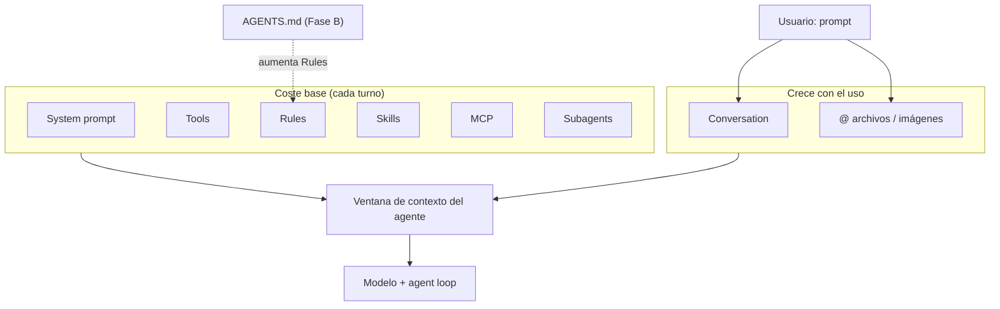

# Laboratorio 4: Ventana de contexto y atención

## Objetivo

Experimentar de forma **observable** cómo Cursor compone la **ventana de contexto** del agente: qué capas consume tokens antes de tu mensaje, cómo crece la conversación y qué impacto tiene añadir instrucciones de proyecto (`AGENTS.md`).

Al final del laboratorio podrás:

1. Leer el panel **Context** de Cursor y relacionar cada segmento (System prompt, Tools, Rules, Skills, MCP, Subagents, Conversation) con su origen.
2. Comparar el uso de tokens **antes y después** de añadir `AGENTS.md` al workspace del laboratorio.
3. Formular preguntas al agente sobre su contexto y aplicar criterios para mantener una ventana de atención eficiente en trabajo real.

**Prerrequisitos:**

- [Laboratorio 1: Desarrollo asistido por IA y Agent Loop](../agent-loop/README.md) — bucle agente–herramientas y capas de contexto local.
- Cursor instalado con modo **Agent** disponible.
- Familiaridad básica con el chat del IDE.

**Material técnico del laboratorio:** carpeta mínima de este lab (`etapa-1/laboratorios/context`). Se recomienda abrirla como **workspace raíz** (no todo el monorepo) para aislar el experimento.

---

## Marco teórico

### Qué es la ventana de contexto

El modelo no “ve” tu repositorio entero: recibe un **paquete finito de tokens** (texto, metadatos de herramientas, reglas, historial de chat, etc.) en cada turno. Ese límite es la **ventana de contexto**. Si el paquete se llena, el sistema debe **resumir**, **truncar** o **descartar** información; el agente deja de “recordar” detalles que ya no están en el prompt activo.

En Cursor, el panel **Context** (junto al campo de entrada del chat) muestra una estimación de uso: porcentaje ocupado, total de tokens y un desglose por categoría.

### Categorías del panel Context (Cursor)

Los nombres y colores pueden variar ligeramente entre versiones; la idea pedagógica es la misma:

| Categoría | Color (referencia) | Qué suele incluir | ¿Fijo por sesión? |
|-----------|-------------------|-------------------|-------------------|
| **System prompt** | Gris | Instrucciones base del producto, modo Agent, políticas internas no editables por el usuario | Relativamente fijo |
| **Tools** | Morado | Esquemas y descripciones de herramientas (Read, Grep, Shell, Task, MCP, etc.) | Alto coste base; crece si hay más MCP/herramientas |
| **Rules** | Verde | Reglas de usuario, `.cursor/rules`, `AGENTS.md`, reglas de equipo | Crece al añadir reglas de proyecto |
| **Skills** | Amarillo | Skills habilitadas (usuario/proyecto) inyectadas en el harness | Depende de skills activas globalmente |
| **MCP** | Magenta | Descriptores y políticas de servidores MCP conectados | Depende de MCP del usuario/proyecto |
| **Subagents** | Azul | Definiciones de subagentes (`.cursor/agents/*.md`, tipos del harness) | Crece con más agentes declarados |
| **Conversation** | Naranja | Tu prompt, respuestas del modelo, resultados de herramientas, archivos adjuntos | Crece en cada turno |

> **Importante:** Los valores en tokens son **estimaciones** del cliente. Tu captura puede diferir de la de otro participante (skills globales, MCP personales, reglas de usuario, modelo elegido).

### Contexto vs. atención

Tener espacio libre en la barra no garantiza que el modelo **priorice** bien cada pieza. La **atención** del modelo se distribuye sobre todo lo presente; bloques largos de Tools, Skills o historial diluyen el peso efectivo de tu instrucción actual. Por eso conviene:

- Reducir ruido fijo (MCP innecesarios, reglas duplicadas, skills no usadas).
- Mantener prompts acotados y archivos relevantes explícitos (`@archivo`).
- Dividir tareas grandes en hilos o cambios con contexto limpio.

Referencia conceptual: documentación de [Rules](https://cursor.com/docs/rules) y el marco del [Laboratorio 1](../agent-loop/README.md) sobre contexto local vs. recuperado.

---

## Componentes del laboratorio

Diagrama de componentes del laboratorio:



---

## Pasos

### Preparación

1. En Cursor: **File → Open Folder** y selecciona solo `etapa-1/laboratorios/context` (esta carpeta como raíz del workspace).
2. Abre un **chat nuevo** en modo **Agent** (modelo por defecto del taller, p. ej. Auto).
3. Opcional: desactiva temporalmente MCP que no necesites para el ejercicio (*Settings → MCP*) y anota cuáles tenías activos; así podrás explicar el segmento MCP de tu captura.
4. Localiza el panel **Context** (icono o enlace junto al cuadro de mensaje; en versiones recientes muestra “X% Full” y el desglose por colores).

---

### Fase A — Línea base: prompt mínimo

**Meta:** Obtener una captura del panel Context **sin** `AGENTS.md` en este workspace, tras una tarea trivial que obligue al agente a usar herramientas.

1. Comprueba que **no** exista `AGENTS.md` en la raíz de este laboratorio (si lo creaste en un intento previo, renómbralo temporalmente).

2. Envía exactamente este prompt:

   ```prompt
   Revisa esta operación 3 + 5 y escribe el resultado en un archivo.
   ```

3. Deja que el agente termine (debería crear un archivo, p. ej. `resultado-suma.txt` con `8`). Acepta o revisa el diff según prefieras el taller.

4. Abre el panel **Context** y registra en una tabla (en tu cuaderno o en `notas-contexto.md`):

   | Categoría | Tokens (aprox.) | % del total | Notas |
   |-----------|-----------------|-------------|-------|
   | System prompt | | | |
   | Tools | | | |
   | Rules | | | |
   | Skills | | | |
   | MCP | | | |
   | Subagents | | | |
   | Conversation | | | |
   | **Total** | | **100%** | |

5. Haz una captura de pantalla del panel (referencia visual del taller).

   > En un workspace mínimo como este, **Rules** y **Subagents** suelen ser bajos. **Tools** y **Skills** suelen dominar el coste fijo. **Conversation** crece con tu prompt, la respuesta y los resultados de herramientas (lecturas, diffs, salida de terminal).

6. Pregunta de reflexión (sin enviar al agente aún): ¿Qué parte crees que crecerá más si repites la misma tarea en un hilo de 20 mensajes?

---

### Fase B — Efecto de `AGENTS.md`

**Meta:** Ver cómo las instrucciones de proyecto incrementan el segmento **Rules** (y posiblemente el comportamiento del agente).

1. Crea en la raíz de este laboratorio un archivo `AGENTS.md` con reglas **cortas pero observables**:

   ```md
   # Reglas del laboratorio — ventana de contexto

   - Responde siempre en español.
   - Si creas archivos de resultado, usa el prefijo `lab-` y kebab-case (ej. `lab-resultado-suma.txt`).
   - Antes de escribir un archivo, indica en una frase qué ruta vas a crear.
   - Al final de cada respuesta, añade la línea: `Contexto-Lab: OK`.
   ```

2. **Cierra este chat** y abre uno **nuevo** (mismo modo Agent, mismo modelo). Esto aisla el experimento y evita arrastrar el historial de la Fase A.

3. Repite el mismo prompt de la Fase A:

   ```prompt
   Revisa esta operación 3 + 5 y escribe el resultado en un archivo.
   ```

4. Comprueba el comportamiento esperado:

   | Señal | Esperado |
   |-------|----------|
   | Idioma | Español |
   | Nombre de archivo | Prefijo `lab-`, kebab-case |
   | Antes de escribir | Una frase con la ruta |
   | Cierre | Línea `Contexto-Lab: OK` |

5. Vuelve a abrir el panel **Context** y completa una **segunda fila** en tu tabla (columna “Con AGENTS.md”). Compara especialmente **Rules** y **Conversation**.

   > Lo habitual: **Rules** sube de forma visible; **Conversation** puede ser similar en un solo turno. El coste de `AGENTS.md` se paga en **cada turno** del hilo.

6. Opcional — experimento de tamaño: añade 30–50 líneas de texto de relleno en `AGENTS.md` (comentarios o políticas ficticias), repite el prompt en un chat nuevo y observa de nuevo **Rules**. Elimina el relleno al terminar.

---

### Fase C — Preguntas al agente sobre su contexto

**Meta:** Usar el propio agente como recurso pedagógico (con la salvedad de que no tiene visibilidad perfecta del panel Context) y recoger buenas prácticas.

En el mismo chat de la Fase B (o uno nuevo **con** `AGENTS.md`), envía estas preguntas **una por una** y anota las respuestas:

1. ```prompt
   ¿Qué componentes crees que ocupan tu ventana de contexto en este turno (system, herramientas, reglas, skills, MCP, subagentes, conversación)? No inventes cifras exactas si no las ves; prioriza el propósito de cada bloque.
   ```

2. ```prompt
   ¿Qué parte de tu contexto es fija en cada mensaje y cuál crece solo cuando uso más el chat o adjunto archivos?
   ```

3. ```prompt
   Revisa el AGENTS.md de este proyecto. ¿Qué reglas son imprescindibles y cuáles podrían acortarse o moverse a documentación humana sin perder seguridad?
   ```

4. ```prompt
   Dame cinco recomendaciones concretas para mantener una ventana de atención sana en un proyecto grande (monorepo, varios MCP, muchas skills).
   ```

5. ```prompt
   Si el panel Context superara el 80% de capacidad, ¿qué harías tú como agente y qué debería hacer yo como desarrollador en Cursor?
   ```

> **Nota pedagógica:** El agente **no** lee el panel Context de la UI. Sus respuestas son inferencia sobre arquitectura conocida. Contrasta siempre con tus mediciones de la Fase A y B.

---

### Fase D — Conversación larga (opcional)

**Meta:** Ver crecer **Conversation** y discutir compactación.

1. En un solo hilo, repite 5–8 variaciones del prompt con operaciones distintas (p. ej. `12 * 3`, `100 - 37`) pidiendo un archivo por resultado.
2. Tras cada turno, anota el % de **Conversation** en el panel Context.
3. Si Cursor ofrece **compact** / nuevo hilo con resumen, pruébalo y compara el desglose.

---

## Hoja de registro (plantilla)

Puedes copiar esto a `notas-contexto.md` durante el taller:

```md
# Registro — Laboratorio 4

Participante:
Fecha:
Modelo Cursor:
MCP activos:
Skills globales aproximadas (sí/no muchas):

## Fase A — sin AGENTS.md
| Categoría | Tokens |
|-----------|--------|
| System prompt | |
| Tools | |
| Rules | |
| Skills | |
| MCP | |
| Subagents | |
| Conversation | |
| Total | |

## Fase B — con AGENTS.md
(misma tabla)

## Diferencia notable
- Rules: 
- Conversation: 

## Tres recomendaciones del agente (Fase C)
1. 
2. 
3. 
```

---

## Conclusiones del laboratorio

- La ventana de contexto es un **presupuesto compartido**: instrucciones del sistema, herramientas y configuración del IDE compiten con tu conversación y los archivos que adjuntas.
- **Tools**, **Skills** y **MCP** suelen ser el mayor coste **fijo**; conviene conectar solo lo necesario para la tarea.
- **`AGENTS.md`** y las reglas de proyecto alimentan **Rules** en cada turno: instrucciones breves y accionables escalan mejor que políticas enormes copiadas de un handbook.
- **Conversation** crece con el historial y las salidas de herramientas; hilos largos requieren nuevo chat, compactación o tareas más acotadas.
- Las respuestas del agente sobre “su contexto” son **heurísticas**; la fuente de verdad para el taller es el panel **Context** de Cursor más tu registro de tokens.

Tras el taller, aplica una revisión en un proyecto real: lista MCP y skills activas, acorta `AGENTS.md` y abre un hilo nuevo por tarea o feature.

---

## Referencias

- [Laboratorio 1 — Agent Loop](../agent-loop/README.md)
- [Laboratorio 7 — AGENTS.md y configuración](../config/README.md)
- [Cursor Rules](https://cursor.com/docs/rules)
- Imagen de referencia del panel Context (captura del taller en `assets/` o la proporcionada por el instructor)
