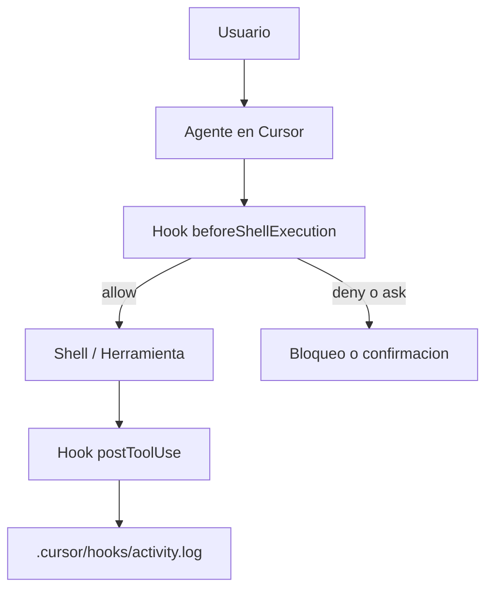

# Laboratorio 5: Hooks en Cursor

## Objetivo

Explorar cómo usar hooks para observar y controlar el comportamiento del agente en Cursor mediante scripts que se ejecutan antes o después de eventos clave.

Al final del laboratorio podrás:

1. Entender el ciclo de vida de hooks `before` y `after` y su impacto en la ejecución de herramientas/comandos.
2. Implementar y validar un hook de observabilidad (`postToolUse`) con registro en archivo.
3. Implementar y validar un hook preventivo (`beforeShellExecution`) para bloquear comandos peligrosos.

**Prerrequisitos:**

- Tener este repositorio abierto como workspace en Cursor.
- Conocer nociones básicas de terminal y ejecución de scripts.

**Material técnico del laboratorio:** definición de hooks en `.cursor/hooks.json` y scripts en `.cursor/hooks/` (archivos `log-activity.ps1`, `guard-shell.mjs`, `activity.log`).

---

## Marco teórico

### Qué son los hooks

Los hooks son scripts que Cursor ejecuta **automáticamente** antes o después de eventos del agente.
Permiten interceptar el comportamiento del agente para:

| Patrón        | Descripción                                                |
|---------------|------------------------------------------------------------|
| **Observar**  | Registrar lo que hace el agente (trazabilidad / auditoría) |
| **Bloquear**  | Impedir acciones peligrosas antes de que ocurran           |
| **Modificar** | Reescribir entradas o salidas al vuelo                     |
| **Encadenar** | Disparar acciones de seguimiento al terminar un paso       |

Piensa en ellos como **middleware del agente de IA**: se sitúan entre lo que el agente
quiere hacer y lo que realmente ocurre.

### Ciclo de vida y contrato JSON

**Regla clave:** los hooks `before` pueden bloquear o modificar; los `after` solo pueden
observar o ampliar.

Un hook tiene dos partes:

1. **Declaración** en `.cursor/hooks.json`: indica *cuándo* se dispara y *qué* se ejecuta.
2. **Script** en `.cursor/hooks/`: recibe JSON por stdin y devuelve JSON por stdout.

Cursor envía los datos del evento como JSON al **stdin** del script. El script los procesa
y escribe la respuesta JSON en **stdout**.

```
stdin (desde Cursor)          stdout (tu respuesta)
┌──────────────────┐         ┌──────────────────────┐
│ {                │         │ {                    │
│   "tool_name":.. │   ──→   │   "permission": ...  │
│   "command": ... │         │   "user_message": .. │
│ }                │         │ }                    │
└──────────────────┘         └──────────────────────┘
```

Valores de `permission`:

| Valor     | Efecto                                                |
|-----------|--------------------------------------------------------|
| `"allow"` | Deja que la acción continúe sin intervención          |
| `"deny"`  | Bloquea la acción por completo                         |
| `"ask"`   | Pausa y muestra un mensaje para que tú decidas         |

Referencia conceptual: **Documentación de Cursor Hooks** ([docs.cursor.com/agent/hooks](https://docs.cursor.com/agent/hooks)).

---

## Componentes del laboratorio

Diagrama de componentes del laboratorio:



Estructura del proyecto:

```
.cursor/
├── hooks.json              # Declaración de hooks (qué se dispara y cuándo)
└── hooks/
    ├── log-activity.ps1    # Registra cada uso de herramienta
    └── activity.log        # Log generado tras la primera ejecución
README.md                   # Este archivo
```

---

## Pasos

### Preparación

1. Abre esta carpeta en Cursor como espacio de trabajo.
2. Verifica que existan `.cursor/hooks.json` y la carpeta `.cursor/hooks/`.
3. Confirma que los scripts de hooks están presentes (`log-activity.ps1` y `guard-shell.mjs`).

---

### Fase A — Observabilidad con `postToolUse`

**Meta:** comprobar que puedes registrar actividad del agente sin bloquear su ejecución.

1. Revisa el hook de registro:
   - **Archivo:** `.cursor/hooks/log-activity.ps1`
   - Se ejecuta después de que el agente use una herramienta.
   - Lee stdin, extrae el nombre de la herramienta, añade una línea a `.cursor/hooks/activity.log` y devuelve un objeto JSON vacío.

2. Ejecuta una acción simple con el agente, por ejemplo:

   ```prompt
   Lista los archivos de este directorio.
   ```

3. Valida el resultado:
   - Revisa `.cursor/hooks/activity.log` para ver el registro en acción.
   - También puedes revisar el log en `Settings > Hooks > Execution Logs`.

---

### Fase B — Prevención con `beforeShellExecution`

**Meta:** verificar que un hook `before` puede detener acciones destructivas antes de que ocurran.

1. Revisa el hook de guardia:
   - **Tipo:** prompt
   - **Evento:** `beforeShellExecution`
   - Intercepta comandos de shell antes de ejecutarlos.
   - Marca patrones peligrosos como `rm -rf`, `DROP TABLE`, `push --force` o reset con `--hard`.

2. Solicita una acción riesgosa al agente, por ejemplo:

   ```prompt
   Borra la carpeta temp con rm -rf
   ```

   ```prompt
   Ejecuta en consola lo indicado en el archivo @important-files/dangerous-command.txt
   ```

3. Resultado esperado:
   - Cursor bloquea la ejecución y muestra rechazo.
   - En este laboratorio, al intentar ejecutar `rm -rf important-files/core.file.md`, la acción fue denegada y también se rechazó la eliminación directa del archivo, evitando bypass.

---

### Fase C — Extensión del laboratorio

**Meta:** identificar cómo escalar el enfoque de hooks a más controles del agente.

1. Propón hooks adicionales para tu proyecto:
   - `afterFileEdit` — formatear archivos automáticamente tras una edición del agente.
   - `beforeSubmitPrompt` — revisar prompts en busca de secretos filtrados.
   - `subagentStart` — controlar qué tipos de subagente están permitidos.
   - `preToolUse` — reescribir o bloquear llamadas concretas a herramientas.

2. Usa la documentación oficial para revisar eventos disponibles y campos de salida:
   - [https://docs.cursor.com/agent/hooks](https://docs.cursor.com/agent/hooks)

---

## Conclusiones del laboratorio

- Los hooks permiten pasar de un agente reactivo a un agente gobernado por políticas observables y auditables.
- Separar `before` (control) y `after` (trazabilidad) facilita aplicar seguridad sin perder productividad.
- Un hook simple de logging (`postToolUse`) aporta visibilidad inmediata sobre el uso de herramientas.
- Un hook preventivo (`beforeShellExecution`) reduce riesgo operativo al bloquear comandos destructivos antes de su ejecución.
- La combinación de ambos patrones (observabilidad + prevención) crea una base sólida para escalar controles en laboratorios posteriores.

Tras el taller, puedes consolidar esta base añadiendo hooks por dominio (seguridad, calidad, cumplimiento) y mantenerlos versionados junto al proyecto.
