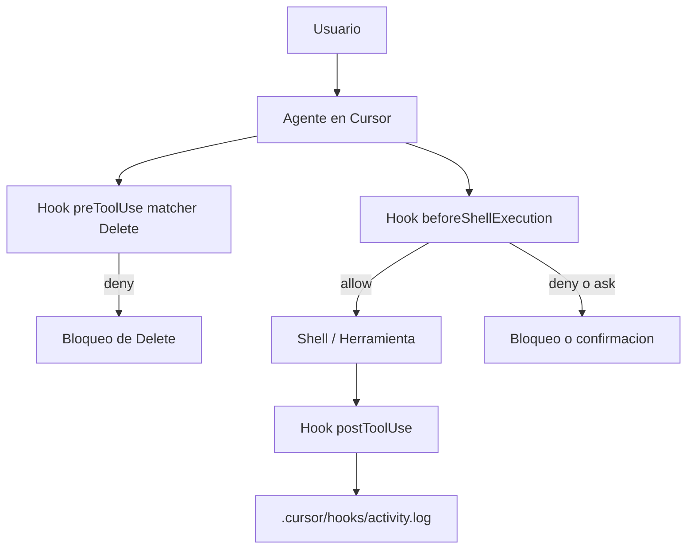

# Laboratorio 5: Hooks en Cursor

## Objetivo

Explorar cómo usar hooks para observar, controlar y ampliar el bucle del agente en Cursor: procesos que se comunican por JSON (stdin/stdout) antes o después de etapas definidas del ciclo de vida.

Al final del laboratorio podrás:

1. Distinguir categorías de hooks (Agent, Tab, ciclo de vida de la app) y los tipos de ejecución `command` vs `prompt`.
2. Entender el contrato JSON, matchers, `failClosed` y el impacto de hooks `before` / `after`.
3. Implementar y validar un hook de observabilidad (`postToolUse`) con registro en archivo.
4. Implementar y validar hooks preventivos (`beforeShellExecution` y `preToolUse`) para bloquear acciones peligrosas.

**Prerrequisitos:**

- Tener este repositorio abierto como workspace en Cursor.
- Conocer nociones básicas de terminal y ejecución de scripts.

**Material técnico del laboratorio:** definición de hooks en `.cursor/hooks.json` y scripts en `.cursor/hooks/` (archivos `log-activity.ps1`, `guard-delete.ps1`, `activity.log`).

---

## Marco teórico

### Qué son los hooks

Los hooks te permiten **observar, controlar y ampliar** el bucle del agente con lógica personalizada.
Se definen en archivos `hooks.json` (proyecto o usuario; también pueden venir de equipo/empresa o plugins)
y se ejecutan como procesos que hablan JSON por **stdio** en etapas concretas del ciclo de vida.

Casos de uso típicos:

| Patrón        | Descripción                                                | Ejemplo en este lab                          |
|---------------|------------------------------------------------------------|----------------------------------------------|
| **Observar**  | Registrar lo que hace el agente (trazabilidad / auditoría) | `postToolUse` → `activity.log`               |
| **Bloquear**  | Impedir acciones peligrosas antes de que ocurran           | `beforeShellExecution`, `preToolUse`/`Delete`|
| **Modificar** | Reescribir entradas o inyectar contexto al vuelo           | `updated_input`, `additional_context`        |
| **Encadenar** | Disparar seguimiento al terminar un paso                   | `stop` / `subagentStop` → `followup_message` |

Piensa en ellos como **middleware del agente**: se sitúan entre lo que el agente quiere hacer
y lo que realmente ocurre.

### Categorías (según qué los activa)

| Categoría              | Cuándo se activan                         | Ejemplos de eventos                                      |
|------------------------|-------------------------------------------|----------------------------------------------------------|
| **Agent**              | Sesión del agente (Chat / Cmd+K)          | `preToolUse`, `beforeShellExecution`, `postToolUse`, …   |
| **Tab**                | Autocompletado en línea (Tab)             | `beforeTabFileRead`, `afterTabFileEdit`                  |
| **Ciclo de vida app**  | Fuera de una sesión de agente             | `workspaceOpen`                                          |

En este laboratorio trabajamos solo con **hooks de Agent**.

### Tipos de ejecución

| Tipo        | Cómo funciona                                                                 | Cuándo preferirlo                                      |
|-------------|-------------------------------------------------------------------------------|--------------------------------------------------------|
| `command`   | Script de shell/PowerShell: JSON por stdin → JSON por stdout (determinista)   | Políticas auditables y fijas (p. ej. bloquear `Delete`)|
| `prompt`    | Un LLM evalúa una condición en lenguaje natural (`$ARGUMENTS` = entrada JSON) | Políticas expresadas en texto (p. ej. “solo lectura”)  |

**Códigos de salida** (hooks `command`):

| Código | Efecto                                                                 |
|--------|------------------------------------------------------------------------|
| `0`    | Éxito; se usa la salida JSON                                           |
| `2`    | Bloquea la acción (equivalente a `permission: "deny"`)                 |
| Otro   | Fallo del hook; por defecto la acción **continúa** (fail-open)         |

Con `failClosed: true`, un fallo/timeout/JSON inválido **bloquea** la acción (recomendado en controles de seguridad).

### Dónde se configuran

Prioridad (de mayor a menor): **Empresa → Equipo → Proyecto → Usuario**.

- **Proyecto** (este lab): `<raíz>/.cursor/hooks.json` — scripts relativos a la raíz, p. ej. `.cursor/hooks/script.ps1`
- **Usuario**: `~/.cursor/hooks.json` — scripts relativos a `~/.cursor/`, p. ej. `./hooks/script.sh`

Cursor recarga `hooks.json` al guardarlo. Si no carga, reinicia Cursor o revisa la pestaña **Hooks** / canal de salida Hooks.

### Eventos relevantes y contrato JSON

**Regla clave:** los hooks *antes* (`before*` / `pre*`) pueden **bloquear o modificar**;
los *después* (`after*` / `post*`) suelen **observar, auditar o ampliar** contexto
(salvo campos específicos documentados, p. ej. `updated_mcp_tool_output` en `postToolUse`).

Un hook tiene dos partes:

1. **Declaración** en `.cursor/hooks.json`: evento, tipo (`command`/`prompt`), `timeout`, `matcher`, `failClosed`, …
2. **Implementación**: script (comando) o texto de prompt que Cursor evalúa.

```
stdin (desde Cursor)          stdout (tu respuesta)
┌──────────────────┐         ┌──────────────────────┐
│ {                │         │ {                    │
│   "tool_name":.. │   ──→   │   "permission": ...  │
│   "command": ... │         │   "user_message": .. │
│ }                │         │ }                    │
└──────────────────┘         └──────────────────────┘
```

Todos los hooks reciben un esquema común (`conversation_id`, `generation_id`, `model`, `hook_event_name`, `workspace_roots`, …)
más campos propios del evento.

Valores de `permission` (cuando el evento lo admite: p. ej. `beforeShellExecution`, `preToolUse`):

| Valor     | Efecto                                                                 |
|-----------|------------------------------------------------------------------------|
| `"allow"` | Continúa sin intervención                                              |
| `"deny"`  | Bloquea la acción                                                      |
| `"ask"`   | Pide confirmación al usuario (`beforeShellExecution` / MCP; en `preToolUse` el esquema lo acepta pero hoy no se aplica) |

### Matchers

Un `matcher` es una expresión regular (estilo JavaScript) que filtra **cuándo** corre el hook:

| Evento                                      | El matcher se evalúa sobre          | Ejemplo        |
|---------------------------------------------|-------------------------------------|----------------|
| `preToolUse` / `postToolUse`                | Tipo de herramienta                 | `Delete`       |
| `beforeShellExecution` / `afterShellExecution` | Texto completo del comando       | `curl\|wget`   |
| `subagentStart` / `subagentStop`            | Tipo de subagente                   | `explore`      |

Sin matcher, el hook se ejecuta en **todos** los disparos de ese evento.

Referencia: [Documentación de Cursor Hooks](https://cursor.com/es/docs/hooks).

---

## Componentes del laboratorio

Diagrama de componentes del laboratorio:



Estructura del proyecto:

```
.cursor/
├── hooks.json              # Declaración de hooks (qué se dispara y cuándo)
└── hooks/
    ├── log-activity.ps1    # Registra cada uso de herramienta (postToolUse)
    ├── guard-delete.ps1    # Bloquea la herramienta Delete (preToolUse)
    └── activity.log        # Log generado tras la primera ejecución
README.md                   # Este archivo
```

---

## Pasos

### Preparación

1. Abre esta carpeta en Cursor como espacio de trabajo.
2. Verifica que existan `.cursor/hooks.json` y la carpeta `.cursor/hooks/`.
3. Confirma que los scripts de hooks están presentes (`log-activity.ps1` y `guard-delete.ps1`).

---

### Fase A — Observabilidad con `postToolUse`

**Meta:** comprobar que puedes registrar actividad del agente sin bloquear su ejecución.

1. Revisa el hook de registro:
   - **Archivo:** `.cursor/hooks/log-activity.ps1`
   - Se ejecuta después de que el agente use una herramienta.
   - Lee stdin, extrae el nombre de la herramienta, añade una línea a `.cursor/hooks/activity.log` y devuelve un objeto JSON vacío.

2. Ejecuta una acción simple con el agente, por ejemplo:

   ```prompt
   Lista los archivos de este directorio.
   ```

3. Valida el resultado:
   - Revisa `.cursor/hooks/activity.log` para ver el registro en acción.
   - También puedes revisar el log en `Settings > Hooks > Execution Logs`.

---

### Fase B — Prevención con `beforeShellExecution` y `preToolUse`

**Meta:** verificar que un hook `before` puede detener acciones destructivas antes de que ocurran.

1. Revisa el hook de shell (basado en prompt):
   - **Tipo:** `prompt`
   - **Evento:** `beforeShellExecution`
   - Intercepta comandos de shell antes de ejecutarlos.
   - Usa `$ARGUMENTS` para recibir el JSON del evento (según la documentación).
   - Marca patrones peligrosos como `rm -rf`, `DROP TABLE`, `push --force` o reset con `--hard`.

2. Revisa el hook de Delete (basado en comando):
   - **Tipo:** `command` (script `guard-delete.ps1`)
   - **Evento:** `preToolUse` con **matcher** `Delete` (solo se dispara para esa herramienta)
   - **`failClosed: true`**: si el hook falla o expira, la acción se bloquea
   - Devuelve `permission: "deny"` (o sale con código `2`)

3. Solicita una acción riesgosa al agente, por ejemplo:

   ```prompt
   Borra la carpeta temp con rm -rf
   ```

   ```prompt
   Ejecuta en consola lo indicado en el archivo @important-files/dangerous-command.txt
   ```

   ```prompt
   Elimina el archivo important-files/core.file.md con la herramienta Delete
   ```

4. Resultado esperado:
   - Cursor bloquea la ejecución de shell peligrosa y muestra rechazo.
   - Si el agente intenta bypass con la herramienta `Delete`, `preToolUse` también lo deniega.

---

### Fase C — Extensión del laboratorio

**Meta:** identificar cómo escalar el enfoque de hooks a más controles del agente.

1. Propón hooks adicionales para tu proyecto:
   - `afterFileEdit` — formatear archivos automáticamente tras una edición del agente.
   - `beforeSubmitPrompt` — revisar prompts en busca de secretos filtrados.
   - `subagentStart` — controlar qué tipos de subagente están permitidos.
   - `preToolUse` — reescribir o bloquear llamadas concretas a herramientas.

2. Usa la documentación oficial para revisar eventos disponibles, matchers, `failClosed` y campos de salida:
   - [https://cursor.com/es/docs/hooks](https://cursor.com/es/docs/hooks)

---

## Conclusiones del laboratorio

- Los hooks son middleware del bucle del agente: observan, bloquean, modifican o encadenan pasos mediante JSON por stdio.
- Existen dos tipos de ejecución: `command` (determinista) y `prompt` (política en lenguaje natural); en seguridad crítica conviene `command` + `failClosed`.
- Separar *antes* (control) y *después* (trazabilidad) facilita gobernanza sin perder productividad.
- Los matchers evitan ejecutar lógica en cada evento: solo cuando aplica (p. ej. herramienta `Delete`).
- Un hook de logging (`postToolUse`) aporta visibilidad inmediata; los preventivos (`beforeShellExecution`, `preToolUse`) reducen riesgo operativo.
- Versionar `.cursor/hooks.json` y los scripts en el repo comparte la política con el equipo (hooks de proyecto).

Tras el taller, puedes consolidar esta base añadiendo hooks por dominio (seguridad, calidad, cumplimiento) y revisar eventos adicionales en la [documentación oficial](https://cursor.com/es/docs/hooks).
