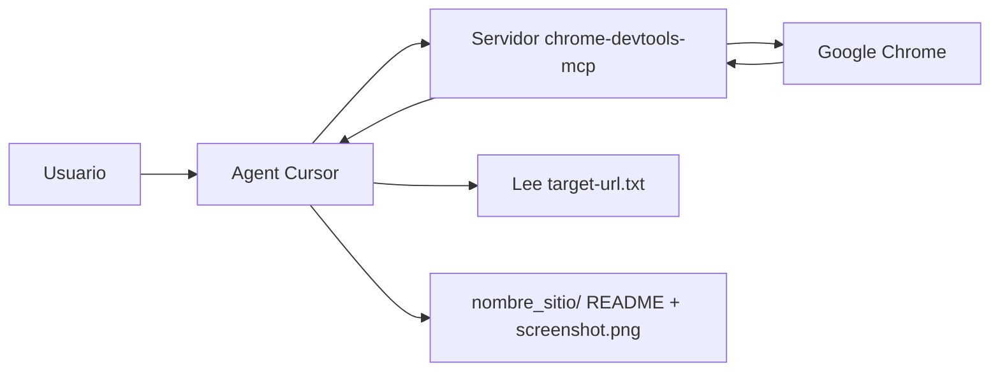

# Laboratorio 4: MCP (Model Context Protocol)

## Objetivo

Conectar **Cursor** a un **servidor MCP** del proyecto para que el agente use herramientas con nombre y esquema definido — en este caso [Chrome DevTools MCP](https://github.com/ChromeDevTools/chrome-devtools-mcp) — y automatice el navegador sin instalar Playwright ni otro runner en el repositorio.

Al final del laboratorio podrás:

1. Configurar un servidor MCP a nivel de proyecto en `.cursor/mcp.json` y verificarlo en Cursor Settings.
2. Invocar herramientas MCP (`navigate_page`, `evaluate_script`, `list_console_messages`, `take_screenshot`) desde el modo Agent.
3. Documentar resultados de una sesión de navegación (título, consola, captura) en una carpeta versionable del workspace.

**Prerrequisitos:**

- [Laboratorio 1: Agentes y subagentes](../agents/README.md) — orquestación en Cursor.
- Opcional: [Laboratorio extra: Agent Loop](../agent-loop/README.md) — bucle agente–herramientas y quién ejecuta cada acción (IDE vs modelo).
- **Node.js** v20.19 o superior (LTS reciente).
- **Google Chrome** actual (el servidor soporta oficialmente Chrome / Chrome for Testing).
- **npm** (incluido con Node).
- Esta carpeta abierta como **workspace** en Cursor.

**Material técnico del laboratorio:** [`.cursor/mcp.json`](./.cursor/mcp.json) (servidor `chrome-devtools`), plantilla [`target-url.example.txt`](./target-url.example.txt) y archivo local `target-url.txt` (en `.gitignore`).

---

## Marco teórico

### Qué es MCP en Cursor

El **Model Context Protocol (MCP)** estandariza cómo un cliente (Cursor) descubre y llama **herramientas** y **recursos** expuestos por un proceso externo (servidor MCP). El agente no “abre Chrome” por sí solo: pide una tool al harness; Cursor ejecuta el servidor MCP; el servidor devuelve JSON y el modelo continúa el bucle.

```
Usuario → Agent (Cursor) → tool call MCP → servidor chrome-devtools-mcp → Chrome
                ↑___________________________________________|
                         resultado JSON al contexto
```

A diferencia de scripts ad hoc en el repo, el contrato de cada herramienta (nombre, parámetros, tipos) lo define el servidor MCP. Eso permite compartir la misma integración entre equipos y versionar solo la configuración en `mcp.json`.

### MCP local vs herramientas nativas del IDE

| Enfoque | Ventaja | Ejemplo en este lab |
|---------|---------|---------------------|
| **Herramientas nativas** (lectura de archivos, terminal, grep) | Sin proceso extra; permisos del IDE | Leer `target-url.txt` |
| **Servidor MCP** | Capacidades especializadas fuera del IDE | Navegar, evaluar JS, consola, captura en Chrome |
| **Config por proyecto** (`.cursor/mcp.json`) | Mismo stack para todo el equipo al clonar el repo | `chrome-devtools` vía `npx` |

No hace falta instalar Playwright en el proyecto: `npx chrome-devtools-mcp@latest` arranca el servidor y este controla una instancia de Chrome cuando el agente invoca sus tools.

### Contrato de las herramientas usadas en el ejercicio

| Herramienta | Rol en el laboratorio |
|-------------|------------------------|
| **`navigate_page`** | Carga la URL indicada en `target-url.txt` |
| **`evaluate_script`** | Ejecuta una función en la página (p. ej. `() => document.title`) y devuelve JSON serializable |
| **`list_console_messages`** | Mensajes de consola **desde la última navegación**; el “último” es el final de la secuencia devuelta |
| **`take_screenshot`** | Guarda captura en disco con **`filePath`** relativo al workspace |

Referencia conceptual: **[Cursor — MCP](https://cursor.com/docs/context/mcp)** y **[chrome-devtools-mcp](https://github.com/ChromeDevTools/chrome-devtools-mcp)**.

---

## Componentes del laboratorio

Diagrama de componentes del laboratorio:



Estructura de archivos en este lab:

```
mcp/
├── README.md                    # Este archivo
├── .cursor/
│   └── mcp.json                 # Servidor MCP del proyecto
├── target-url.example.txt       # Plantilla de URL
├── target-url.txt               # Tu URL (gitignored, créalo en Fase B)
└── <nombre_sitio>/              # Salida del ejercicio (Fase C)
    ├── README.md                # URL, título, último mensaje de consola
    └── screenshot.png
```

Configuración del servidor en [`.cursor/mcp.json`](./.cursor/mcp.json):

```json
{
  "mcpServers": {
    "chrome-devtools": {
      "command": "npx",
      "args": ["-y", "chrome-devtools-mcp@latest"]
    }
  }
}
```

---

## Pasos

### Preparación

1. Abre la carpeta `etapa-1/laboratorios/mcp` como **workspace** en Cursor (`Archivo → Abrir carpeta`).
2. Comprueba Node y npm:

   ```powershell
   node -v
   npm -v
   ```

   Necesitas Node **v20.19+**.
3. Revisa que existan `.cursor/mcp.json` y `target-url.example.txt`.

---

### Fase A — Habilitar Chrome DevTools MCP en Cursor

**Meta:** que el servidor `chrome-devtools` aparezca activo y listo para tool calls desde el Agent.

1. Ve a **Cursor Settings → MCP** y confirma que aparece el servidor **chrome-devtools** (Cursor carga la config del proyecto desde `.cursor/mcp.json`).

2. Si no aparece o falla al arrancar, abre la pestaña **MCP Logs** y revisa errores de `npx` o de Chrome ([documentación Cursor — MCP](https://cursor.com/docs/context/mcp)).

3. **Windows:** si el servidor tarda en arrancar, consulta la sección de clientes Windows en el [README de chrome-devtools-mcp](https://github.com/ChromeDevTools/chrome-devtools-mcp/blob/main/README.md) (timeouts, ruta de Chrome).

4. **Opciones del servidor** (misma clave `chrome-devtools` en `args`):
   - `--slim` — menos herramientas expuestas.
   - `--headless` — navegador sin UI.
   - `--no-usage-statistics` — desactiva estadísticas de uso del paquete (ver README upstream).

   > El MCP puede ver e interactuar con **todo lo que haya en la instancia de Chrome** que controla. Usa URLs de prueba y evita sesiones con datos sensibles.

---

### Fase B — Definir la URL objetivo

**Meta:** separar configuración personal (URL) del repositorio versionado.

1. Copia la plantilla a un archivo local (ignorado por git):

   ```powershell
   Copy-Item target-url.example.txt target-url.txt
   ```

2. Edita **`target-url.txt`**: escribe la URL en la **primera línea no vacía** (p. ej. `https://example.com`).

3. Calcula **`nombre_sitio`** a partir del hostname de esa URL (carpeta de salida en la raíz del lab):

   | Regla | Ejemplo |
   |-------|---------|
   | Quitar prefijo `www.` | `www.example.com` → `example.com` |
   | Sustituir caracteres inválidos en Windows (`\ / : * ? " < > |`) por `_` | `sub.dominio.es:8080` → `sub.dominio.es` |

   | URL | Carpeta sugerida |
   |-----|------------------|
   | `https://www.example.com/path` | `example.com` |
   | `https://sub.dominio.es:8080/x` | `sub.dominio.es` |

El agente debe leer `target-url.txt` del workspace y usar esa URL en `navigate_page`.

---

### Fase C — Ejercicio: título, consola y captura

**Meta:** completar un flujo agente + MCP y dejar evidencia en `<nombre_sitio>/`.

En el chat del **Agent** de Cursor (MCP habilitado; aprueba las herramientas si Cursor lo solicita), usa un prompt equivalente a:

```prompt
Lee target-url.txt y obtén la URL de la primera línea no vacía.
Usa las herramientas MCP de chrome-devtools para:
1) navigate_page con type "url" y esa URL (timeout razonable si la red es lenta).
2) evaluate_script con una función que devuelva document.title (serializable a JSON).
3) list_console_messages desde la última navegación y reporta el ÚLTIMO mensaje (tipo + texto); si no hay ninguno, indica "sin mensajes".
4) take_screenshot guardando en <nombre_sitio>/screenshot.png con filePath relativo al workspace.
Crea <nombre_sitio>/README.md con: URL usada, título de la página, último mensaje de consola y referencia a screenshot.png.
```

Pasos que debe cumplir el agente (referencia manual si prefieres guiarlo paso a paso):

1. Leer `target-url.txt` y obtener la URL.
2. **`navigate_page`**: `type: "url"` con esa URL.
3. **`evaluate_script`**: p. ej. `() => document.title`.
4. **`list_console_messages`**: tomar el **último** de la secuencia devuelta (o “sin mensajes”).
5. **`take_screenshot`**: `filePath` como `<nombre_sitio>/screenshot.png` (o ruta absoluta con `${workspaceFolder}` si tu cliente lo exige).
6. Crear **`<nombre_sitio>/README.md`** con URL, título, último mensaje de consola y enlace a la captura.

Validación:

- Existe la carpeta `<nombre_sitio>/` con `README.md` y `screenshot.png`.
- El README refleja datos reales de la página visitada.

---

### Fase D — Reflexión (opcional)

**Meta:** relacionar MCP con gobernanza y laboratorios posteriores.

1. ¿Qué ejecuta realmente cada tool call MCP: el modelo, Cursor o el proceso `chrome-devtools-mcp`?

2. ¿Por qué `target-url.txt` está en `.gitignore` y `mcp.json` no?

3. Antes de añadir más servidores en `mcp.json`, ¿qué preguntas harías en un repo con datos sensibles? (Relaciona con [Laboratorio 7: Seguridad](../security/README.md).)

---

## Conclusiones del laboratorio

- **MCP** extiende al agente con herramientas tipadas definidas por un servidor externo; Cursor orquesta la llamada, no el LLM directamente.
- La configuración en **`.cursor/mcp.json`** versiona la integración por proyecto; el equipo comparte el mismo servidor al clonar el repo.
- **Chrome DevTools MCP** cubre navegación, evaluación de script, consola y capturas sin añadir Playwright al proyecto.
- Separar **`target-url.txt`** (local, gitignored) de la config MCP reduce fugas de enlaces personales al repositorio.
- El patrón agente → tool MCP → Chrome es el mismo **agent loop** (ver [Laboratorio extra](../agent-loop/README.md)), con un proveedor de herramientas adicional.

Tras el taller, continúa con [Laboratorio 5: Hooks](../hooks/README.md) para observar y controlar el comportamiento del agente (incluidas tool calls) antes y después de cada acción.

---

## Referencias

| Tema | Fuente |
|------|--------|
| MCP en Cursor | [Cursor — MCP / mcp.json](https://cursor.com/docs/context/mcp) |
| Servidor del lab | [chrome-devtools-mcp](https://github.com/ChromeDevTools/chrome-devtools-mcp) |
| Especificación MCP | [Model Context Protocol](https://modelcontextprotocol.io/) |
| Agent loop (contexto) | [Laboratorio extra: Agent Loop](../agent-loop/README.md) |
| Seguridad y MCP | [Laboratorio 7: Seguridad](../security/README.md) |
