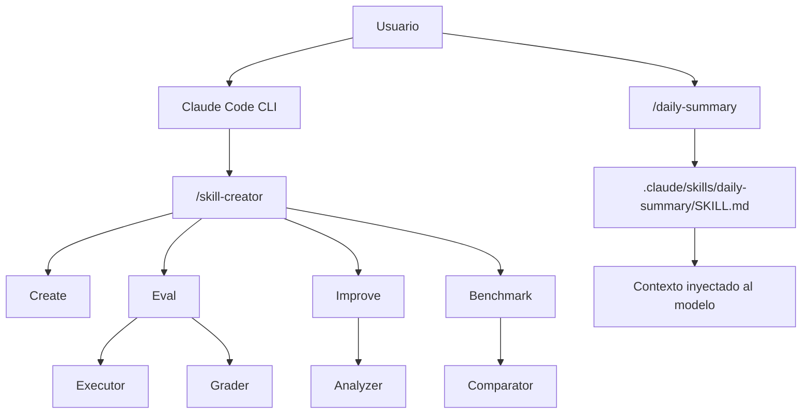

# Laboratorio 3: Prompts y skills

## Objetivo

Aprender a definir, versionar y evaluar **skills** (comandos reutilizables con instrucciones persistentes) en Claude Code, usando el plugin oficial `skill-creator` para cerrar el ciclo crear → probar → mejorar.

Al final del laboratorio podrás:

1. Diferenciar slash commands nativos, skills personalizadas y plugins.
2. Crear una skill con frontmatter YAML y cuerpo Markdown en `.claude/skills/`.
3. Evaluar e iterar una skill con los modos Create, Eval, Improve y Benchmark de `skill-creator`.

**Prerrequisitos:**

- [Laboratorio 1: Agent Loop](../agent-loop/README.md) — contexto sobre cómo el agente inyecta instrucciones y ejecuta herramientas.
- Claude Code CLI instalado y autenticado.
- Este repositorio abierto como **workspace** (Cursor o terminal en la carpeta del lab).

**Material técnico del laboratorio:** skill de ejemplo en [`.claude/skills/daily-summary/SKILL.md`](./.claude/skills/daily-summary/SKILL.md) y configuración local en [`.claude/settings.local.json`](./.claude/settings.local.json) (plugin `skill-creator` habilitado).

---

## Marco teórico

### Qué es una skill

Una **skill** es un slash-command reutilizable que inyecta instrucciones específicas en el contexto de Claude cuando lo invocas. En lugar de repetir el mismo prompt, defines la lógica una vez en un archivo Markdown y la invocas con `/nombre-de-tu-skill`:

```
/daily-summary     # ← skill de este laboratorio
/code-review       # ← skill de equipo (ejemplo)
/deploy            # ← skill de equipo (ejemplo)
```

Las skills se almacenan como archivos versionables junto al código y pueden compartirse con todo el equipo.

### Skills vs. slash commands nativos vs. plugins

| Concepto | Qué es | Ejemplos |
|----------|--------|----------|
| **Slash commands nativos** | Lógica fija en el CLI; no personalizables | `/help`, `/clear`, `/model`, `/compact` |
| **Skills** | Archivos Markdown con instrucciones que tú defines | `/daily-summary`, `/review`, `/standup` |
| **Plugins** | Colección empaquetada de skills, agentes y hooks | `skill-creator`, `code-reviewer` |

### Anatomía de una skill

Cada skill vive en su propio directorio con al menos un archivo `SKILL.md`:

```
.claude/
└── skills/
    └── daily-summary/
        ├── SKILL.md          # requerido — instrucciones y metadatos
        ├── scripts/          # opcional — scripts ejecutables
        ├── references/       # opcional — documentación de contexto
        └── assets/           # opcional — plantillas, íconos, etc.
```

El **frontmatter YAML** (entre `---`) define el nombre del slash-command y la descripción. El **cuerpo Markdown** son las instrucciones que Claude sigue al invocar la skill:

```markdown
---
name: daily-summary
description: Genera un resumen de trabajo del día basado en los commits de git
---

# Daily Summary

## Instrucciones
1. Ejecuta `git log --since="midnight" ...`
2. ...
```

| Scope | Ruta | Cuándo usarla |
|-------|------|----------------|
| **Proyecto** (solo este repo) | `.claude/skills/<nombre>/` | Skills del equipo, versionadas con git |
| **Global** (todos los proyectos) | `~/.claude/skills/<nombre>/` | Skills personales de uso general |

### Qué es `skill-creator`

`skill-creator` es el **plugin oficial de Anthropic** para desarrollar, evaluar y optimizar skills. Cubre el ciclo de vida completo:

| Modo | Comando | Qué hace |
|------|---------|----------|
| **Create** | `/skill-creator` → Create | Genera la estructura inicial desde una descripción en lenguaje natural |
| **Eval** | `/skill-creator` → Eval | Ejecuta la skill contra casos de prueba y puntúa resultados |
| **Improve** | `/skill-creator` → Improve | Sugiere mejoras basadas en evaluaciones previas |
| **Benchmark** | `/skill-creator` → Benchmark | Corre múltiples iteraciones y analiza varianza |

Internamente usa agentes compuestos: **Executor** (ejecuta prompts de prueba), **Grader** (evalúa outputs), **Comparator** (A/B ciego) y **Analyzer** (propone mejoras).

> **Nota:** En Claude Desktop y Claude Cowork, `skill-creator` viene preinstalado. En Claude Code CLI debes instalarlo o habilitarlo (ver Fase A).

Referencia conceptual: **[Extend Claude with skills](https://code.claude.com/docs/en/skills)** (documentación oficial).

---

## Componentes del laboratorio

Diagrama de componentes del laboratorio:



Estructura de archivos en este lab:

```
skills/
├── README.md                           # Este archivo
└── .claude/
    ├── settings.local.json             # Plugin skill-creator habilitado
    └── skills/
        └── daily-summary/
            └── SKILL.md                # Skill de ejemplo del laboratorio
```

---

## Pasos

### Preparación

1. Abre la carpeta `etapa-1/laboratorios/skills` como workspace en Cursor (o navega ahí en tu terminal).
2. Revisa el contenido de [`.claude/skills/daily-summary/SKILL.md`](./.claude/skills/daily-summary/SKILL.md): frontmatter, instrucciones y formato de salida esperado.
3. Confirma que tienes un repositorio git con al menos un commit reciente (para probar `/daily-summary` con datos reales).

---

### Fase A — Instalar y verificar `skill-creator`

**Meta:** tener el plugin disponible antes de crear o evaluar skills.

1. Si aún no lo tienes instalado, desde Claude Code:

   ```prompt
   /plugin install skill-creator
   ```

   Alternativa con registry oficial:

   ```prompt
   /plugin install skill-creator@anthropic-agent-skills
   ```

2. En este laboratorio el plugin ya está referenciado en [`.claude/settings.local.json`](./.claude/settings.local.json). Verifica que Claude Code cargue esa configuración al abrir este directorio.

3. Comprueba la instalación:

   ```prompt
   /skill-creator
   ```

   Debes ver el menú con **Create**, **Eval**, **Improve** y **Benchmark**.

---

### Fase B — Crear y probar la skill `/daily-summary`

**Meta:** entender cómo una skill inyecta instrucciones persistentes y cómo se invoca desde el CLI.

1. **Opción rápida (recomendada):** usa la skill ya incluida en `.claude/skills/daily-summary/`. Léela y comprueba que el `name` del frontmatter coincide con el comando `/daily-summary`.

2. **Opción desde cero:** crea la estructura manualmente:

   ```powershell
   # Skill local al proyecto (versionada con git)
   mkdir .claude\skills\daily-summary
   ```

   O global (todos tus proyectos):

   ```powershell
   mkdir $env:USERPROFILE\.claude\skills\daily-summary
   ```

3. Crea o edita `SKILL.md` siguiendo el ejemplo del repo. El contenido mínimo debe incluir:
   - Frontmatter con `name` y `description`.
   - Pasos que invoquen `git log` para commits del día.
   - Formato de salida acotado (resumen en ~10 líneas).

4. Verifica que Claude detecta la skill. Escribe `/` en el CLI y busca `daily-summary` en la lista.

5. Prueba la skill desde un repo con commits de hoy:

   ```prompt
   /daily-summary
   ```

   Comprueba que el output respeta el formato definido en `SKILL.md` y agrupa commits por tema cuando sea posible.

   > Si no hay commits de hoy, la skill debe indicarlo y ofrecer alternativas (según las instrucciones del archivo).

6. **Opcional — crear con el plugin:** invoca `/skill-creator`, elige **Create** y describe en lenguaje natural una skill similar. Compara el `SKILL.md` generado con el del repositorio.

---

### Fase C — Evaluar, mejorar y medir consistencia

**Meta:** cerrar el ciclo de calidad con `skill-creator` antes de compartir la skill con el equipo.

1. Ejecuta una evaluación formal:

   ```prompt
   /skill-creator
   ```

   Elige **Eval** e indica el nombre `daily-summary`. Revisa la puntuación y los casos que fallaron.

2. Si el Eval señala mejoras, itera con **Improve**:

   ```prompt
   /skill-creator
   ```

   Elige **Improve** y describe qué salió mal (formato, agrupación, comandos git). Aplica los cambios sugeridos al `SKILL.md` y vuelve a ejecutar `/daily-summary`.

3. **Opcional — benchmark:** para medir estabilidad antes de publicar la skill al equipo:

   ```prompt
   /skill-creator
   ```

   Elige **Benchmark** (p. ej. 10 runs). El **Analyzer** mostrará varianza; una skill muy inconsistente puede necesitar instrucciones más explícitas o ejemplos en el cuerpo del Markdown.

4. Reflexión breve (anota o discute en grupo):
   - ¿Qué parte de la skill controlas tú (Markdown versionado) y qué parte delegas al plugin (Eval/Improve)?
   - ¿En qué situación preferirías scope **proyecto** frente a **global**?

---

## Conclusiones del laboratorio

- Una **skill** encapsula instrucciones repetibles en Markdown versionable; se invoca con `/nombre` y complementa (no sustituye) los slash commands nativos del CLI.
- El **frontmatter** (`name`, `description`) y el **cuerpo** definen el contrato de la skill; cuanto más explícitos sean formato, pasos y límites, más predecible será el comportamiento.
- **`skill-creator`** aporta un ciclo Create → Eval → Improve → Benchmark con agentes especializados; es la palanca para calidad antes de compartir skills en equipo.
- El scope **proyecto** (`.claude/skills/`) permite alinear skills con el repo y revisarlas en PR; el scope **global** sirve para convenciones personales transversales.
- Las skills se relacionan con el **agent loop** del Laboratorio 1: son contexto persistente que el agente carga bajo demanda, similar en espíritu a reglas y prompts reutilizables en Cursor.

Tras el taller, continúa con [Laboratorio 4: Ventana de contexto y atención](../context/README.md) para entender cómo el tamaño y la selección de contexto afectan el comportamiento del agente cuando usas skills, reglas y recuperación de código.

---

## Referencias

| Tema | Fuente |
|------|--------|
| Skills en Claude Code | [Extend Claude with skills](https://code.claude.com/docs/en/skills) |
| Plugin skill-creator | [Skill Creator Plugin](https://claude.com/plugins/skill-creator) |
| Registry oficial | [anthropics/claude-plugins-official — skill-creator](https://github.com/anthropics/claude-plugins-official/tree/main/plugins/skill-creator) |
| Skills públicas de ejemplo | [anthropics/skills](https://github.com/anthropics/skills) |
| Guía de creación | [How to create custom Skills — Help Center](https://support.claude.com/en/articles/12512198-how-to-create-custom-skills) |
