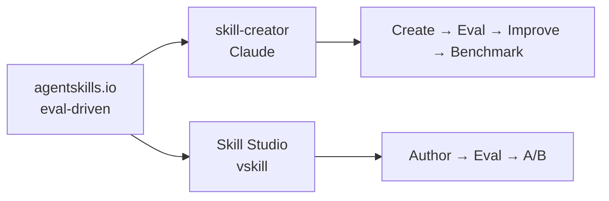
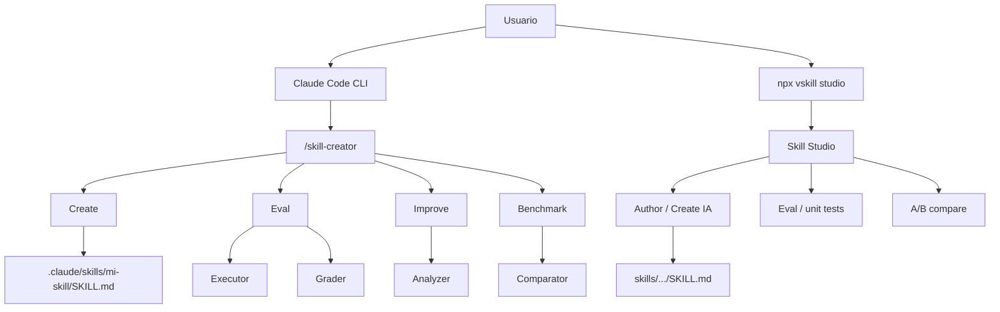

# Laboratorio 2B: Creación de skills

## Objetivo

Crear skills propias desde cero y cerrar el ciclo de calidad **crear → probar → mejorar** (método [eval-driven](https://agentskills.io/skill-creation/evaluating-skills)) con el plugin oficial `skill-creator` de Anthropic. Como **alternativa con interfaz gráfica**, también puedes usar [**vskill**](https://github.com/anton-abyzov/vskill) / **Skill Studio** para creación asistida por IA, unit tests (evals) y comparación A/B.

Al final de esta parte podrás:

1. Crear una skill con frontmatter YAML y cuerpo Markdown en `.claude/skills/`.
2. Generar la estructura inicial de una skill con el modo Create de `skill-creator`.
3. Evaluar e iterar una skill con los modos Eval, Improve y Benchmark.
4. *(Alternativa)* Usar Skill Studio para autoría asistida, generar pruebas unitarias/evals y correr A/B (con vs. sin skill).

**Prerrequisitos:**

- [Parte 1: Fundamentos de skills](../fundamentos/README.md) — prompt vs. skill, anatomía y scopes, uso de `/daily-summary`.
- Claude Code CLI instalado y autenticado.
- Esta carpeta (`creacion/`) abierta como **workspace** (Cursor o terminal en la carpeta del lab).
- *(Solo si usas la alternativa vskill)* Node.js 18+ y una API key de proveedor LLM (p. ej. Anthropic) para evals/A/B en Studio.

**Material técnico del laboratorio:** configuración local en [`.claude/settings.local.json`](./.claude/settings.local.json) (plugin `skill-creator` habilitado). Skills de ejemplo opcionales en [`skills/`](./skills/).

---

## Marco teórico

### Evaluación dirigida por evals (estándar Agent Skills)

Probar una skill “una vez en el chat y parece que funciona” no responde: ¿es fiable con prompts distintos?, ¿cubre edge cases?, ¿es mejor que no tener skill? El estándar abierto **[Evaluating skill output quality](https://agentskills.io/skill-creation/evaluating-skills)** (Agent Skills) define un bucle **eval-driven** que es el marco conceptual de este laboratorio:

1. **Diseñar casos de prueba** — cada caso tiene *prompt* realista, *expected output* (qué es éxito) y, opcionalmente, *input files*. Se guardan en `evals/evals.json` dentro del directorio de la skill.
2. **Correr baseline** — ejecutar cada caso **con** la skill y **sin** ella (o contra una versión anterior). Así mides impacto, no solo “pasó una vez”.
3. **Assertions y grading** — tras ver los primeros outputs, añades aserciones verificables (no “el output es bueno”). Un grader marca `PASS`/`FAIL` con evidencia concreta; puedes complementar con scripts para checks mecánicos (JSON válido, conteos, etc.).
4. **Agregar y analizar** — `benchmark.json` resume pass rate, tiempo y tokens (con vs. sin skill). Buscas patrones: aserciones que siempre pasan en ambos (ruido), que siempre fallan (caso/assertion rota), o que solo pasan con la skill (valor real). Alta varianza → instrucciones ambiguas.
5. **Revisión humana + iterar** — el humano captura lo que las aserciones no midieron; luego mejoras el `SKILL.md` (generalizar, mantenerlo lean, explicar el *porqué*) y repites en una nueva iteración.

| Idea del estándar | Por qué importa en el taller |
|-------------------|------------------------------|
| Pocos casos al inicio (2–3), variados | No sobreinvertir antes del primer feedback |
| Prompts realistas + un edge case | Evita tests demasiado vagos o “de laboratorio” |
| Comparación ciega (blind A/B) | Reduce sesgo de “esta versión debería ganar” |
| Timing / tokens | Una skill que mejora calidad pero triplica costo es otro trade-off |

En capas: **agentskills.io = el método**; las herramientas del lab = **cómo ejecutarlo**.



### Qué es `skill-creator`

`skill-creator` es el **plugin oficial de Anthropic** que **automatiza** gran parte del bucle anterior (la propia guía de Agent Skills lo cita como automatización del workflow). Cubre el ciclo de vida completo:

| Modo | Comando | Qué hace | Eco en agentskills.io |
|------|---------|----------|------------------------|
| **Create** | `/skill-creator` → Create | Genera la estructura inicial desde una descripción en lenguaje natural | Autoría del `SKILL.md` |
| **Eval** | `/skill-creator` → Eval | Ejecuta la skill contra casos de prueba y puntúa resultados | Casos + grading |
| **Improve** | `/skill-creator` → Improve | Sugiere mejoras basadas en evaluaciones previas | Iterar el skill con señales de eval |
| **Benchmark** | `/skill-creator` → Benchmark | Corre múltiples iteraciones y analiza varianza | Agregados / stddev / consistencia |

Internamente usa agentes compuestos alineados con ese método: **Executor** (prompts de prueba), **Grader** (assertions / outputs), **Comparator** (A/B ciego) y **Analyzer** (propone mejoras).

> **Nota:** En Claude Desktop y Claude Cowork, `skill-creator` viene preinstalado. En Claude Code CLI debes instalarlo o habilitarlo (ver Fase A).

Referencias: **[Extend Claude with skills](https://code.claude.com/docs/en/skills)** · skill-creator en [anthropics/skills](https://github.com/anthropics/skills/tree/main/skills/skill-creator).

### Alternativa: vskill / Skill Studio

**vskill** es un gestor de paquetes para skills de agentes. Su IDE local **Skill Studio** (`npx vskill@latest studio`) ofrece una UI en localhost para el **mismo ciclo de calidad** del estándar (evals + baseline A/B), con énfasis en interfaz asistida y veredicto explícito del juez:

| Capacidad | Qué hace | Eco en agentskills.io |
|-----------|----------|------------------------|
| **Author** | Generador asistido por IA + editor live de `SKILL.md` (motor Anthropic skill-creator o vskill nativo) | Autoría / iteración |
| **Eval** | Benchmarks pass/fail (SSE) — unit tests / evals de la skill | Casos + grading agregado |
| **A/B** | Misma prompt con vs. sin skill; juez LLM ciego: `EFFECTIVE` / `MARGINAL` / `INEFFECTIVE` / `DEGRADING` | Baseline + blind comparison |
| **Find / Publish** | Buscar e instalar desde el registry; publicar (opcional, fuera del mínimo del taller) | Distribución (fuera del bucle de eval) |

No reemplaza a `skill-creator`: es **otra implementación** del método eval-driven, útil si prefieres UI, multi-proveedor o el flujo visual de A/B.

#### Resumen rápido: instalar y usar vskill

| Acción | Comando |
|--------|---------|
| Abrir Skill Studio | `npx vskill@latest studio` |
| Instalar CLI global (opcional) | `npm i -g vskill` |
| Guardar API key (evals / A/B) | `npx vskill@latest keys set anthropic` |
| Crear skill por CLI | `npx vskill@latest skill new` |
| Instalar skill del registry | `npx vskill@latest install <nombre>` |
| Buscar skills | `npx vskill@latest find <query>` |

1. En la carpeta del lab: `npx vskill@latest studio` → workbench en `localhost`.
2. **Author** → describe la skill → elige motor → edita el `SKILL.md`.
3. Genera **evals**, ejecútalos y corre **A/B**; revisa el veredicto del juez.
4. Opcional: app de escritorio en [GitHub Releases](https://github.com/anton-abyzov/vskill/releases).

Docs: [Getting Started](https://verified-skill.com/docs/getting-started) · [anton-abyzov/vskill](https://github.com/anton-abyzov/vskill).

---

## Componentes del laboratorio

Diagrama de componentes de esta parte (camino principal + alternativa):



Estructura de archivos en esta parte:

```
creacion/
├── README.md                           # Este archivo
├── skills/                             # Ejemplos / práctica (opcional)
│   └── …/SKILL.md (+ evals/)
└── .claude/
    ├── settings.local.json             # Plugin skill-creator habilitado
    └── skills/                         # Skills locales del lab
```

---

## Pasos

### Preparación

1. Completa la [Parte 1: Fundamentos](../fundamentos/README.md) si aún no lo has hecho.
2. Abre la carpeta `etapa-1/laboratorios/skills/creacion` como workspace en Cursor (o navega ahí en tu terminal).

---

### Fase A — Instalar y verificar `skill-creator`

**Meta:** tener el plugin disponible antes de crear o evaluar skills.

1. Si aún no lo tienes instalado, desde Claude Code:

   ```prompt
   /plugin install skill-creator
   ```

   Alternativa con registry oficial:

   ```prompt
   /plugin install skill-creator@anthropic-agent-skills
   ```

2. En este laboratorio el plugin ya está referenciado en [`.claude/settings.local.json`](./.claude/settings.local.json). Verifica que Claude Code cargue esa configuración al abrir este directorio.

3. Comprueba la instalación:

   ```prompt
   /skill-creator
   ```

   Debes ver el menú con **Create**, **Eval**, **Improve** y **Benchmark**.

---

### Fase B — Crear una skill desde cero

**Meta:** construir tu propia skill aplicando la anatomía vista en la Parte 1.

1. **Opción manual:** crea la estructura a mano. Como ejercicio, recrea `daily-summary` (o una variante propia, p. ej. `/standup` o `/changelog`):

   ```powershell
   # Skill local al proyecto (versionada con git)
   mkdir .claude\skills\daily-summary
   ```

   O global (todos tus proyectos):

   ```powershell
   mkdir $env:USERPROFILE\.claude\skills\daily-summary
   ```

2. Crea `SKILL.md` dentro del directorio. El contenido mínimo debe incluir:
   - Frontmatter con `name` y `description`.
   - Pasos que invoquen `git log` para commits del día.
   - Formato de salida acotado (resumen en ~10 líneas).

   Puedes apoyarte en el ejemplo de la Parte 1: [`../fundamentos/.claude/skills/daily-summary/SKILL.md`](../fundamentos/.claude/skills/daily-summary/SKILL.md).

3. Verifica que Claude detecta la skill. Escribe `/` en el CLI y búscala en la lista.

4. Prueba la skill desde un repo con commits de hoy y comprueba que el output respeta el formato definido en `SKILL.md`.

5. **Opción con el plugin:** invoca `/skill-creator`, elige **Create** y describe en lenguaje natural una skill similar. Compara el `SKILL.md` generado con el que escribiste a mano: ¿qué secciones agregó el plugin que tú no consideraste?

---

### Fase C — Evaluar, mejorar y medir consistencia

**Meta:** cerrar el ciclo de calidad con `skill-creator` antes de compartir la skill con el equipo.

1. Ejecuta una evaluación formal:

   ```prompt
   /skill-creator
   ```

   Elige **Eval** e indica el nombre de tu skill (p. ej. `daily-summary`). Revisa la puntuación y los casos que fallaron.

2. Si el Eval señala mejoras, itera con **Improve**:

   ```prompt
   /skill-creator
   ```

   Elige **Improve** y describe qué salió mal (formato, agrupación, comandos git). Aplica los cambios sugeridos al `SKILL.md` y vuelve a ejecutar la skill.

3. **Opcional — benchmark:** para medir estabilidad antes de publicar la skill al equipo:

   ```prompt
   /skill-creator
   ```

   Elige **Benchmark** (p. ej. 10 runs). El **Analyzer** mostrará varianza; una skill muy inconsistente puede necesitar instrucciones más explícitas o ejemplos en el cuerpo del Markdown.

4. Reflexión breve (anota o discute en grupo):
   - ¿Qué parte de la skill controlas tú (Markdown versionado) y qué parte delegas al plugin (Eval/Improve)?
   - ¿Qué caso de prueba del Eval te sorprendió? ¿Cómo lo habrías detectado sin el plugin?

---

### Fase D (alternativa) — Skill Studio: UI, unit tests y A/B

**Meta:** recorrer el mismo ciclo con interfaz gráfica vía vskill, sin reemplazar las fases A–C.

1. Abre Studio desde esta carpeta:

   ```powershell
   npx vskill@latest studio
   ```

2. Configura la API key si hace falta:

   ```powershell
   npx vskill@latest keys set anthropic
   ```

3. En **Author / Create**, describe una skill (o reabre la de las fases anteriores). Elige motor Anthropic o vskill nativo; ajusta el `SKILL.md` en el editor.

4. Genera o edita **casos de prueba** (evals / unit tests) y ejecuta el benchmark. Revisa pass/fail e historial.

5. Corre **A/B compare** (con vs. sin skill) y anota el veredicto: `EFFECTIVE`, `MARGINAL`, `INEFFECTIVE` o `DEGRADING`. Itera el Markdown si el resultado no es bueno.

6. Opcional por CLI: `npx vskill@latest skill new` · `npx vskill@latest eval sweep <skill>`.

7. Compara con el camino Claude: ¿qué te resultó más claro en `/skill-creator` vs. en Studio (creación, evals, A/B)?

---

## Conclusiones de esta parte

- Crear una skill es escribir un contrato: frontmatter (`name`, `description`) más pasos, formato y límites explícitos en el cuerpo Markdown.
- El método de calidad es **eval-driven** ([agentskills.io](https://agentskills.io/skill-creation/evaluating-skills)): casos → con/sin skill → assertions/grading → benchmark → iterar.
- **`skill-creator`** aporta un ciclo Create → Eval → Improve → Benchmark que automatiza ese método en Claude; es la palanca principal del lab antes de compartir skills en equipo.
- **Skill Studio (vskill)** es una alternativa con UI para el mismo método (evals + A/B); no sustituye el estándar ni al plugin, solo otra forma de ejecutarlo.
- Evaluar con casos de prueba y medir varianza (Benchmark) o impacto (A/B) convierte la escritura de skills en un proceso iterativo con evidencia, no en prueba y error manual.
- Una skill lista para el equipo debería vivir en scope **proyecto** (`.claude/skills/`), pasar por PR y tener al menos una evaluación registrada.

Tras el taller, continúa con [Laboratorio 3: Ventana de contexto y atención](../../context/README.md) para entender cómo el tamaño y la selección de contexto afectan el comportamiento del agente cuando usas skills, reglas y recuperación de código.

---

## Referencias

| Tema | Fuente |
|------|--------|
| Eval-driven (estándar) | [Evaluating skill output quality — agentskills.io](https://agentskills.io/skill-creation/evaluating-skills) |
| Skills en Claude Code | [Extend Claude with skills](https://code.claude.com/docs/en/skills) |
| Plugin skill-creator | [Skill Creator Plugin](https://claude.com/plugins/skill-creator) |
| skill-creator (repo skills) | [anthropics/skills — skill-creator](https://github.com/anthropics/skills/tree/main/skills/skill-creator) |
| Registry oficial | [anthropics/claude-plugins-official — skill-creator](https://github.com/anthropics/claude-plugins-official/tree/main/plugins/skill-creator) |
| Skills públicas de ejemplo | [anthropics/skills](https://github.com/anthropics/skills) |
| Guía de creación | [How to create custom Skills — Help Center](https://support.claude.com/en/articles/12512198-how-to-create-custom-skills) |
| vskill (alternativa UI) | [anton-abyzov/vskill](https://github.com/anton-abyzov/vskill) |
| Skill Studio / Getting started | [verified-skill.com/docs/getting-started](https://verified-skill.com/docs/getting-started) |
| CLI vskill | [verified-skill.com/docs/cli-reference](https://verified-skill.com/docs/cli-reference) |
| Releases escritorio vskill | [vskill/releases](https://github.com/anton-abyzov/vskill/releases) |
