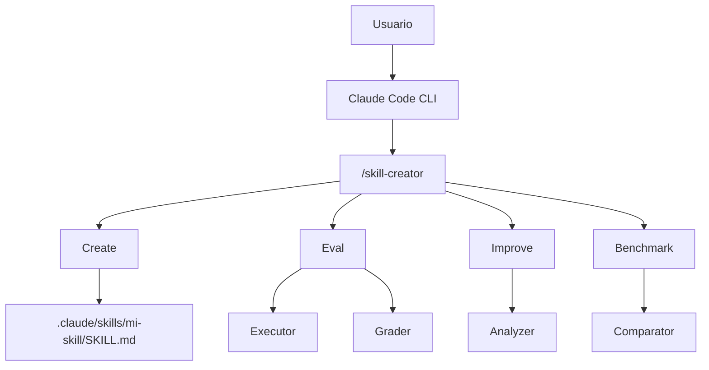

# Laboratorio 2B: Creación de skills

## Objetivo

Crear skills propias desde cero y cerrar el ciclo de calidad **crear → probar → mejorar** con el plugin oficial `skill-creator` de Anthropic.

Al final de esta parte podrás:

1. Crear una skill con frontmatter YAML y cuerpo Markdown en `.claude/skills/`.
2. Generar la estructura inicial de una skill con el modo Create de `skill-creator`.
3. Evaluar e iterar una skill con los modos Eval, Improve y Benchmark.

**Prerrequisitos:**

- [Parte 1: Fundamentos de skills](../fundamentos/README.md) — prompt vs. skill, anatomía y scopes, uso de `/daily-summary`.
- Claude Code CLI instalado y autenticado.
- Esta carpeta (`creacion/`) abierta como **workspace** (Cursor o terminal en la carpeta del lab).

**Material técnico del laboratorio:** configuración local en [`.claude/settings.local.json`](./.claude/settings.local.json) (plugin `skill-creator` habilitado).

---

## Marco teórico

### Qué es `skill-creator`

`skill-creator` es el **plugin oficial de Anthropic** para desarrollar, evaluar y optimizar skills. Cubre el ciclo de vida completo:

| Modo | Comando | Qué hace |
|------|---------|----------|
| **Create** | `/skill-creator` → Create | Genera la estructura inicial desde una descripción en lenguaje natural |
| **Eval** | `/skill-creator` → Eval | Ejecuta la skill contra casos de prueba y puntúa resultados |
| **Improve** | `/skill-creator` → Improve | Sugiere mejoras basadas en evaluaciones previas |
| **Benchmark** | `/skill-creator` → Benchmark | Corre múltiples iteraciones y analiza varianza |

Internamente usa agentes compuestos: **Executor** (ejecuta prompts de prueba), **Grader** (evalúa outputs), **Comparator** (A/B ciego) y **Analyzer** (propone mejoras).

> **Nota:** En Claude Desktop y Claude Cowork, `skill-creator` viene preinstalado. En Claude Code CLI debes instalarlo o habilitarlo (ver Fase A).

Referencia conceptual: **[Extend Claude with skills](https://code.claude.com/docs/en/skills)** (documentación oficial).

---

## Componentes del laboratorio

Diagrama de componentes de esta parte:



Estructura de archivos en esta parte:

```
creacion/
├── README.md                           # Este archivo
└── .claude/
    └── settings.local.json             # Plugin skill-creator habilitado
```

---

## Pasos

### Preparación

1. Completa la [Parte 1: Fundamentos](../fundamentos/README.md) si aún no lo has hecho.
2. Abre la carpeta `etapa-1/laboratorios/skills/creacion` como workspace en Cursor (o navega ahí en tu terminal).

---

### Fase A — Instalar y verificar `skill-creator`

**Meta:** tener el plugin disponible antes de crear o evaluar skills.

1. Si aún no lo tienes instalado, desde Claude Code:

   ```prompt
   /plugin install skill-creator
   ```

   Alternativa con registry oficial:

   ```prompt
   /plugin install skill-creator@anthropic-agent-skills
   ```

2. En este laboratorio el plugin ya está referenciado en [`.claude/settings.local.json`](./.claude/settings.local.json). Verifica que Claude Code cargue esa configuración al abrir este directorio.

3. Comprueba la instalación:

   ```prompt
   /skill-creator
   ```

   Debes ver el menú con **Create**, **Eval**, **Improve** y **Benchmark**.

---

### Fase B — Crear una skill desde cero

**Meta:** construir tu propia skill aplicando la anatomía vista en la Parte 1.

1. **Opción manual:** crea la estructura a mano. Como ejercicio, recrea `daily-summary` (o una variante propia, p. ej. `/standup` o `/changelog`):

   ```powershell
   # Skill local al proyecto (versionada con git)
   mkdir .claude\skills\daily-summary
   ```

   O global (todos tus proyectos):

   ```powershell
   mkdir $env:USERPROFILE\.claude\skills\daily-summary
   ```

2. Crea `SKILL.md` dentro del directorio. El contenido mínimo debe incluir:
   - Frontmatter con `name` y `description`.
   - Pasos que invoquen `git log` para commits del día.
   - Formato de salida acotado (resumen en ~10 líneas).

   Puedes apoyarte en el ejemplo de la Parte 1: [`../fundamentos/.claude/skills/daily-summary/SKILL.md`](../fundamentos/.claude/skills/daily-summary/SKILL.md).

3. Verifica que Claude detecta la skill. Escribe `/` en el CLI y búscala en la lista.

4. Prueba la skill desde un repo con commits de hoy y comprueba que el output respeta el formato definido en `SKILL.md`.

5. **Opción con el plugin:** invoca `/skill-creator`, elige **Create** y describe en lenguaje natural una skill similar. Compara el `SKILL.md` generado con el que escribiste a mano: ¿qué secciones agregó el plugin que tú no consideraste?

---

### Fase C — Evaluar, mejorar y medir consistencia

**Meta:** cerrar el ciclo de calidad con `skill-creator` antes de compartir la skill con el equipo.

1. Ejecuta una evaluación formal:

   ```prompt
   /skill-creator
   ```

   Elige **Eval** e indica el nombre de tu skill (p. ej. `daily-summary`). Revisa la puntuación y los casos que fallaron.

2. Si el Eval señala mejoras, itera con **Improve**:

   ```prompt
   /skill-creator
   ```

   Elige **Improve** y describe qué salió mal (formato, agrupación, comandos git). Aplica los cambios sugeridos al `SKILL.md` y vuelve a ejecutar la skill.

3. **Opcional — benchmark:** para medir estabilidad antes de publicar la skill al equipo:

   ```prompt
   /skill-creator
   ```

   Elige **Benchmark** (p. ej. 10 runs). El **Analyzer** mostrará varianza; una skill muy inconsistente puede necesitar instrucciones más explícitas o ejemplos en el cuerpo del Markdown.

4. Reflexión breve (anota o discute en grupo):
   - ¿Qué parte de la skill controlas tú (Markdown versionado) y qué parte delegas al plugin (Eval/Improve)?
   - ¿Qué caso de prueba del Eval te sorprendió? ¿Cómo lo habrías detectado sin el plugin?

---

## Conclusiones de esta parte

- Crear una skill es escribir un contrato: frontmatter (`name`, `description`) más pasos, formato y límites explícitos en el cuerpo Markdown.
- **`skill-creator`** aporta un ciclo Create → Eval → Improve → Benchmark con agentes especializados; es la palanca para calidad antes de compartir skills en equipo.
- Evaluar con casos de prueba y medir varianza (Benchmark) convierte la escritura de skills en un proceso iterativo con evidencia, no en prueba y error manual.
- Una skill lista para el equipo debería vivir en scope **proyecto** (`.claude/skills/`), pasar por PR y tener al menos una evaluación registrada.

Tras el taller, continúa con [Laboratorio 3: Ventana de contexto y atención](../../context/README.md) para entender cómo el tamaño y la selección de contexto afectan el comportamiento del agente cuando usas skills, reglas y recuperación de código.

---

## Referencias

| Tema | Fuente |
|------|--------|
| Skills en Claude Code | [Extend Claude with skills](https://code.claude.com/docs/en/skills) |
| Plugin skill-creator | [Skill Creator Plugin](https://claude.com/plugins/skill-creator) |
| Registry oficial | [anthropics/claude-plugins-official — skill-creator](https://github.com/anthropics/claude-plugins-official/tree/main/plugins/skill-creator) |
| Skills públicas de ejemplo | [anthropics/skills](https://github.com/anthropics/skills) |
| Guía de creación | [How to create custom Skills — Help Center](https://support.claude.com/en/articles/12512198-how-to-create-custom-skills) |
