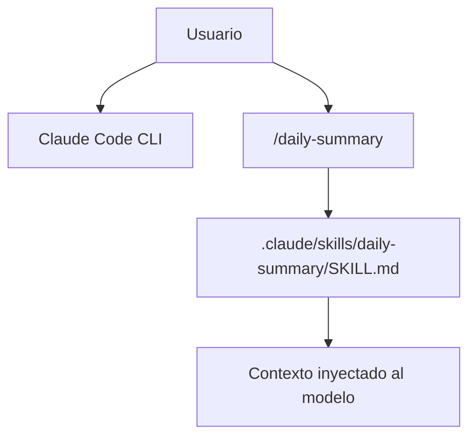

# Laboratorio 2A: Fundamentos de skills

## Objetivo

Entender la diferencia entre un **prompt** y una **skill**, conocer la estructura de una skill y trabajar con una skill ya creada (`/daily-summary`) en Claude Code.

Al final de esta parte podrás:

1. Explicar cuándo conviene un prompt puntual y cuándo una skill reutilizable.
2. Diferenciar slash commands nativos, skills personalizadas y plugins.
3. Leer la anatomía de una skill (frontmatter YAML + cuerpo Markdown) y sus scopes (proyecto vs. global).
4. Invocar y verificar el comportamiento de una skill existente.

**Prerrequisitos:**

- [Laboratorio 1: Agentes y subagentes](../../agents/README.md) — orquestación y delegación en Cursor.
- Opcional: [Laboratorio extra: Agent Loop](../../agent-loop/README.md) — marco teórico del bucle agente–herramientas.
- Claude Code CLI instalado y autenticado.
- Esta carpeta (`fundamentos/`) abierta como **workspace** (Cursor o terminal en la carpeta del lab).

**Material técnico del laboratorio:** skill de ejemplo en [`.claude/skills/daily-summary/SKILL.md`](./.claude/skills/daily-summary/SKILL.md).

---

## Marco teórico

### Prompt vs. skill

Un **prompt** es una instrucción efímera: la escribes, el modelo la ejecuta y se pierde al cerrar la sesión. Una **skill** es esa misma instrucción convertida en un artefacto persistente y versionable: la defines una vez en un archivo Markdown y la invocas cuantas veces quieras con `/nombre-de-tu-skill`.

| Dimensión | Prompt | Skill |
|-----------|--------|-------|
| **Persistencia** | Vive solo en la conversación | Archivo en el repo o en tu perfil |
| **Reutilización** | Copiar/pegar manual | Invocación con `/nombre` |
| **Versionado** | No | Sí, junto al código (git, PRs) |
| **Compartible con el equipo** | Por chat o documentos | Automático al clonar el repo |
| **Consistencia** | Depende de cómo lo redactes cada vez | Mismo contrato en cada invocación |

Regla práctica: si te descubres escribiendo el mismo prompt más de dos veces, es candidato a skill.

```
/daily-summary     # ← skill de este laboratorio
/code-review       # ← skill de equipo (ejemplo)
/deploy            # ← skill de equipo (ejemplo)
```

### Skills vs. slash commands nativos vs. plugins

| Concepto | Qué es | Ejemplos |
|----------|--------|----------|
| **Slash commands nativos** | Lógica fija en el CLI; no personalizables | `/help`, `/clear`, `/model`, `/compact` |
| **Skills** | Archivos Markdown con instrucciones que tú defines | `/daily-summary`, `/review`, `/standup` |
| **Plugins** | Colección empaquetada de skills, agentes y hooks | `skill-creator`, `code-reviewer` |

### Anatomía de una skill

Cada skill vive en su propio directorio con al menos un archivo `SKILL.md`:

```
.claude/
└── skills/
    └── daily-summary/
        ├── SKILL.md          # requerido — instrucciones y metadatos
        ├── scripts/          # opcional — scripts ejecutables
        ├── references/       # opcional — documentación de contexto
        └── assets/           # opcional — plantillas, íconos, etc.
```

El **frontmatter YAML** (entre `---`) define el nombre del slash-command y la descripción. El **cuerpo Markdown** son las instrucciones que Claude sigue al invocar la skill:

```markdown
---
name: daily-summary
description: Genera un resumen de trabajo del día basado en los commits de git
---

# Daily Summary

## Instrucciones
1. Ejecuta `git log --since="midnight" ...`
2. ...
```

| Scope | Ruta | Cuándo usarla |
|-------|------|----------------|
| **Proyecto** (solo este repo) | `.claude/skills/<nombre>/` | Skills del equipo, versionadas con git |
| **Global** (todos los proyectos) | `~/.claude/skills/<nombre>/` | Skills personales de uso general |

Referencia conceptual: **[Extend Claude with skills](https://code.claude.com/docs/en/skills)** (documentación oficial).

---

## Componentes del laboratorio

Diagrama de componentes de esta parte:



Estructura de archivos en esta parte:

```
fundamentos/
├── README.md                           # Este archivo
└── .claude/
    └── skills/
        └── daily-summary/
            └── SKILL.md                # Skill de ejemplo del laboratorio
```

---

## Pasos

### Preparación

1. Abre la carpeta `etapa-1/laboratorios/skills/fundamentos` como workspace en Cursor (o navega ahí en tu terminal).
2. Confirma que tienes un repositorio git con al menos un commit reciente (para probar `/daily-summary` con datos reales).

---

### Fase A — El mismo trabajo como prompt

**Meta:** experimentar el costo de repetir instrucciones a mano antes de ver la alternativa persistente.

1. Abre Claude Code y pide un resumen del día escribiendo un prompt libre, por ejemplo:

   ```prompt
   Revisa los commits de hoy con git log y hazme un resumen del trabajo del día,
   agrupado por tema, con los archivos más modificados y próximos pasos.
   ```

2. Observa el resultado y cierra la sesión (`/clear` o nueva conversación).
3. Vuelve a pedir lo mismo sin mirar tu prompt anterior. Compara ambos outputs: el formato y el nivel de detalle probablemente varían, porque el contrato vive solo en tu memoria.

---

### Fase B — El mismo trabajo como skill

**Meta:** entender cómo una skill inyecta instrucciones persistentes y cómo se invoca desde el CLI.

1. Revisa el contenido de [`.claude/skills/daily-summary/SKILL.md`](./.claude/skills/daily-summary/SKILL.md): frontmatter, instrucciones y formato de salida esperado. Comprueba que el `name` del frontmatter coincide con el comando `/daily-summary`.

2. Verifica que Claude detecta la skill. Escribe `/` en el CLI y busca `daily-summary` en la lista.

3. Prueba la skill desde un repo con commits de hoy:

   ```prompt
   /daily-summary
   ```

   Comprueba que el output respeta el formato definido en `SKILL.md` y agrupa commits por tema cuando sea posible.

   > Si no hay commits de hoy, la skill debe indicarlo y ofrecer alternativas (según las instrucciones del archivo).

4. Ejecuta `/daily-summary` una segunda vez (o en otra sesión) y compara con la Fase A: ahora el formato es estable porque el contrato vive en el archivo, no en tu memoria.

---

### Fase C — Diseccionar la skill

**Meta:** conectar cada sección del `SKILL.md` con el comportamiento observado.

1. Identifica en el `SKILL.md`:
   - Qué comando git ejecuta y con qué filtros.
   - Qué hace cuando no hay commits (caso borde explícito).
   - Qué límites impone al output (formato, longitud máxima).

2. Haz un cambio pequeño y controlado (p. ej. cambia el límite de líneas del resumen o agrega una sección al formato de salida), vuelve a invocar `/daily-summary` y verifica que el output refleja el cambio.

3. Reflexión breve (anota o discute en grupo):
   - ¿Qué instrucciones del `SKILL.md` hacen el output predecible? ¿Cuáles dejarías más abiertas?
   - ¿En qué situación preferirías scope **proyecto** frente a **global**?

---

## Conclusiones de esta parte

- Un **prompt** resuelve una necesidad puntual; una **skill** convierte esa necesidad en un contrato repetible, versionable y compartible con el equipo.
- Una **skill** encapsula instrucciones en Markdown; se invoca con `/nombre` y complementa (no sustituye) los slash commands nativos del CLI.
- El **frontmatter** (`name`, `description`) y el **cuerpo** definen el contrato de la skill; cuanto más explícitos sean formato, pasos y límites, más predecible será el comportamiento.
- El scope **proyecto** (`.claude/skills/`) permite alinear skills con el repo y revisarlas en PR; el scope **global** sirve para convenciones personales transversales.
- Las skills se relacionan con el **agent loop** (ver [Laboratorio extra](../../agent-loop/README.md)): son contexto persistente que el agente carga bajo demanda, similar en espíritu a reglas y prompts reutilizables en Cursor.

Continúa con la [Parte 2: Creación de skills](../creacion/README.md) para crear tus propias skills y cerrar el ciclo de calidad con `skill-creator`.

---

## Referencias

| Tema | Fuente |
|------|--------|
| Skills en Claude Code | [Extend Claude with skills](https://code.claude.com/docs/en/skills) |
| Skills públicas de ejemplo | [anthropics/skills](https://github.com/anthropics/skills) |
| Guía de creación | [How to create custom Skills — Help Center](https://support.claude.com/en/articles/12512198-how-to-create-custom-skills) |
