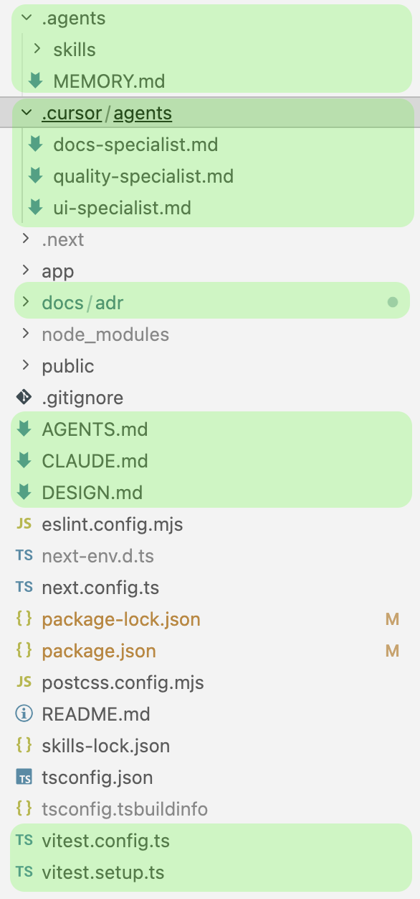
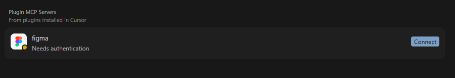
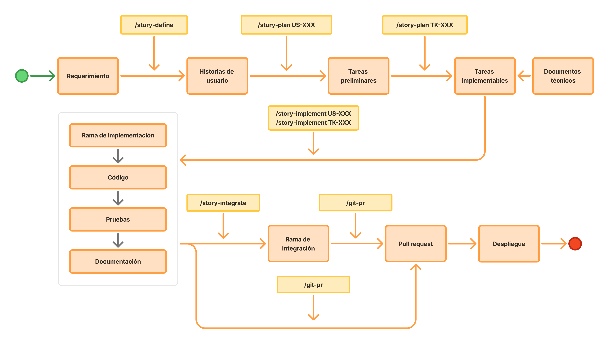
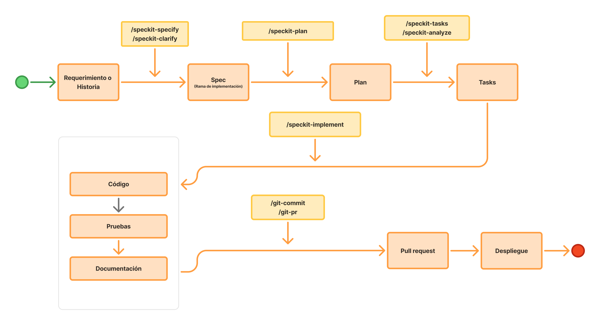
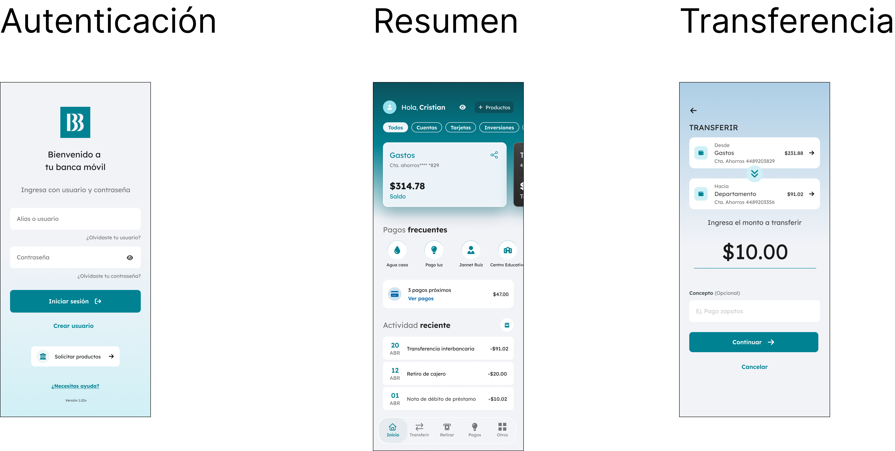

# ETAPA 2 - PRÁCTICA CONTROLADA CON EL INSTRUCTOR

# Objetivo

El objetivo de este taller de **SDD (Spec Driven Development)** es aterrizar en un flujo real los conceptos presentados previamente sobre desarrollo asistido por agentes de IA. A través de un enfoque práctico, se trabajará desde la construcción del **harness de agentes** —incluyendo archivos como `AGENTS.md`, `MEMORY.md`, Skills, Plugins, ADRs y documentos de diseño— para entender cómo estructurar el contexto, las reglas y las capacidades que utilizarán los agentes durante la implementación.

Posteriormente, el taller se enfocará en la creación de **Specs dentro de un flujo**, transformando requerimientos en documentación técnica, historias de usuario y tareas implementables. El objetivo es mostrar cómo SDD permite pasar de conceptos teóricos a un proceso más estructurado, consistente y preparado para iteraciones de desarrollo guiadas por IA.

## Pre-requisitos

- Cursor v3.3+ instalado: [https://cursor.com/](https://cursor.com/)
- Nodejs v22+ instalado: [https://nodejs.org/en](https://nodejs.org/en)
- Cuenta de Figma creada: [https://www.figma.com/](https://www.figma.com/)
- Git instalado: [https://git-scm.com/install/](https://git-scm.com/install/)
- Github CLI (MAC: `brew install gh`, PC: `winget install --id GitHub.cli`)
- Speckit instalado: [https://github.com/github/spec-kit#-get-started](https://github.com/github/spec-kit#-get-started)

# Harness de agentes (SDD harness)

|  | Cursor | Claude Code | Codex | Github Copilot |
| --- | --- | --- | --- | --- |
| Instrucciones persistentes | AGENTS.md | CLAUDE.md | AGENTS.md | .github/copilot-instructions.md |
| Rules | .cursor/rules |  |  | .github/instructions |
| Skills | .cursor/skills .codex/skills .claude/skills .agents/skills | .claude/skills | .codex/skills .agents/skills | .github/skills .claude/skills .agents/skills |
| Hooks | .cursor/hooks | .claude/hooks | .agents/hooks .codex/hooks | .github/hooks |
| Subagents | .cursor/agents | .claude/agents | .codex/agents | .github/agents |
| MCP | .cursor/mcp.json | .mcp.json | .vscode/mcp.json | .codex/config.toml |
| ADRs | docs/adr/ | docs/adr/ |  | docs/adr/ (Agente especializado) |
| DESIGN.md |  | lo considera |  |  |

## Principales archivos



## AGENTS.md

Define **el comportamiento operativo y las reglas permanentes** que los agentes de IA deben seguir dentro del repositorio.

Es un archivo estable del proyecto y funciona como una política de ejecución para los agentes.

Su contenido debería cambiar únicamente cuando cambia el flujo de desarrollo, las reglas de ingeniería o la estrategia operativa del proyecto.

## MEMORY.md

Define **el contexto evolutivo y persistente** que los agentes deben recordar durante el desarrollo.

Es un archivo vivo que puede actualizarse automáticamente por los agentes o mediante instrucciones del usuario durante las sesiones de trabajo.

Su objetivo es conservar conocimiento relevante del proyecto sin convertirlo en documentación formal.

## Skills

Son **capacidades reutilizables y especializadas** que un agente puede aplicar para ejecutar tareas concretas de manera consistente, predecible y estandarizada.

Un skill encapsula conocimiento operativo, reglas, validaciones y pasos de ejecución para resolver un tipo específico de problema.

Su objetivo es evitar que el agente improvise continuamente la misma lógica y permitir que ciertas tareas se ejecuten siempre bajo el mismo criterio.

```bash
npx skills add https://github.com/vercel-labs/next-skills --skill next-best-practices
npx skills add https://github.com/juanca202/ai
```

Para explorar que skills te pueden servir en tu stack tecnológico podrias usar ese comando:

```bash
npx autoskills
```

También puedes consultar [skills.sh](https://www.skills.sh/): un directorio abierto de skills listos para instalar con `npx skills add`. Sirve para descubrir capacidades ya probadas por la comunidad y como referencia al diseñar los skills propios del proyecto.

## Plugins

Son extensiones que agregan capacidades adicionales al agente base. Funcionan como módulos especializados que permiten que la IA interactúe con sistemas externos, automatice tareas o incorpore nuevas herramientas dentro del flujo de trabajo.

- Buscar el plugin de Figma e instalarlo.
- Revisar que esté instalado el MCP y los Skills de Figma.



## ADRs (Architecture Decision Records)

Son documentos donde registras **decisiones arquitectónicas importantes** de un proyecto.

Sirven para: 

- Evitar perder el **“por qué”** de decisiones
- Mantener coherencia técnica
- Ayudar a humanos y agentes de IA a no romper arquitectura

Los ADRs se limitan a registrar la decisión y pueden incluir ejemplos básicos. Cuando la implementación implique complejidad técnica, se pueden utilizar **skills** para asegurar que la ejecución se realice correctamente y de forma consistente.

### **Ejercicio: Crear un ADR con el skill /adr-manage**

> **Biblioteca de componentes con Base UI**
> Usaremos **Base UI** (`@base-ui/react`) como biblioteca de componentes base del proyecto. Los primitivos de Base UI deben usarse **prioritariamente** frente a HTML nativo cuando exista un componente equivalente que cubra el caso (accesibilidad, teclado, ARIA, patrones compuestos). Solo cuando Base UI no ofrezca una pieza adecuada se evaluara HTML nativo u otra dependencia, documentando la excepcion.
> La documentacion del paquete y el indice orientado a LLMs estan en Base UI - documentacion.


## DESIGN.md

Define el **sistema de diseño compartido** del proyecto para que humanos y agentes de IA generen interfaces consistentes.

Su objetivo es centralizar las reglas visuales, patrones de UX y convenciones de UI que deben respetarse durante la generación o implementación de interfaces.

`DESIGN.md` funciona como la fuente de verdad del diseño del producto.

- Extraer DESIGN.md con [https://designmd.me/](https://designmd.me/)

**Escribir en el chat:** Puedes generar un theme de tailwindcss con @DESIGN.md en @src/theme/index.css 

# Specs

Su objetivo es transformar una necesidad de negocio en tareas implementables, verificables y desplegables.

- Libre de ambigüedades
- Sin decisiones pendientes
- Incluye los insumos necesario


| Framework | Contexto                      | Verbosidad típica | Curva de aprendizaje |
| --------- | ----------------------------- | ----------------- | -------------------- |
| Agile     | Stories + Tasks               | Baja              | Baja                 |
| Speckit   | Specs + Implementation Plans  | Media-Alta        | Media                |
| OpenSpec  | Specs + Change Proposals      | Media             | Media                |
| BMAD      | PRDs + Engineering Workflows  | Alta              | Alta                 |
| GSD       | Context + Execution State     | Baja-Media        | Media                |
| AgentOS   | Workflows + Cognitive Runtime | Media             | Media                |
| Kiro      | Intent + Structured Context   | Media             | Baja-Media           |


> **Tip:** En trabajo colaborativo, la documentación del requerimiento debe formar parte del repositorio para que el agente pueda utilizarla como contexto durante la implementación.
>
> La estrategia de organización depende de las unidades de trabajo involucradas:
>
> - Si existe una sola unidad de trabajo, la documentación puede mantenerse dentro del mismo repositorio.
> - Si el requerimiento involucra múltiples unidades de trabajo, la documentación puede mantenerse en un repositorio independiente y agregarse como submódulo en cada una de ellas.
>
> Las unidades de trabajo se refieren a los repositorios involucrados en el requerimiento.

## Flujo Agile



El flujo Agile de generación de Specs cubre todo el ciclo de trabajo, desde el ingreso del requerimiento hasta la publicación de la implementación. El proceso inicia con la definición del requerimiento, donde se transforma la necesidad funcional en historias de usuario claras y alineadas con los objetivos del proyecto mediante comandos como `/story-define`.

Una vez definidas las historias, se realiza una planificación progresiva. Primero se generan tareas preliminares con `/story-plan US-XXX`, permitiendo identificar el alcance técnico y las dependencias principales. Posteriormente, estas tareas evolucionan a tareas implementables mediante `/story-plan TK-XXX`, agregando el nivel de detalle necesario para que puedan ejecutarse de forma consistente por desarrolladores o agentes de IA.

Cada historia se implementa de manera aislada en una rama de implementación dedicada. Dentro de este flujo se desarrolla el código, se ejecutan pruebas y se actualiza la documentación asociada. Los comandos `/story-implement US-XXX` y `/story-implement TK-XXX` permiten mantener trazabilidad entre historias, tareas e implementación, facilitando además el trabajo paralelo y reduciendo conflictos entre cambios.

Finalmente, los cambios pasan por un proceso de integración y validación antes de su publicación. Mediante `/story-integrate`, los cambios se incorporan a la rama de desarrollo, donde se realizan revisiones de código y generación de Pull Requests usando `/code-review` y `/git-pr`. Esto permite mantener un flujo controlado, incremental y alineado entre especificación, implementación y despliegue.

## Flujo Speckit

Este flujo de Specification-Driven Development (SDD) con Speckit organiza el desarrollo en etapas claramente definidas para asegurar que cada cambio esté basado en una especificación verificable antes de escribir código.

El proceso inicia con un requerimiento o historia de usuario. A partir de este insumo, se utilizan los comandos /speckit-specify y /speckit-clarify para crear y refinar la especificación, definiendo el alcance, los requisitos y los criterios de aceptación.

Una vez aprobada la especificación, se ejecuta /speckit-plan para generar el plan técnico de implementación, donde se documentan las decisiones de diseño, arquitectura, dependencias y estrategia de pruebas.

Posteriormente, mediante /speckit-tasks y /speckit-analyze, el plan se transforma en un conjunto de tareas concretas y verificables que servirán como guía para la implementación.

Con las tareas definidas, /speckit-implement ejecuta el trabajo necesario para producir el código, las pruebas y la documentación requeridos por la especificación.

Finalmente, los cambios se preparan para revisión utilizando /git-commit y /git-pr, generando el Pull Request que, una vez aprobado, continúa hacia el despliegue. De esta forma, cada entrega mantiene una trazabilidad completa desde el requerimiento inicial hasta la solución implementada.



## Implementación de ejercicios

### To-Do List App

Este ejercicio introduce el flujo de **Specification-Driven Development (SDD)** en un escenario *greenfield*. Los objetivos son:

1. **Crear una aplicación desde cero**: levantar el proyecto base de la app de to-dos (estructura, dependencias y configuración inicial) sin código previo de referencia.
2. **Construir un harness simple para agentes**: definir el contexto mínimo que guiará al agente de IA durante la implementación —por ejemplo `AGENTS.md`, convenciones del proyecto y la estructura de carpetas para specs, historias y tareas.
3. **Ejecutar el flujo de implementación completo**: recorrer las etapas de SDD —definición de historia de usuario, planificación de tareas, detalle técnico, implementación e integración— usando el requerimiento descrito a continuación.

[Ejercicio 0: Todo list (Speckit)](greenfield/LB-000-todo-list.md)

### Banca Móvil App

Este ejercicio permite aplicar el flujo de **Specification-Driven Development (SDD)** en un escenario de desarrollo de una aplicación financiera. Los objetivos son:

1. **Implementar funcionalidades a partir de especificaciones existentes**: utilizar historias de usuario, tareas y detalles técnicos previamente definidos para construir las funcionalidades del sistema de manera incremental.

2. **Desarrollar las capacidades fundamentales de la aplicación**: implementar la pantalla de autenticación y el control de acceso.

3. **Construir la experiencia principal del usuario**: desarrollar la pantalla de posición consolidada como punto central de consulta, permitiendo visualizar la información financiera relevante de manera integrada.

4. **Implementar un flujo de negocio completo**: desarrollar el proceso de transferencia entre cuentas propias, incluyendo validaciones, interacción con servicios y actualización de la información presentada al usuario.

5. **Ejecutar el flujo de implementación guiado por especificaciones**: recorrer las etapas de análisis técnico, implementación, validación e integración de cada historia de usuario, utilizando agentes de IA como apoyo para la construcción de software alineada con las especificaciones definidas.

6. **Aplicar prácticas de desarrollo iterativo**: completar cada historia de usuario de forma incremental, verificando que los criterios de aceptación, las reglas de negocio y los requisitos técnicos sean satisfechos antes de avanzar a la siguiente funcionalidad.



[Ejercicio 1: Autenticación](greenfield/LB-001-implementacion-simple.md)

[Ejercicio 2: Posición consolidada](greenfield/LB-002-multiples-tareas.md)

[Ejercicio 3: Transferencia entre cuentas propias](greenfield/LB-003-nuevo-requerimiento.md)

[Ejercicio 4: Modificación](greenfield/LB-004-modificacion.md)
