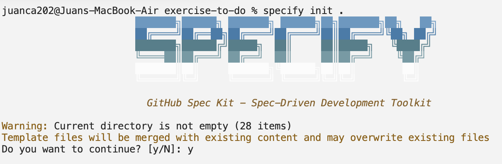
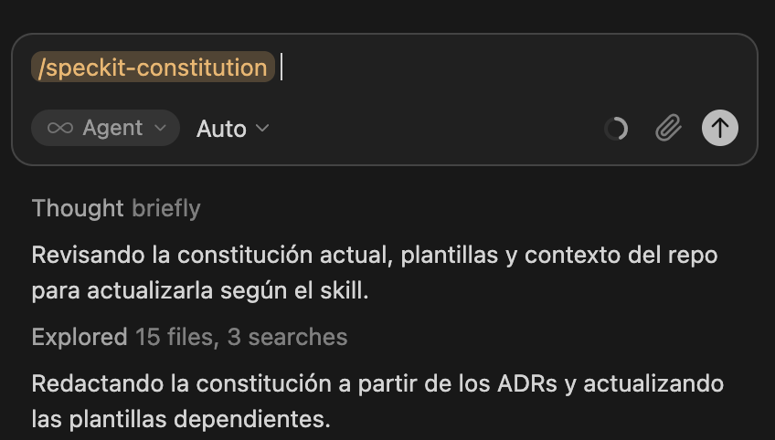
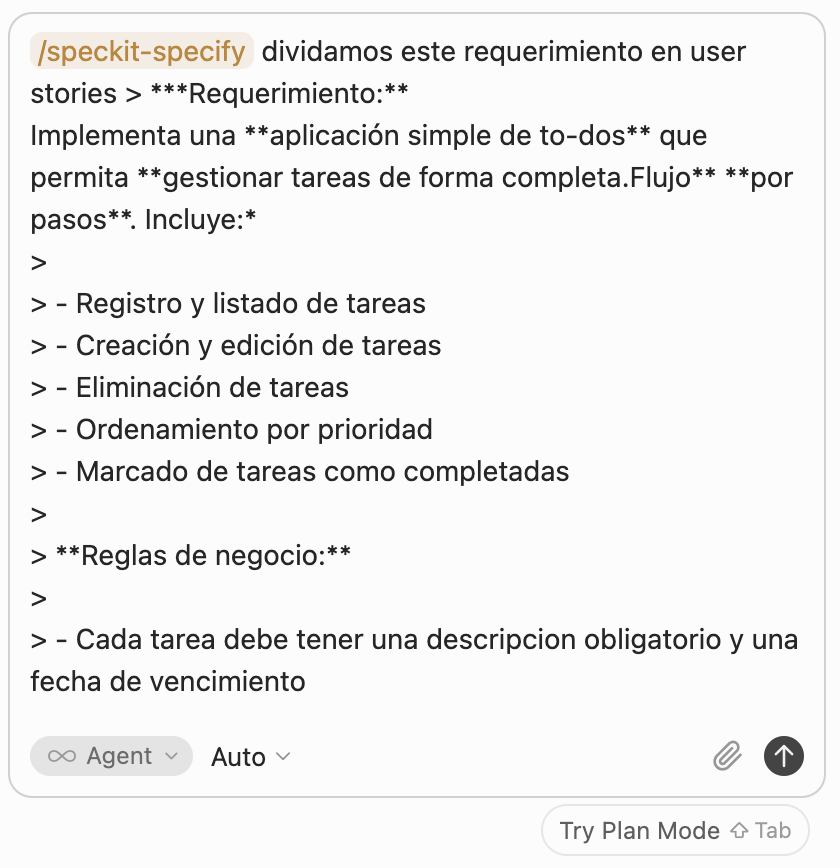
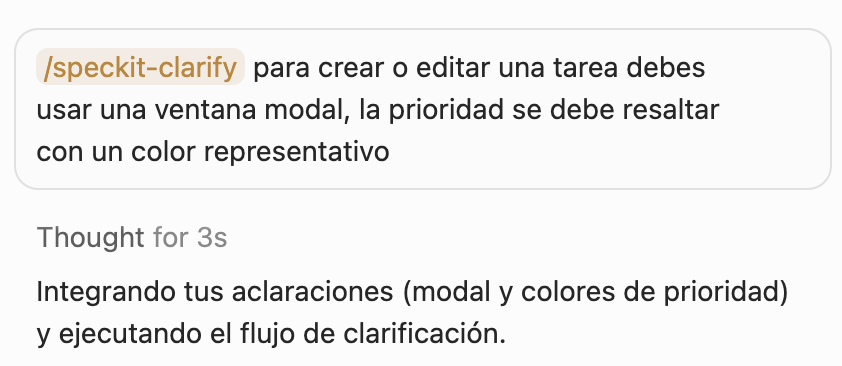
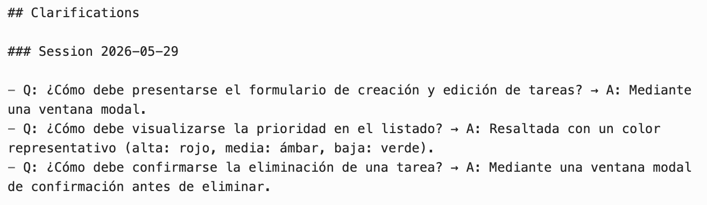
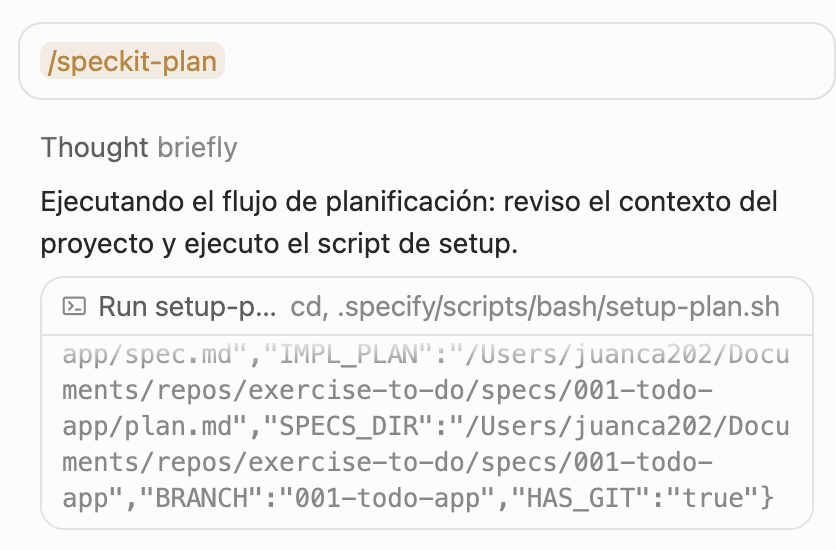
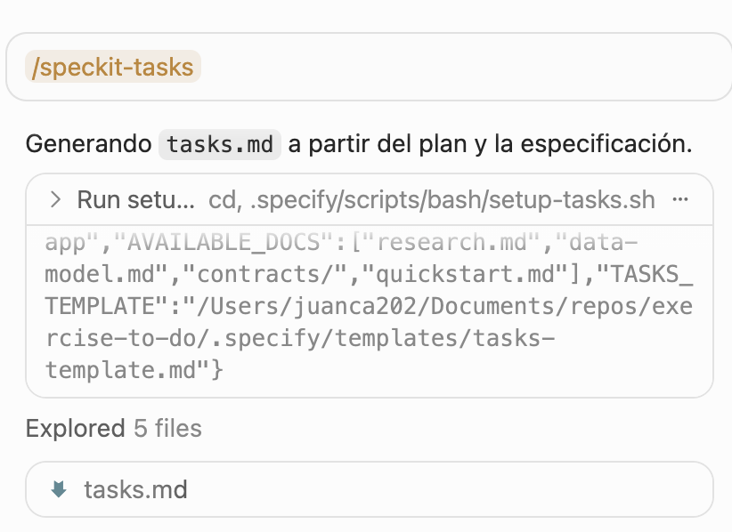
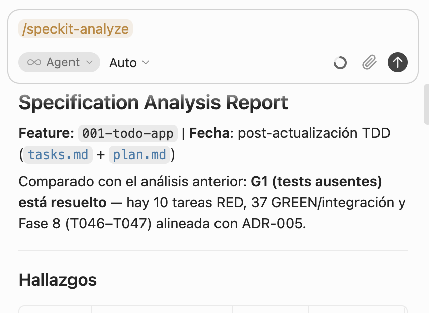
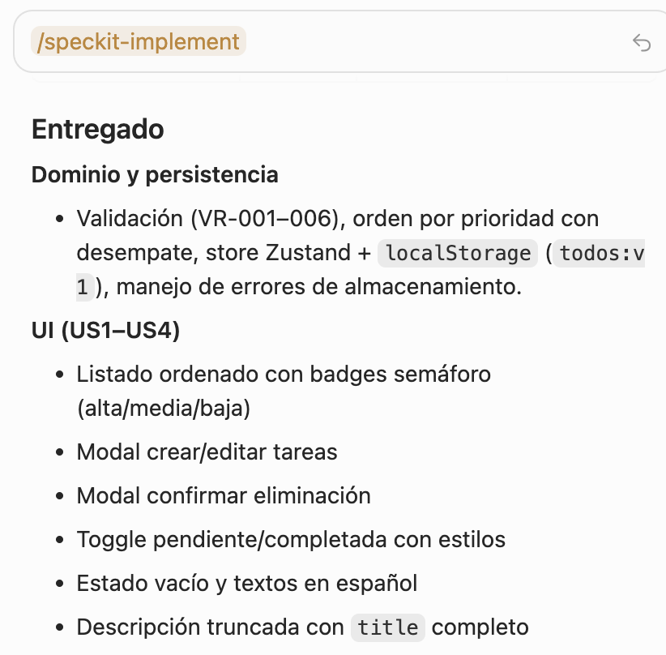

# Ejercicio 0: Implementación de una aplicación de To-Dos simple

> ***Requerimiento:** 
Implementa una **aplicación simple de to-dos** que permita **gestionar tareas de forma completa.** 
**Flujo** **por pasos**. Incluye:*
> 
> - Registro y listado de tareas
> - Creación y edición de tareas
> - Eliminación de tareas
> - Ordenamiento por prioridad
> - Marcado de tareas como completadas
> 
> **Reglas de negocio:** 
> 
> - Cada tarea debe tener una descripcion obligatorio y una fecha de vencimiento
> - La prioridad solo puede ser: alta, media o baja
> - Las tareas completadas deben distinguirse visualmente de las pendientes
> - El listado debe ordenarse por prioridad (alta → media → baja) de forma predeterminada
>
> **Consideraciones técnicas:** 
> - No requiere autenticación
> - La persistencia se hara usando localStorage
> - No existe backend

## Ejecución del flujo

# Paso 1: Descargar proyecto base y abrirlo en Cursor

```bash
git clone https://github.com/juanca202/exercise-to-do.git
```

Este proyecto base no es solo un *scaffold* de Next.js: ya trae un **harness para agentes de IA** — un conjunto de reglas, memoria, skills y subagentes especializados que orientan a Cursor (y herramientas compatibles) sobre **cómo trabajar en este repositorio**. El agente sabe dónde consultar decisiones, qué convenciones respetar y cuándo delegar en especialistas (UI, pruebas, documentación), reduciendo alucinaciones y desvíos respecto al stack real del proyecto.

## **`AGENTS.md` / `CLAUDE.md`**

Define el **orden obligatorio de consulta**:

1. `.agents/MEMORY.md` — memoria y preferencias del proyecto
2. `docs/adr/` — decisiones arquitectónicas
3. Preguntar al usuario si hay ambigüedad
4. Ofrecer persistir respuestas útiles en `MEMORY.md`

También indica el uso obligatorio de subagentes especializados para UI, testing y documentación.

## **Memoria del proyecto (`.agents/MEMORY.md`)**

Archivo vivo donde se guardan preferencias transversales. Hoy incluye, por ejemplo, `preferred language: es`, que otros artefactos (ADRs, TSDoc, specs) ya referencian como fuente de verdad.

## **Subagentes especializados (`.cursor/agents/`)**

Tres agentes con rol, alcance y contrato de salida definidos:

| **Agente** | **Rol** |
| --- | --- |
| **ui-specialist** | UI alineada al stack real del repo; lee `DESIGN.md` y convenciones vecinas |
| **quality-specialist** | Tests con Vitest + Testing Library, orientados a comportamiento observable |
| **docs-specialist** | Specs (US/TK), ADRs y documentación; sin tocar código |

Cada uno incluye un checklist de descubrimiento obligatorio antes de actuar.

## **Decisiones arquitectónicas (`docs/adr/`)**

ADRs ya aceptados que el agente puede consultar:

- App Router exclusivo
- Tailwind CSS
- Zustand para estado cliente
- Arquitectura por features (`src/features/`, `src/shared/`, etc.)
- Estrategia de pruebas con Vitest
- Base UI como librería de componentes
- TSDoc para documentación de API

## **Sistema de diseño (`DESIGN.md`)**

Tokens, paleta, tipografía y patrones UI que el **ui-specialist** debe aplicar al implementar interfaces.

## **Stack alineado con las decisiones**

El código base ya refleja las ADRs: Next.js 16, React 19, Tailwind 4, Zustand, Base UI, Vitest + Testing Library, Husky/commitlint y estructura `src/` preparada para features.

## Quality Gate

Para agentes de IA en SDD, el **Quality Gate** sirve como una barrera automática que controla si el agente puede continuar avanzando con cambios de código.

La utilidad principal es evitar que el agente:

- genere código roto
- introduzca regresiones
- haga merge de implementaciones incompletas
- “crea” que terminó cuando realmente no cumple la spec

En flujos con agentes, el quality gate funciona como una **validación objetiva, deterministica e independiente** del LLM.

Las etapas típicas son:

| **Etapa** | **Ejemplo de gate** |
| --- | --- |
| **Pre-commit** (local) | ESLint / Prettier en archivos staged |
| **Pre-push / CI** | Tests + lint + build |
| **Pre-merge** | Suite completa + cobertura mínima |

La herramienta (Vitest, ESLint) es el **mecanismo**; el quality gate es la **política** que la hace obligatoria.

| Herramienta | Objetivo |
| --- | --- |
| Lint | Calidad y estilo del código |
| Unit Test | Validar lógica aislada |
| E2E | Validar flujos completos |
| SonarQube | Medir calidad técnica global |

# Paso 2: Completar el Harness de agentes de IA

Conocimiento sobre framework

```bash
npx skills add https://github.com/vercel-labs/next-skills --skill next-best-practices
```

Habilidades utilitarias para la implementación con specs

```bash
npx skills add https://github.com/juanca202/ai
```

Instalación del Development Toolkit para SDD, en este caso Speckit

```bash
specify init .
```



Luego tienes que pedir la creación de la constitución:



## Paso 3: Llevar el requerimiento a historias de usuario

> ***Requerimiento:** 
Implementa una **aplicación simple de to-dos** que permita **gestionar tareas de forma completa.Flujo** **por pasos**. Incluye:*
> 
> - Registro y listado de tareas
> - Creación y edición de tareas
> - Eliminación de tareas
> - Ordenamiento por prioridad
> - Marcado de tareas como completadas
> 
> **Reglas de negocio:**
> 
> - Cada tarea debe tener una descripcion obligatorio y una fecha de vencimiento
> - La prioridad solo puede ser: alta, media o baja
> - Las tareas completadas deben distinguirse visualmente de las pendientes
> - El listado debe ordenarse por prioridad (alta → media → baja) de forma predeterminada
> 
> **Consideraciones técnicas:**
> 
> - No requiere autenticación
> - La persistencia se hara usando localStorage
> - No existe backend

Solicitamos al agente que nos proponga historias de usuario para la implementación: 



Si es necesario podemos usar el skill de clarificación para darle más detalle a la especificación:



La sesión de aclaración se agregará a la especificación y adicionalmente hace los cambios necesarios en el contenido.



## Paso 4: Creación de artefactos de planificación

En caso de estar conforme con la especificación se puede pasar a la planificación:



Esto crea los artefactos necesarios para posteriormente generar las tareas de implementación, los artefactos principales son:

| Archivo | Objetivo |
| --- | --- |
| `spec.md` | Define la funcionalidad |
| `checklists/requirements.md` | Valida calidad y completitud |
| `quickstart.md` | Explica cómo ejecutar y probar la feature |
| `research.md` | Resuelve incertidumbre técnica |
| `data-model.md` | Documentar entidades y relaciones |
| `plan.md` | Define como se va a ejecutar la implementación |

## Paso 5: Planificación de tareas

Debemos revisar todos los artefactos generados y a continuación pasar a la planificación de tareas:



Esto puede cambiar el contenido de los artefactos y podria quedar inconsistente, por tanto para asegurarnos de la consistencia de todo el Spec podemos ejecutar un análisis del Spec:



Si hay algun hallazgo importante del analisis podemos pedirle que nos ayude a correguirlo, con el proposito de tener el Spec listo para la implementación.

## Paso 6: Implementación de tareas

Ejecutar el skill de implementación:



## Paso 7: Despliegue

Luego de implementar si ya estamos conformes con el resultado y queremos pasar a los distintos ambientes de despliegue, podemos preparar la entrega en 2 pasos:

### Ejecutamos un Code Review


Esto ejecuta el suite completo de control y pruebas para garantizar la calidad del entregable si es necesario correcciones el agente los pruebe resolver proactivamente.

### Proponemos un Pull Request para el despliegue en ambientes


De esta manera hemos cubierto el proceso de desarrollo de punta a punta totalmente asistido por el agente de IA.

## Conclusión

Este laboratorio introduce **Specification-Driven Development (SDD)** en un escenario *greenfield* real: partes de un proyecto vacío, configuras el harness para agentes de IA y recorres el ciclo completo —desde el requerimiento hasta la implementación— usando **Speckit** como toolkit de especificación.

El flujo combina tres capas: el **proyecto base** (stack, ADRs y subagentes), el **harness ampliado** (skills y `specify init`) y los **artefactos de spec** (`spec.md`, `plan.md`, tareas, etc.) que guían al agente paso a paso. A diferencia de los ejercicios posteriores, aquí construyes tanto la aplicación como la infraestructura de contexto que la IA necesita para trabajar con criterio.

Al cerrar este ejercicio tendrás una app de to-dos funcional y un spec coherente listo para implementar; ese resultado es la base sobre la que se apoyan los laboratorios siguientes, donde el foco pasa de levantar el entorno a refinar historias, tareas e integración.