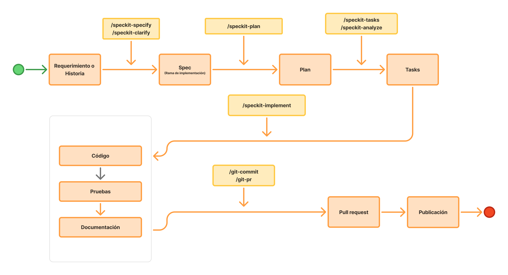

# Ejercicio 1: Implementación simple desde una historia con una tarea

# Paso 1: Descargar proyecto base y abrirlo en Cursor

```bash
git clone https://github.com/juanca202/exercise-mobile.git
```

Este proyecto base no es solo un *scaffold* de Next.js: ya trae un **harness para agentes de IA** — un conjunto de reglas, memoria, skills y subagentes especializados que orientan a Cursor (y herramientas compatibles) sobre **cómo trabajar en este repositorio**. El agente sabe dónde consultar decisiones, qué convenciones respetar y cuándo delegar en especialistas (UI, pruebas, documentación), reduciendo alucinaciones y desvíos respecto al stack real del proyecto.

## Ejecución del flujo

### Paso 1: Pasar el requerimiento a una Spec

Llama al skill de /speckit-specify incluyendo la historia de usuario y el documentos técnicos relacionados


### Paso 2: Planifica la implementación

Siguiente paso es ejecutar la planificación de la especificación:


### Paso 3: Crea las tareas de implementación


### Paso 4: Implementa el Spec


### Paso 3: Valida y corrige 

**Escribir en el chat:** usa el MCP de Figma y revisa que el diseño del html sea fiel al diseño de Figma si es necesario lo puedes rehacer



**Escribir en el chat:** Guarda en memoria persistente que en clases de tailwindcss con colores específicos preferir usar las variables desde @src/theme/index.css a colores fijos, lo mismo con espacios, tamaños, etc, no agregues nuevas variables al theme, si no encuentras una variable que se ajuste, deja la clase tal como esta