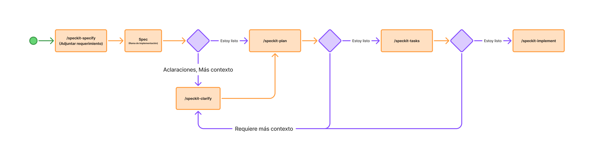
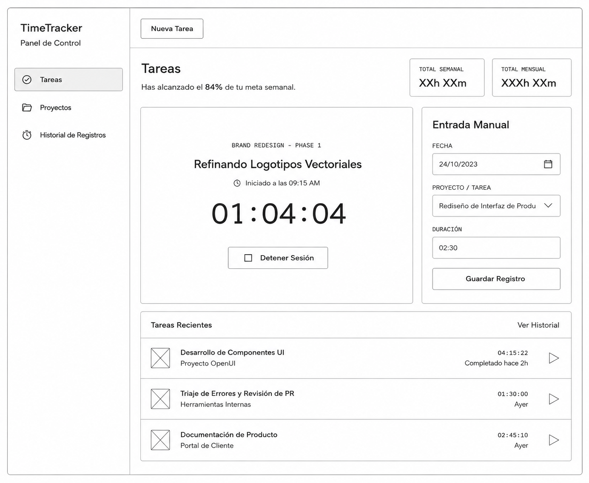
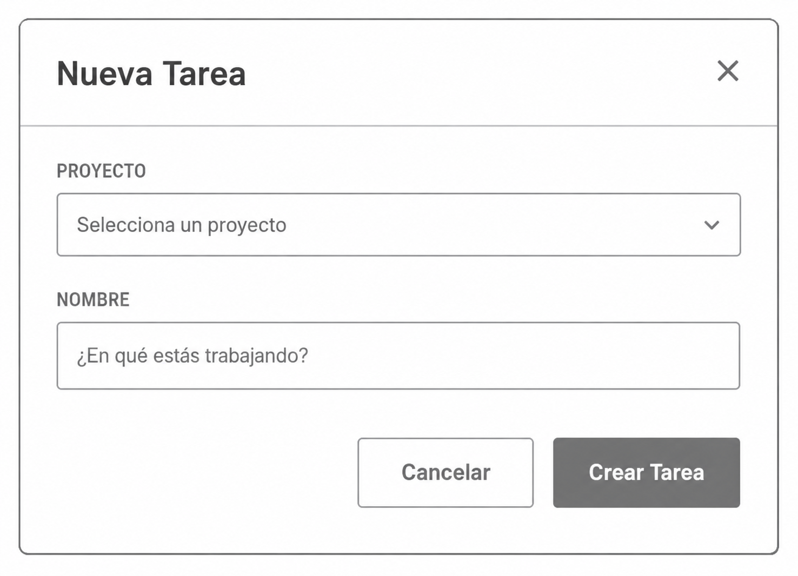
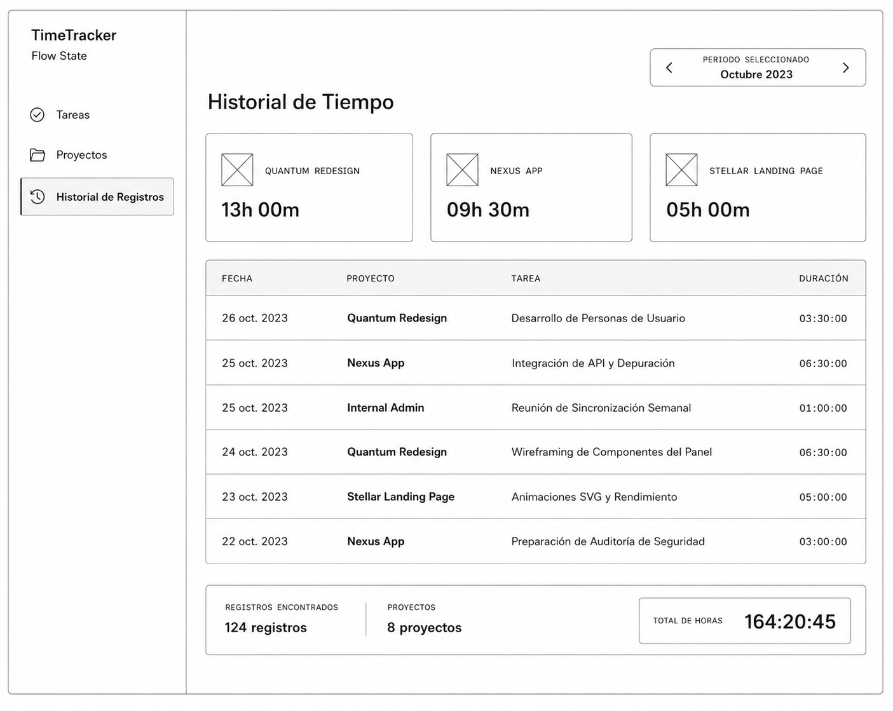
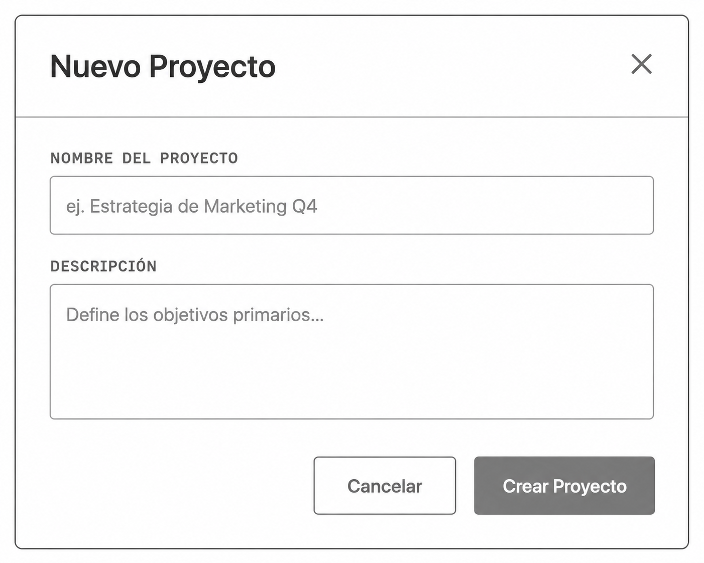

# Ejercicio 1: Implementación de una aplicación Time Tracker

> **¿Dudas antes de empezar?** Consulta el [FAQ de la etapa 2](../faq.md): insumos para la especificación, wireframes vs prototipos, ADRs y flujo con Speckit.

# Paso 1: Descargar proyecto base y abrirlo en Cursor

```bash
git clone https://github.com/juanca202/exercise-time-tracker.git
npm install
```

# Paso 2: Analizar si requerimos ADRs previos a la implementación

Analizamos el requerimiento, los elementos gráficos proporcionados y si es necesario establecer decisiones arquitectónicas (ADRs) previas a la implementación.

# Paso 3: Implementación usando SpeckKit



## Objetivo

Implementar una herramienta de uso personal para registrar el tiempo dedicado a tareas dentro de proyectos, ya sea en tiempo real (temporizador) o de forma diferida (manual), permitiendo visualizar los totales acumulados por mes.

Además del dominio funcional, el ejercicio practica el uso de **[DESIGN.md](../assets/DESIGN.md)** y **wireframes** como insumos de la especificación, de modo que la UI generada respete tokens, patrones y layout acordados antes de escribir código. 

## Alcance

El sistema resolverá exclusivamente el flujo principal:

- Creación de Proyectos y Tareas.
- Registro de tiempo automatizado (Iniciar/Detener temporizador).
- Registro de tiempo manual.
- Visualización de horas acumuladas e historial de datos.

## Reglas de Negocio

- **Persistencia:** Toda la información del sistema (Proyectos, Tareas y Registros) debe persistirse exclusivamente en el almacenamiento local del dispositivo, garantizando el funcionamiento sin conexión a internet (*offline-first*).
- **Estructura:** Un **Proyecto** contiene muchas **Tareas**. Una Tarea pertenece obligatoriamente a un único Proyecto.
- **Relación:** Un **Registro de Tiempo** pertenece obligatoriamente a una única Tarea.
- **Concurrencia:** El sistema solo puede tener un (1) temporizador activo ("en ejecución") a la vez en toda la aplicación.
- **Integridad (temporizador):** Los registros generados por el temporizador deben almacenar *Fecha, Hora Inicio, Hora Fin* y **Duración** (calculada a partir del intervalo entre inicio y fin). No se permiten duraciones menores o iguales a cero.
- **Integridad (manual):** Los registros manuales deben almacenar *Fecha* y **Duración** (ingresada por el usuario). *Hora Inicio* y *Hora Fin* no son obligatorias. No se permiten duraciones menores o iguales a cero.
- **Cálculos:** El total de horas de una Tarea es la suma de sus registros. El total de un Proyecto es la suma de las horas de todas sus tareas.

## Criterios de Aceptación

### **1. Gestión de Proyectos y Tareas**

- **Crear Proyecto:** El sistema debe permitir registrar un Proyecto en el almacenamiento local ingresando *Nombre* (obligatorio) y *Descripción* (opcional).
- **Crear Tarea:** El sistema debe permitir registrar una Tarea asociándola a un Proyecto existente, ingresando únicamente su *Nombre*.

### **2. Control de Tiempo Automatizado**

- **Iniciar Temporizador:** Al activar el temporizador en una tarea, el sistema guarda localmente el estado "En Ejecución" con la hora e identificador de la tarea actual.
- **Cambio Automático:** Si se inicia un temporizador mientras existe otro activo en otra tarea, el sistema debe **detener automáticamente el anterior** (calculando y guardando su registro de tiempo según *RN-04*) antes de iniciar el nuevo.
- **Detener Temporizador:** Al detener el temporizador activo, el sistema registra la *Hora Fin*, calcula la **Duración** a partir de la *Hora Inicio* y el instante de detención, y persiste el **Registro de Tiempo** de forma inmediata.

### **3. Ingreso Manual y Reportes**

- **Registro Manual:** El usuario puede crear un Registro de Tiempo directamente en una tarea ingresando *Tarea, Fecha* y **Duración**. No se requieren *Hora Inicio* ni *Hora Fin* en este flujo.
- **Visualización:** El sistema debe leer del almacenamiento y mostrar en la interfaz el historial de registros, así como los tiempos totales calculados por tarea y por proyecto.

## Referencia de diseño

### Sistema de diseño

- **[DESIGN.md](../assets/DESIGN.md)** (tema *Precision Focus*): sistema de diseño del laboratorio con paleta, tipografía, espaciado y patrones de componentes. Cópialo a la raíz del repositorio del time tracker antes de especificar o implementar.

### Wireframes

#### Tareas (panel principal)

Vista con temporizador activo, entrada manual y listado de tareas recientes.



#### Nueva Tarea

Modal para asociar una tarea a un proyecto existente.



#### Proyectos

Listado de proyectos con totales por proyecto. Reutiliza la navegación lateral y los patrones de tarjeta definidos en [DESIGN.md](../assets/DESIGN.md) y en los wireframes de Tareas e Historial.



#### Nuevo Proyecto

Modal de creación con nombre obligatorio y descripción opcional.



#### Historial de Registros

Vista de historial con selector de período, resumen por proyecto y tabla de registros.


## Conclusión

Este laboratorio consolida SDD en un segundo *greenfield* y suma una capa que el ejercicio 0 apenas introduce: **diseño como insumo de la spec**. [DESIGN.md](../assets/DESIGN.md) fija tokens y convenciones; los wireframes fijan layout y composición por pantalla. Sin ambos, el agente tiende a cumplir la lógica funcional pero improvisar la interfaz.

El aprendizaje central es que **funcionalidad y diseño deben especificarse juntos**: incluye [DESIGN.md](../assets/DESIGN.md) y wireframes en `/speckit-specify`, clarifica con `/speckit-clarify` y valida la UI antes de dar por cerrada la entrega.

Al terminar tendrás la app de time tracker implementada y habrás practicado cómo anclar a Speckit recursos visuales reutilizables. Eso prepara los ejercicios de **banca móvil** (2 en adelante), donde el diseño en Figma cumple un rol similar sobre historias ya definidas.