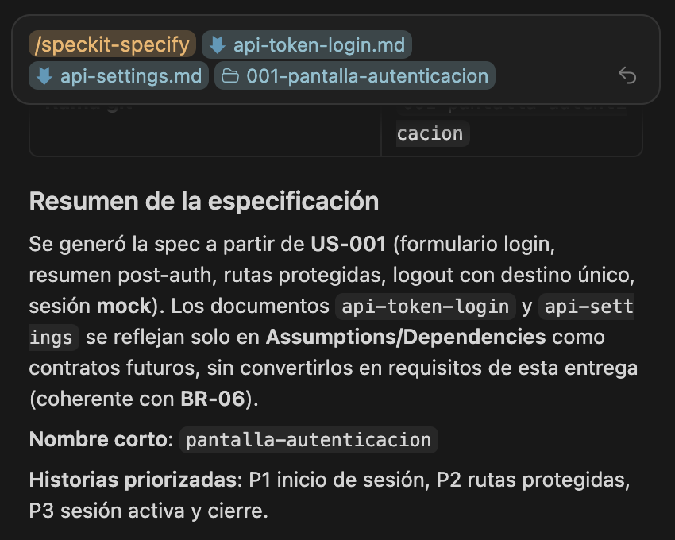
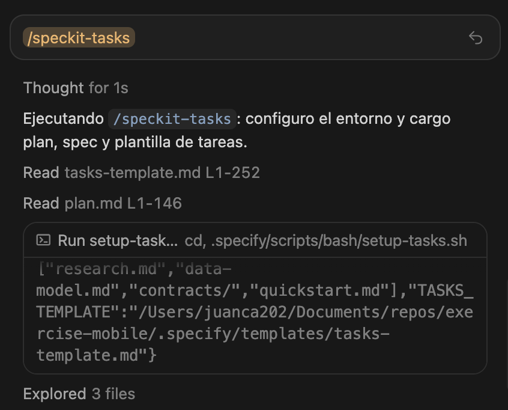
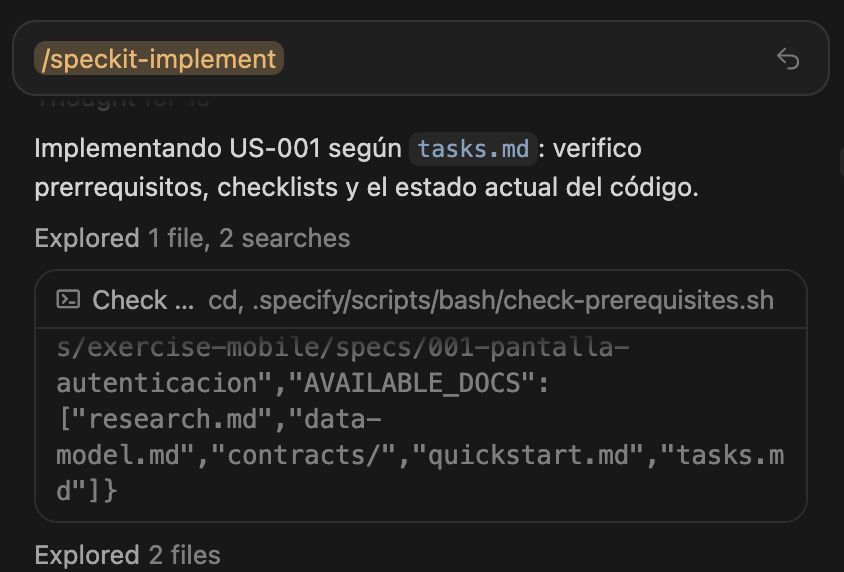
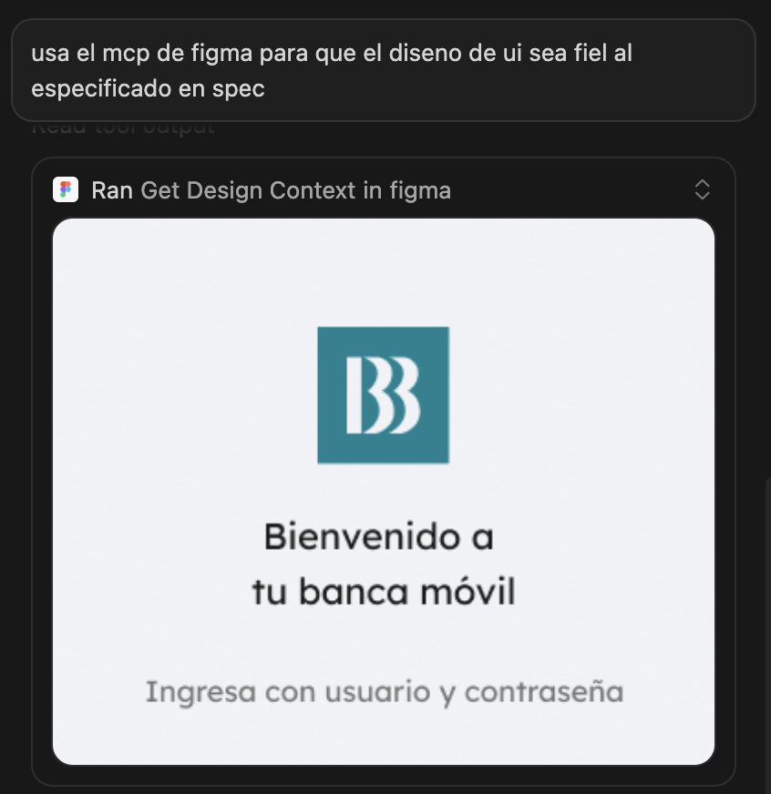

# Ejercicio 2: Implementación simple desde una historia con una tarea

# Paso 1: Descargar proyecto base y abrirlo en Cursor

```bash
git clone https://github.com/juanca202/exercise-mobile.git
npm install
```

Este proyecto base no es solo un *scaffold* de Next.js: ya trae un **harness para agentes de IA** — un conjunto de reglas, memoria, skills y subagentes especializados que orientan a Cursor (y herramientas compatibles) sobre **cómo trabajar en este repositorio**. El agente sabe dónde consultar decisiones, qué convenciones respetar y cuándo delegar en especialistas (UI, pruebas, documentación), reduciendo alucinaciones y desvíos respecto al stack real del proyecto.

## Ejecución del flujo

### Paso 1: Transformar Historia de Usuario en una Spec

Llama al skill de /speckit-specify incluyendo la historia de usuario y el documentos técnicos relacionados



### Paso 2: Planifica la implementación

Siguiente paso es ejecutar la planificación de la especificación:


### Paso 3: Crea las tareas de implementación



### Paso 4: Implementa el Spec



### Paso 3: Valida y corrige 

**Escribir en el chat:** usa el MCP de Figma y revisa que el diseño del html sea fiel al diseño de Figma si es necesario lo puedes rehacer



**Escribir en el chat:** los iconos no estan respetando las proporsiones, es necesario revisarlo nuevamente

**Escribir en el chat:** Guarda en memoria persistente que en clases de tailwindcss con colores específicos preferir usar las variables desde @src/app/globals.css a colores fijos, lo mismo con espacios, tamaños, etc, no agregues nuevas variables al theme, si no encuentras una variable que se ajuste, deja la clase tal como esta

## Conclusión

Este laboratorio aplica **Specification-Driven Development (SDD)** en el escenario más acotado de la app de banca móvil: una **historia de usuario ya definida con una sola tarea**. A diferencia de los ejercicios 0 y 1 —donde levantaste el harness y practicaste Speckit sobre un requerimiento nuevo en otro proyecto—, aquí el foco está en **ejecutar el flujo Speckit sobre documentación existente** y llevarla hasta código funcional.

El recorrido sigue las etapas del toolkit de especificación:

1. **Especificación** (`/speckit-specify`): la historia de usuario y los documentos técnicos del repositorio se transforman en una especificación con alcance, criterios de aceptación y requisitos verificables.
2. **Planificación** (`/speckit-plan`): se documenta la estrategia técnica —decisiones de diseño, dependencias y enfoque de pruebas— antes de escribir código.
3. **Tareas** (`/speckit-tasks`): el plan se descompone en trabajo concreto e implementable que guía al agente paso a paso.
4. **Implementación** (`/speckit-implement`): el agente produce la pantalla de autenticación alineada a la spec.
5. **Validación y corrección**: la persona revisa el resultado frente al diseño en Figma (vía MCP), corrige desvíos visuales —proporciones de iconos, fidelidad al layout— y refina convenciones del proyecto en memoria persistente.

El aprendizaje central es que **tener specs previas no elimina la revisión humana**: la primera implementación puede cumplir la lógica funcional y aun así desviarse del diseño o de las convenciones del proyecto. La fase de validación —comparar con Figma, iterar correcciones y persistir preferencias en `MEMORY.md`— cierra el ciclo y mejora las iteraciones siguientes.

Al terminar este ejercicio tendrás la **pantalla de autenticación** implementada y habrás practicado el camino más directo del flujo Speckit sobre un proyecto *greenfield* con harness ya configurado. Ese resultado es la base para los laboratorios siguientes, donde el alcance crece: pantallas con **múltiples tareas**, un **flujo de negocio multi-paso** con reglas de negocio y **modificaciones** sobre funcionalidades existentes.
