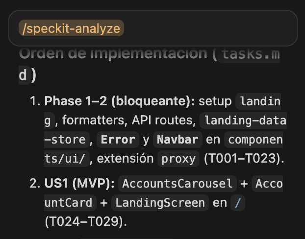
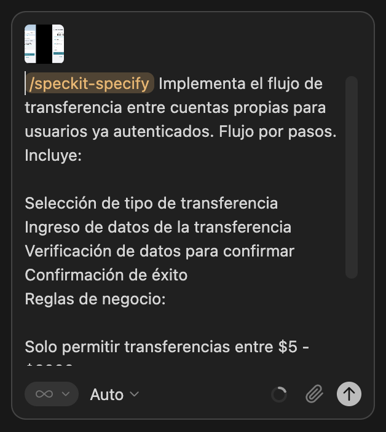
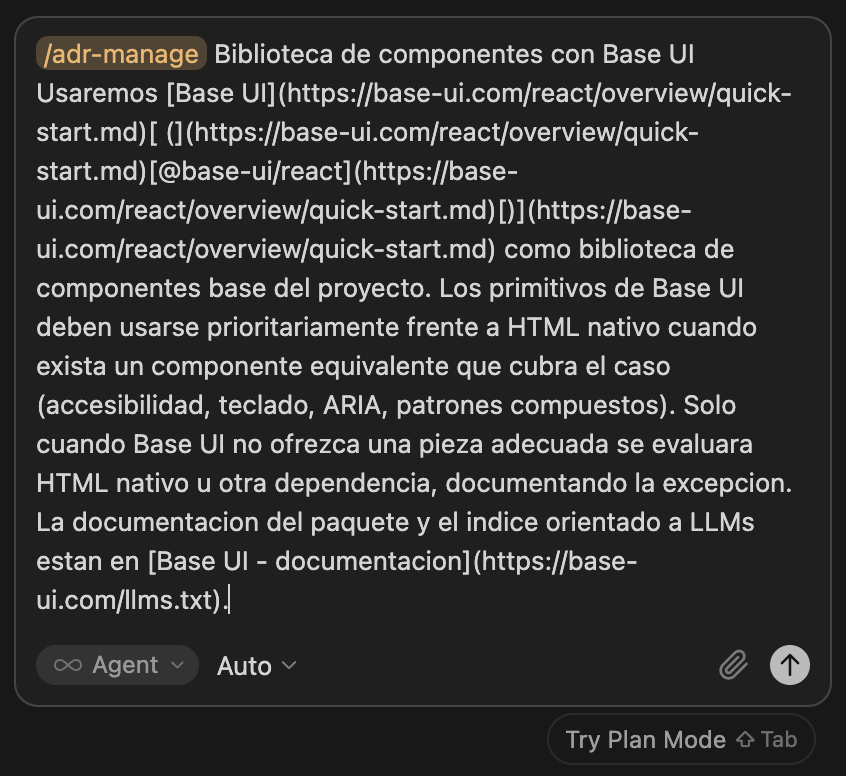
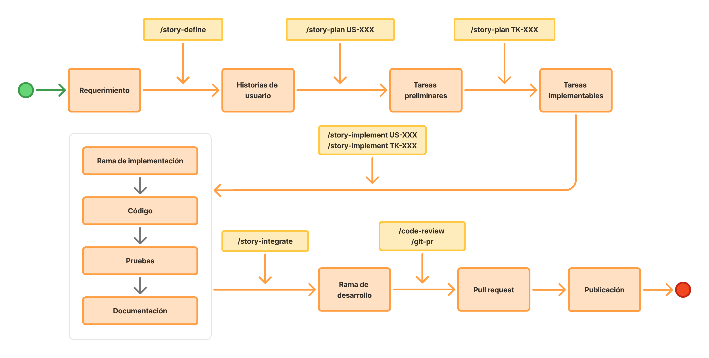
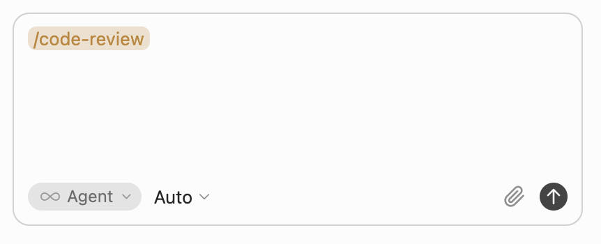
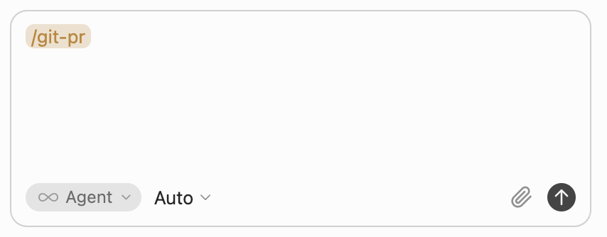

# Ejercicio 3: Transferencia entre cuentas propias

## Requerimiento

> Implementa el flujo de **transferencia entre cuentas propias** para **usuarios ya autenticados.**
> **Flujo por pasos**. Incluye:
>
> - Selección de tipo de transferencia
> - Ingreso de datos de la transferencia
> - Verificación de datos para confirmar
> - Confirmación de éxito
>
> **Reglas de negocio:**
>
> - Solo permitir transferencias entre $5 - $2000
>
> **Referencia de diseño**
>
> 
>
> Diseño de Figma: https://www.figma.com/design/7pt2W7JSic4ZoAVcgvQ5qD/Pantallas-taller-SDD

## Ejecución del flujo

### Paso 1: Transformar el requerimiento en una Spec

Invoca el skill `/speckit-specify` incluyendo el requerimiento anterior, el enlace de Figma y los documentos técnicos relacionados del repositorio (ADRs, convenciones, `DESIGN.md`, etc.).

Revisa la spec generada: debe cubrir los cuatro pasos del flujo, la regla de montos ($5–$2000) y los criterios de aceptación verificables antes de continuar.

### Paso 2: Planifica la implementación

Ejecuta la planificación de la especificación con `/speckit-plan`:

Durante la planificación, refina la spec con los siguientes prompts (ajusta según lo que proponga el agente):

**Escribir en el chat:** `/speckit-clarify` Incluir la referencias de diseno de las pantallas de flujo - **Paso 1 — Selección de tipo de transferencia:** [Figma node 36-1459](https://www.figma.com/design/7pt2W7JSic4ZoAVcgvQ5qD/Pantallas-taller-SDD?node-id=36-1459&m=dev)
- **Paso 2 — Ingreso de datos de la transferencia:** [Figma node 36-1794](https://www.figma.com/design/7pt2W7JSic4ZoAVcgvQ5qD/Pantallas-taller-SDD?node-id=36-1794&m=dev)
- **Paso 3 — Revisión y confirmación:** [Figma node 1-2920](https://www.figma.com/design/7pt2W7JSic4ZoAVcgvQ5qD/Pantallas-taller-SDD?node-id=1-2920&m=dev)
- **Paso 4 — Comprobante de éxito:** [Figma node 1-2984](https://www.figma.com/design/7pt2W7JSic4ZoAVcgvQ5qD/Pantallas-taller-SDD?node-id=1-2984&m=dev)

### Paso 3: Crea las tareas de implementación

### Paso 4: Analiza la coherencia entre artefactos

Ejecuta `/speckit-analyze` para revisar que la spec, el plan y las tareas estén alineados. Corrige las inconsistencias detectadas antes de implementar.

### Paso 5: Implementa el Spec

### Paso 6: Valida y corrige

Revisa que los criterios de aceptación se cumplan —en especial la regla de montos y la navegación entre los cuatro pasos. Si hay inconsistencias en UI, puedes pedir correcciones, por ejemplo:

**Escribir en el chat:** Usa el MCP de Figma y revisa que el diseño del HTML sea fiel al de Figma en cada paso del flujo; si es necesario, rehazlo.

**Escribir en el chat:** Verifica que el mensaje de error por monto fuera de rango ($5–$2000) sea visible y coherente con el diseño.

## Paso 7: Despliegue

Luego de implementar, si ya estamos conformes con el resultado y queremos pasar a los distintos ambientes de despliegue, podemos preparar la entrega en 2 pasos:

### Ejecutamos un Code Review

Esto ejecuta el suite completo de control y pruebas para garantizar la calidad del entregable; si es necesario, el agente puede resolver las correcciones de forma proactiva.

### Proponemos un Pull Request para el despliegue en ambientes

De esta manera hemos cubierto el proceso de desarrollo de punta a punta totalmente asistido por el agente de IA.

> **Alternativa — flujo Agile:** si prefieres levantar la historia desde cero con `/story-define`, `/story-plan` y `/story-implement`, sigue el laboratorio [LB-003 (Agile)](LB-003-transferencia-cuentas-propias-agile.md).

## Conclusión

Este laboratorio aplica **Specification-Driven Development (SDD)** al flujo de negocio más completo de la app de banca móvil: la **transferencia entre cuentas propias**, un asistente de varios pasos con validaciones de negocio y pantallas enlazadas en Figma.

El recorrido extiende el flujo Speckit de los ejercicios 1 y 2:

1. **Especificación** (`/speckit-specify`): el requerimiento, la referencia de Figma y la documentación técnica del repositorio se transforman en una especificación con alcance, criterios de aceptación y reglas de negocio verificables (montos, pasos del wizard).
2. **Planificación y clarificación** (`/speckit-plan` + `/speckit-clarify`): se refinan decisiones concretas —estructura del asistente de cuatro pasos, validación de montos, pantalla de resumen y de éxito— antes de que el agente genere código.
3. **Tareas** (`/speckit-tasks`): el plan se descompone en trabajo concreto que cubre cada paso del flujo y su integración con el resto de la app.
4. **Análisis de coherencia** (`/speckit-analyze`): se revisa que spec, plan y tareas describan el mismo alcance antes de implementar.
5. **Implementación** (`/speckit-implement`): el agente produce el flujo completo alineado a la spec refinada.
6. **Validación y corrección**: la persona revisa criterios funcionales y fidelidad visual frente a Figma (vía MCP), con especial atención a la regla $5–$2000 y a la navegación entre pasos.
7. **Despliegue**: code review automatizado y apertura de PR para integrar el entregable.

El aprendizaje central es que **un flujo de negocio multi-paso exige la misma disciplina de especificación que una pantalla única, pero con más puntos de clarificación**: nombres de pasos, validaciones, resumen previo a confirmar y rutas de salida deben quedar explícitos en la spec antes de implementar; de lo contrario, el agente improvisa transiciones o omite reglas de negocio.

Al terminar este ejercicio tendrás el **flujo de transferencia entre cuentas propias** implementado y habrás practicado cómo escalar Speckit de pantallas aisladas a un **proceso guiado por pasos con reglas de negocio**. Ese resultado prepara el terreno para el laboratorio siguiente: **modificaciones** sobre funcionalidades ya existentes.
