# Ejercicio 4 (alternativa Agile): Transferencia entre cuentas propias

> **Nota:** el laboratorio principal del ejercicio 4 usa el flujo Speckit. Consulta [LB-004-transferencia-cuentas-propias.md](LB-004-transferencia-cuentas-propias.md). Este documento conserva el flujo con `/story-define`, `/story-plan` y `/story-implement`.

## Objetivo

Implementar un requerimiento de negocio nuevo siguiendo el flujo completo de **Specification-Driven Development (SDD)**: definir la historia de usuario, planificar y detallar sus tareas técnicas, ejecutar la implementación e integrar el resultado. El punto de partida es el requerimiento descrito más abajo; el contexto del proyecto —harness de agentes, convenciones, referencias de diseño en Figma, ADRs y demás insumos técnicos ya disponibles— sustenta cada paso del proceso.

La persona revisa y valida cada hito antes de continuar (**Human-in-the-Loop**): alcance de la historia, granularidad de las tareas, detalle técnico y aceptación del código.

> ***Requerimiento:** 
Implementa el flujo de **transferencia entre cuentas propias** para **usuarios ya autenticados.** 
**Flujo** **por pasos**. Incluye:*
> 
> - Selección de tipo de transferencia
> - Ingreso de datos de la transferencia
> - Verificación de datos para confirmar
> - Confirmación de éxito
> 
> **Reglas de negocio:** 
> 
> - Solo permitir transferencias entre $5 - $2000
> 
> ***Referencia de diseño***
> 
> 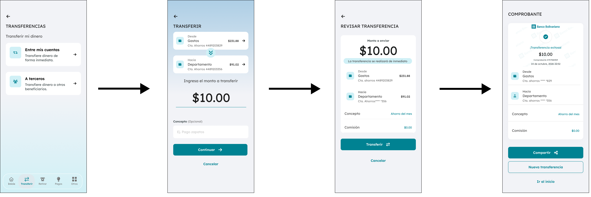
> 
> Diseño de Figma: https://www.figma.com/design/7pt2W7JSic4ZoAVcgvQ5qD/Pantallas-taller-SDD

## Ejecución del flujo

### Paso 1 - Definición de historia de usuario

Usamos el skill **/story-define** y le proporcionamos el requerimiento que necesitamos implementar. Como esta tarea requiere un **mayor nivel de razonamiento** para analizar y planificar correctamente la solución, es recomendable utilizar un modelo con capacidades avanzadas de razonamiento, como **Sonnet 4.6 Thinking**.

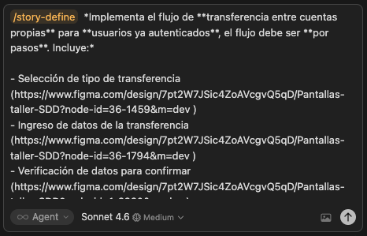

Al terminar la ejecución nos mostrará un pequeño resumen de lo creado. 

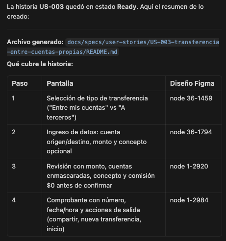

Dependiendo del modelo LLM que utilicemos —y considerando que los modelos LLM no son determinísticos, por lo que no siempre generan exactamente la misma respuesta—, el agente podría sugerir o no continuar con el paso de planificación de **Tareas preliminares**, siempre y cuando la historia de usuario pase las validaciones de **INVEST** y **DoR** y sea marcada como **Ready**, de no ser el caso es necesario aclarar las duda con el agente hasta que todos los criterios se marque que **“Cumple”**.

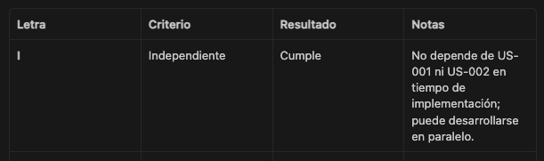

Verificar que todos los criterios en Resultado esté marcado como Cumple y que el estado de la historia esté en **Ready**

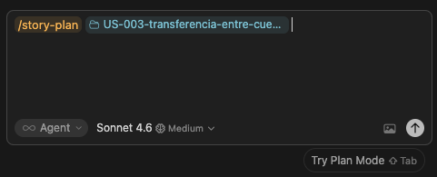

Si el agente pudo analizar y validar la historia sin requerir información adicional, podría sugerir continuar con el paso de planificación de tareas preliminares.

Antes de continuar, debes revisar completamente la historia de usuario y asegurarte de que cubra todos los criterios funcionales y requisitos esperados para la solución.

> **Nota:** este es un proceso continuo que debe realizarse cada vez que el agente finaliza una tarea. Este enfoque se conoce como ***Human-in-the-Loop***, donde una persona revisa, valida y guía el trabajo generado por la IA antes de continuar con el siguiente paso.
> 

### Paso 2 - Planificación preliminar de tareas

Si nos ofrece planificar las tareas le indicamos **“Continuar”**.

Si el proceso ya terminó en ese punto, puedes indicarle que utilice el skill **/story-plan** y proporcionarle la carpeta de la historia de usuario. Esto le indica al agente que debe analizar la historia y realizar una planificación preliminar de las tareas necesarias para su implementación.

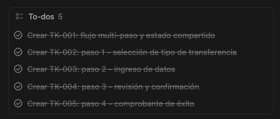

El agente analiza el requerimiento, las reglas de negocio y los criterios de aceptación de la historia. Con base en esa información, identifica las tareas necesarias para implementar la solución y crea el esqueleto inicial de cada tarea en estado **Draft**.

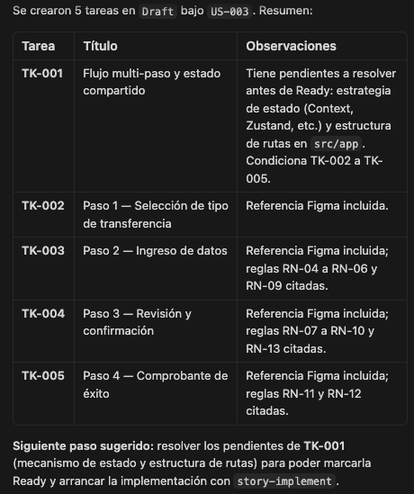

El proceso puede finalizar en ese punto o el agente puede sugerir continuar directamente con la implementación. Sin embargo, es importante tener en cuenta que las tareas no son realmente implementables si aún no cuentan con suficiente detalle técnico. Antes de iniciar la implementación, debemos enriquecer cada tarea con la información técnica necesaria para que el agente pueda ejecutarlas correctamente.

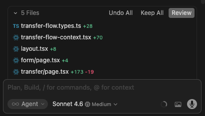

Debemos revisar si las tareas propuestas cubren completamente la implementación esperada. En caso contrario, podemos indicarle al agente que agregue tareas adicionales o realizar ajustes sobre las tareas sugeridas.

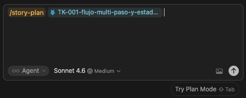

> **Tip:** Cada vez que el agente finaliza una tarea, mostrará las opciones **Undo all** y **Keep all**.
> 
> - Usa **Keep all** si deseas conservar y confirmar todos los cambios realizados hasta ese momento.
> - Usa **Undo all** si los cambios no cumplen con lo esperado y quieres que el agente descarte todo lo realizado para volver a empezar desde cero.

### Paso 3 - Planificación técnica tarea por tarea

Cuando estemos de acuerdo con las tareas a implementar, debemos agregar el detalle técnico de cada una. Lo más importante en esta etapa es definir claramente las **dependencias**, las **referencias** necesarias y el **plan de implementación** que seguirá el agente.

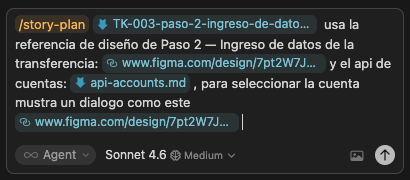

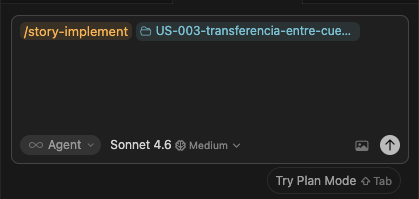

### Paso 4 - Implementación

Antes de continuar, debes revisar que el repositorio esté limpio sin cambios pendientes, y que todas las tareas a implementar estén en estado **Ready.**

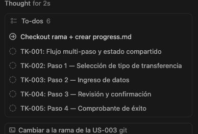

El agente te mostrara las tareas que tienes pendientes para implementar

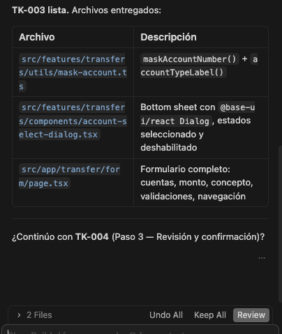

Al terminar cada tarea, el agente debe esperar tu revisión. Puedes iterar en cambios hasta que el resultado sea aceptable para ti. Una vez aprobado, puedes presionar **Keep all** antes de indicarle al agente que continúe con la siguiente tarea.

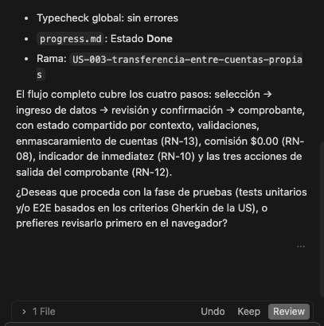

Al finalizar todas las tareas asignadas, puedes iniciar la fase de pruebas para completar la historia de usuario, indicando que deseas continuar.

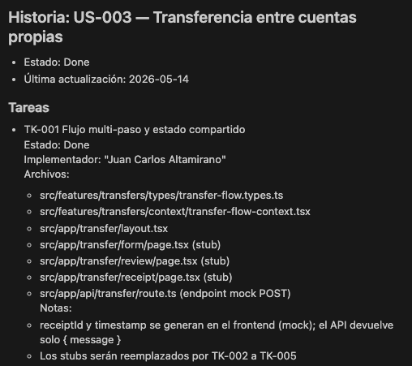

Si deseas conocer el estado de la implementación o quieres saber que se hizo en cada tarea, puedes abrir el archivo **progress.md** dentro de la carpeta de la historia de usuario.

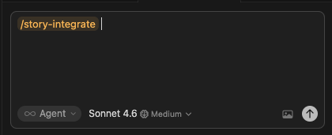

Aquí es el espacio para las últimas revisiones y validaciones si estas confirme con la implementación puedes continuar con el siguiente paso.

### Paso 5 - Integración

En este paso tienes que pasar tu historia implementada a tu rama de desarrollo y finaliza tu implementación.

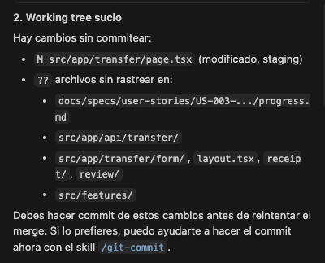

Si no has hecho commit el agente te puede asistir en eso previo a la integración a tu rama de desarrollo.

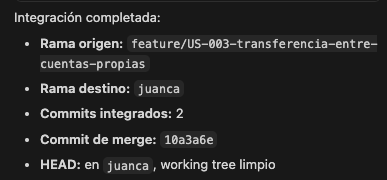

Este mensaje te confirma que la integración fue completada.

## Conclusión

Este laboratorio recorre el ciclo completo de **Specification-Driven Development (SDD)** para un requerimiento nuevo en un proyecto *greenfield*: desde un requerimiento de negocio y un diseño en Figma hasta código integrado en la rama de desarrollo, con el agente de IA como ejecutor y la persona como implementador.

El flujo se organiza en **cinco pasos encadenados**, cada uno con un artefacto y un estado claros:

1. **Definición de historia de usuario** (`/story-define`): el requerimiento se convierte en una historia documentada, validada con **INVEST** y **Definition of Ready (DoR)**. La historia solo avanza cuando queda en estado **Ready** y todos los criterios figuran como **Cumple**.
2. **Planificación preliminar** (`/story-plan`): el agente descompone la historia en tareas en estado **Draft**, alineadas a criterios de aceptación y reglas de negocio. Aquí se revisa cobertura funcional antes de escribir código.
3. **Planificación técnica**: cada tarea se enriquece con dependencias, referencias y un plan de implementación concreto hasta quedar **Ready** para ejecución.
4. **Implementación** (`/story-implement`): el agente ejecuta tarea por tarea; tras cada una, la persona revisa, itera si hace falta y confirma con **Keep all** (o descarta con **Undo all**). El archivo **progress.md** registra el avance.
5. **Integración**: la historia se integra a la rama de desarrollo (con apoyo del agente en commit si es necesario), cerrando el ciclo de entrega.

El hilo conductor del proceso es **Human-in-the-Loop**: la IA acelera análisis, planificación e implementación, pero las decisiones de calidad —alcance de la historia, granularidad de tareas, detalle técnico y aceptación del código— permanecen en manos del equipo. No se trata de delegar el criterio, sino de combinar velocidad de generación con revisión humana en cada hito.
