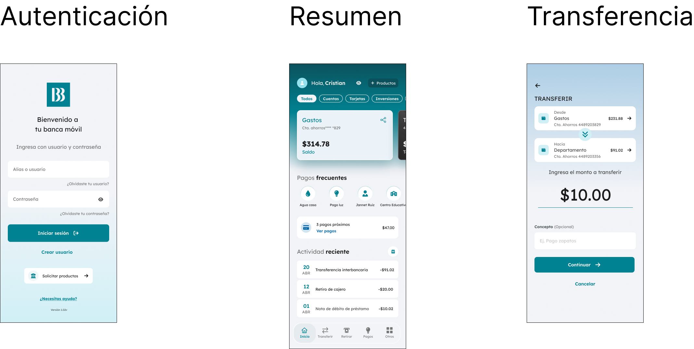

# ETAPA 2.2 - SDD SOBRE PROYECTOS NUEVOS (GREENFIELD)

## Objetivo

El objetivo de este taller de **SDD (Spec Driven Development)** es aterrizar en un flujo real los conceptos presentados previamente sobre desarrollo asistido por agentes de IA. A través de un enfoque práctico, se trabajará desde la construcción del **harness de agentes** —incluyendo archivos como `AGENTS.md`, `MEMORY.md`, Skills, Plugins, ADRs y documentos de diseño— para entender cómo estructurar el contexto, las reglas y las capacidades que utilizarán los agentes durante la implementación.

Posteriormente, el taller se enfocará en la creación de **Specs dentro de un flujo Agile**, transformando requerimientos en documentación técnica, historias de usuario y tareas implementables. El objetivo es mostrar cómo SDD permite pasar de conceptos teóricos a un proceso más estructurado, consistente y preparado para iteraciones de desarrollo guiadas por IA.

## Ejercicio práctico

El ejercicio práctico consistirá en la implementación de 3 funcionalidadeds de una aplicación de banca móvil utilizando estos conceptos.

