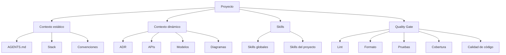
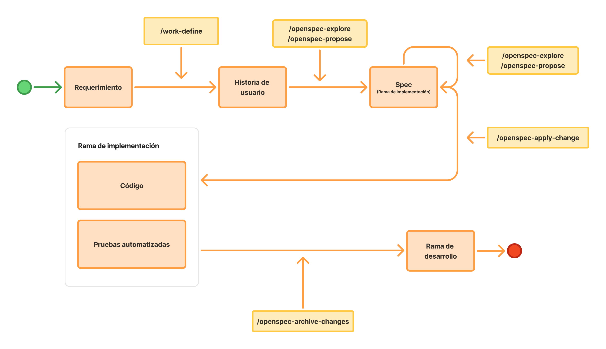
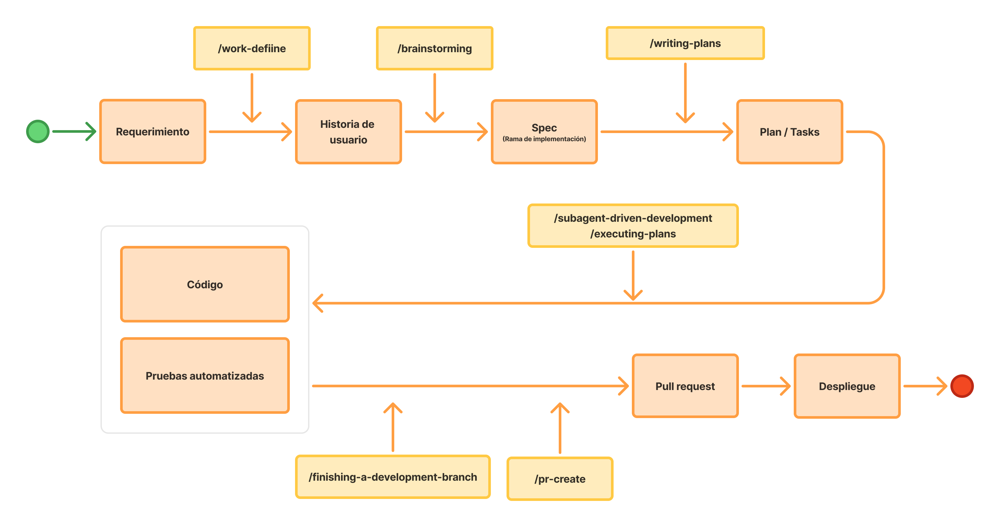

# Dia 1: Laboratorio 1: To-Do App

# Objetivo

Comprender el proceso completo de desarrollo de un proyecto nuevo utilizando Specification-Driven Development (SSD), desde la creación del *scaffolding* del proyecto y la configuración del *AI Harness* hasta la implementación de la primera funcionalidad. El ejercicio se enfocará en definir claramente **qué** se desea construir mediante especificaciones, requisitos y criterios de aceptación, evitando prescribir **cómo** debe implementarse. De esta manera, se otorgará al agente de IA la libertad de proponer y ejecutar la solución técnica más adecuada dentro de las restricciones y estándares establecidos por el proyecto.

# Paso 1: Instalar proyecto base

```bash
git clone https://github.com/juanca202/exercise-to-do.git
npm install
```

# Harness base



## Paso 2: Configuración de instrucciones persistentes

AGENTS.md

```markdown
# Agents

## Reglas operativas y arquitectónicas
- @.agents/MEMORY.md — memoria persistente del proyecto
- @docs/adr/README.md — índice de Architecture Decision Records (decisiones arquitectónicas vigentes)

### Consideraciones

- Si la información es arquitectónica → consultar ADRs
- Si es preferencia o regla operativa → usar MEMORY.md
- Si hay conflicto → ADRs tienen prioridad sobre MEMORY.md

## Reglas generales

## Stack tecnológico
```

CLAUDE.md

```markdown
@AGENTS.md
```

## Paso 3: Skills de stack

Debemos analizar e investigar qué *skills* pueden ayudarnos a mejorar el desarrollo del proyecto, asegurándonos de que sean compatibles con nuestro *stack* tecnológico. Además, es importante revisar los *skills* globales disponibles para identificar aquellos que sean innecesarios, redundantes o que puedan entrar en conflicto con los *skills* específicos definidos para el proyecto.

```bash
# Nos sugiere skills para nuestro stack tecnológico
npx autoskills

# Skills para facilitar SSD
npx skills add https://github.com/juanca202/ai
```

## Paso 4: Definición de ADRs base

- ADR: La arquitectura del proyecto debe ser featured based
- ADR: Usar los estándares y convenciones de codificado de Google Style Guides
- ADR: La documentación del código se hará usando TSDoc, se debe documentar mientras se desarrolla, no como tarea diferida, no es necesario documentar, no se exige documentar en lógica simple o trivial
- ADR: Se adopta la siguiente estrategia para pruebas unitarias:
    - se utilizará Vitest + Testing Library para la implementación
    - Ubicación de archivos junto al código bajo prueba
    - Utilizar el patrón AAA
    - Utilizar el patrón Object Mother Pattern
    - Cobertura de pruebas de mínimo de 80%
    - Debe considerarse aislamiento y determinismo
- ADR: Uso de Playwight para las pruebas E2E
- ADR: Se adopta un Quality Gate (shift left) con los siguientes componentes
    - Lint
    - Formato (Prettier)
    - Pruebas y cobertura (Vitest)
    - Git hooks (Husky)
    - Ejecución solo en archivos modificados (lint-staged)
    - Pruebas E2E (Playwight)
    - Calidad de código (Sonar scanner)
- ADR: Usar como estrategia de branching GitFlow con commits convencionales
- ADR: Solo utilizar App Router descargar el uso de Page Router
- ADR: Uso de Tailwindcss como framework de presentación
- ADR: Uso de Base UI como libreria de componentes
- ADR: Uso de Zurtand para manejo de estado

## Paso 5: Instalación, configuración y verificación del harness base

Necesitamos que el *stack* tecnológico quede claramente establecido en las instrucciones persistentes (`AGENTS.md`). Para ello, le indicamos al agente lo siguiente:

```bash
Actualiza el stack tecnológico en AGENTS.md
```

Ejecutar la auditoria de ADRs para validar que el código base sea coherente con los ADRs definidos:

```bash
/adr-audit
```

> Para el manejo de ADRs hay disponibles estos 3 skills:
- **/adr-manage** - Crear o actualizar Architecture Decision Records en `docs/adr/`
- **/adr-discover** - Analiza un repositorio y proponer ADRs candidatos a partir de decisiones implícitas
- **/adr-audit** - Auditar el cumplimiento de los ADR y de `AGENTS.md` contra el estado real del repo, generando un informe priorizado en `docs/adr/audits/`
> 

---

# Implementación del Spec



***Requerimiento:*** 

> 
> 
> 
> ***Aplicación simple de to-dos** que permita **gestionar tareas de forma completa.*** 
> 
> ***Incluye:***
> 
> - Registro y listado de tareas
> - Creación y edición de tareas
> - Eliminación de tareas
> - Ordenamiento por prioridad
> - Marcado de tareas como completadas
> 
> **Reglas de negocio:**
> 
> - Cada tarea debe tener una descripción obligatorio y una fecha de vencimiento
> - La prioridad solo puede ser: alta, media o baja
> - Las tareas completadas deben distinguirse visualmente de las pendientes
> - El listado debe ordenarse por prioridad (alta → media → baja) de forma predeterminada
> 
> **Consideraciones técnicas:**
> 
> - No requiere autenticación
> - La persistencia se hará usando localStorage
> - No existe backend

## Paso 1: Definición de historia de usuario

```bash
/work-define [REQUERIMIENTO]
```

## Paso 2: Definir casos de prueba

```bash
# Si estamos en la misma sesión de chat nos va a sugerir usar las historias creadas, sino podemos indicarle los códigos de las historias a utilizar
/test-define
```

## Paso 3: Definición de spec

```bash
/openspec-propose [URL DE HISTORIA DE USUARIO]
```

## Paso 4: Implementación del spec

```bash
# Implementa el Spec
/openspec-apply-change

# Archiva el Spec y lo agrega al Spec del feature
/openspec-archive-change
```

## Paso 5: Implementación requerimiento con Superpowers



> **Requerimiento:**
> 
> 
> Agregar una sección de **Notes** para que los usuarios puedan guardar notas de texto libre.
> 
> La navegación principal tendrá dos opciones: **To-do** y **Notes**. Al ingresar a **Notes**, el usuario verá el listado de notas registradas y podrá crear nuevas notas, así como editar y eliminar las existentes. Para crear o editar una nota solo se mostrará un área de texto donde el usuario podrá escribir libremente y guardar los cambios.
> 
> **Cambios**
> 
> - Agregar la opción **Notes** junto a **To-do**.
> - Mostrar un listado con las notas registradas.
> - Agregar una opción para crear una nueva nota.
> - Permitir editar una nota existente.
> - Permitir eliminar una nota existente.
> - La creación y edición de una nota mostrarán únicamente un área de texto para ingresar el contenido.
> - Al guardar una nota nueva o los cambios realizados en una existente, esta deberá reflejarse en el listado.
> - Al eliminar una nota, esta deberá desaparecer del listado.

## Paso 6: Definición de historia de usuario

```bash
/work-define [REQUERIMIENTO]
```

## Paso 7: Definir casos de prueba

```bash
# Si estamos en la misma sesión de chat nos va a sugerir usar las historias creadas, sino podemos indicarle los códigos de las historias a utilizar
/test-define
```

## Paso 8: Definición de spec

```bash
/brainstorming [URL DE HISTORIA DE USUARIO]
```

## Paso 9: Implementación del spec

```bash
/writing-plans 
```

## Paso 10: Implementación del spec

```bash
/executing-plans
```

# Conclusión

En este ejercicio se recorrió el proceso completo de desarrollo de un proyecto utilizando Specification-Driven Development (SSD), comenzando por la configuración del *AI Harness* y la definición del contexto del proyecto mediante instrucciones persistentes, ADRs y *skills*. Posteriormente, la implementación se guió por especificaciones, requisitos y criterios de aceptación, priorizando la definición de **qué** debía construirse antes que **cómo** implementarlo.

Este enfoque demuestra que, al proporcionar al agente un contexto claro, restricciones arquitectónicas y criterios de calidad, es posible delegar gran parte de las decisiones de implementación sin perder consistencia. Así, el desarrollador puede concentrarse en comprender el problema y definir correctamente los requisitos, mientras el agente genera una solución alineada con los estándares del proyecto.