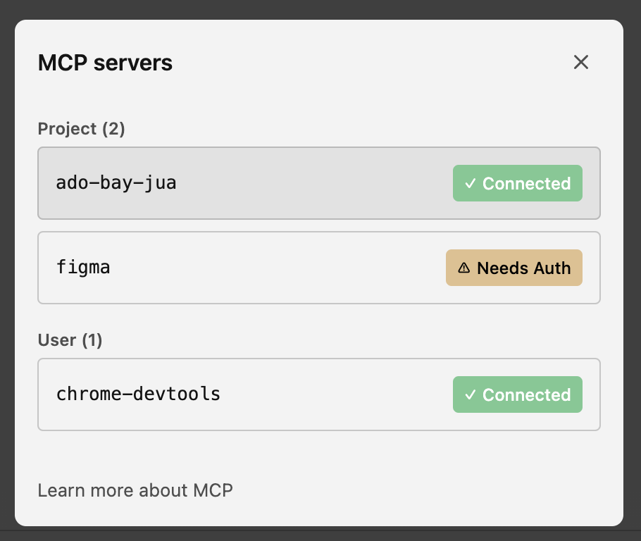
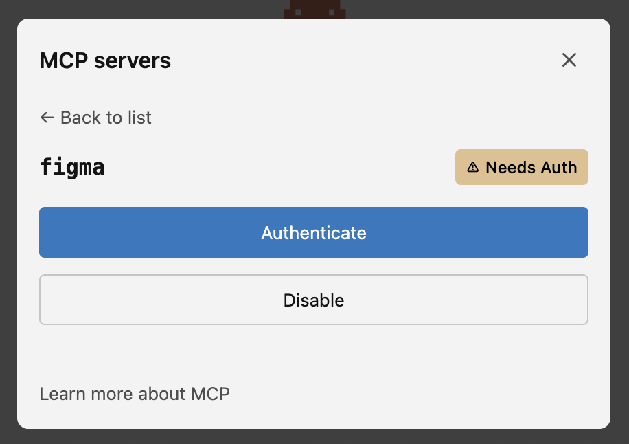
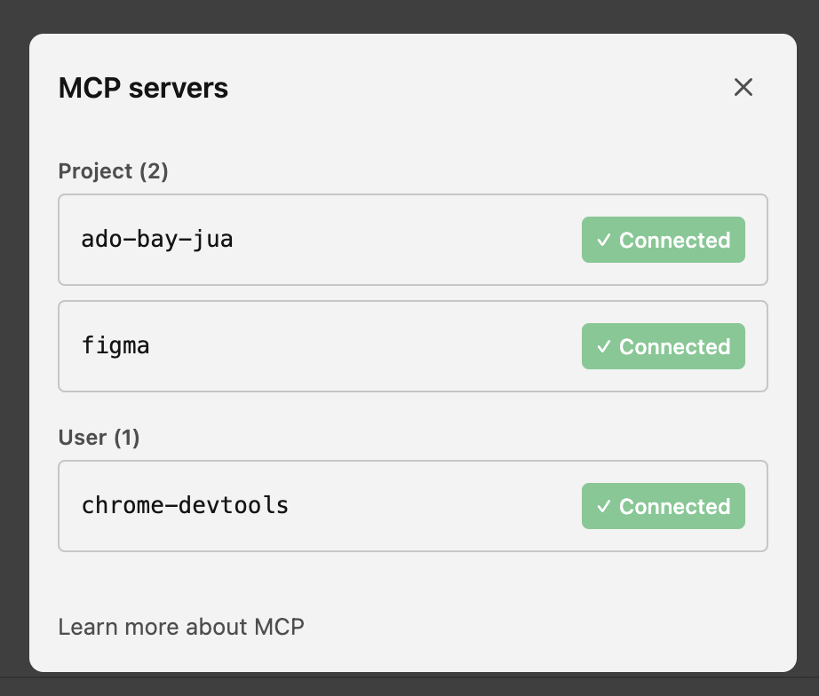
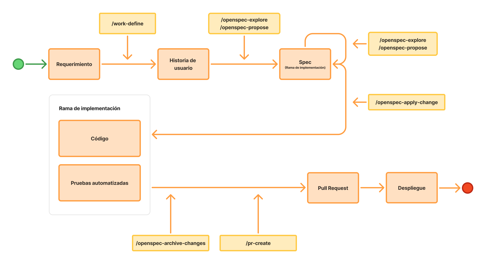

# Día 2 - 3: Laboratorio 2: Time Tracker App

# Objetivo

Comprender cómo extender y gobernar un proceso de desarrollo basado en Specification-Driven Development (SDD) mediante la integración con otras plataformas del ecosistema de desarrollo. A diferencia del ejercicio inicial, este laboratorio no solo se enfocará en definir claramente **qué** se desea construir a través de especificaciones, requisitos y criterios de aceptación, sino también en establecer **cómo** debe ejecutarse el proceso de desarrollo mediante flujos, integraciones, automatizaciones y controles que guíen el comportamiento del agente de IA. El objetivo es aprovechar las capacidades del agente sin renunciar a la trazabilidad, la gobernanza y la alineación con los procesos, estándares y herramientas utilizados por el equipo de desarrollo.

## Nivel de responsabilidades

El humano define la intención, las restricciones y las decisiones importantes; el agente decide los detalles de implementación dentro de esos límites.

| Nivel                     | Lo define normalmente | Asistido por IA   |
| ------------------------- | --------------------- | ----------------- |
| Problema de negocio       | Humano                | `/work-define`    |
| Comportamiento esperado   | Humano                | `Spec Framework     |
| UX/UI (cómo debe verse)   | Humano (Diseñador)    |                   |
| Modelo de dominio / datos | Humano (Arquitecto)   | `/design-define`  |
| Arquitectura              | Humano (Arquitecto)   | `/adr-manage`     |
| Implementación detallada  | Agente                | Spec Framework |


# Paso 1: Instalar proyecto base

```bash
git clone https://github.com/juanca202/exercise-time-tracker.git
npm install -g pnpm
pnpm install
```

# Paso 2: Integración con Figma y Chrome Devtools

Modificar el archivo **.mcp.json** y agregar:

```bash
{
  "mcpServers": {
	  "figma": {
		  "type": "http",
		  "url": "https://mcp.figma.com/mcp"
		},
		"chrome-devtools": {
      "command": "npx",
      "args": ["-y", "chrome-devtools-mcp@latest"]
    }
	  ...
	}
}
```

Luego en el chat de Claude Code escribir:

```bash
/mcp
```

Esto muestra las siguientes pantallas:

|  |  |  |
| --- | --- | --- |

Cuando ya esta el servidor **figma** Connected entonces ya esta habilitado el MCP.

---

# Paso 3: Definición de flujo de trabajo



# Paso 4: Definición de historia de usuario

```bash
# Aclaremos que cree 4 historias de usuario: Layout, Proyectos, Tareas y Historial de registros
/work-define [PATH DEL REQUERIMIENTO]
```

# Paso 5: Definir casos de prueba

```bash
# Si estamos en la misma sesión de chat nos va a sugerir usar las historias creadas, sino podemos indicarle los códigos de las historias a utilizar
/test-define
```

# Paso 6: Investigar decisiones pendientes antes de crear los specs

```bash
/work-research docs/specs/user-stories
```

# Paso 7: Definición de spec

```bash
# Debemos aclarar que vamos a hacer una especificacion por user-story
/openspec-explore [PATH DE HISTORIA DE USUARIO o docs/user-stories]
```

# Paso 8: Implementación de spec

Antes de empezar la implementación debes crear una rama para la implementación:

feature/[NOMBRE DE SPEC]

Luego ejecutar en el agente el siguiente skill:

```bash
/openspec-apply-change
```

# Paso 9: Revisar implementación

Hacemos una revisión de la implementación antes de generar el PR.

# Paso 10: Preparar la entrega

```bash
/pr-create
```

# Conclusión

En este laboratorio se evidenció que **Specification-Driven Development (SDD)** puede integrarse de forma efectiva con las herramientas y procesos utilizados por un equipo de desarrollo, permitiendo que la IA no solo implemente funcionalidades, sino que también siga un flujo de trabajo gobernado y alineado con los estándares del proyecto. La integración con Azure DevOps, Figma y otras herramientas del ecosistema facilita mantener la trazabilidad entre requisitos, diseño, especificaciones, pruebas e implementación.

Asimismo, se comprobó que complementar las especificaciones funcionales con automatizaciones, flujos de trabajo e integraciones incrementa la calidad y consistencia del proceso de desarrollo. De esta manera, el agente de IA actúa dentro de un marco de gobernanza definido, generando implementaciones alineadas con las necesidades del equipo y reduciendo el esfuerzo manual sin perder control sobre el ciclo de vida del software.