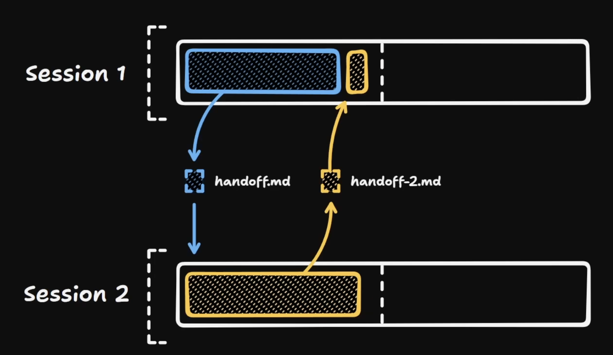

# Día 4: Laboratorio 3: Skills

Un **Skill** es una capacidad reutilizable que permite a un agente de IA realizar tareas específicas mediante instrucciones y recursos agrupados en un archivo `SKILL.md` y archivos auxiliares.

**Especificación:** [agentskills.io](https://agentskills.io/home?utm_source=chatgpt.com)

La especificación recomienda mantener `SKILL.md` por debajo de **500 líneas** y **5.000 tokens**, moviendo la lógica compleja a scripts o recursos externos para optimizar el uso del contexto.

Un skill puede contener desde instrucciones simples hasta flujos complejos que involucren agentes, herramientas, otros skills, scripts y archivos de contexto.

Los skills permiten reutilizar conocimiento durante el desarrollo y ampliar las capacidades de los agentes de IA.

# Como empezar

```bash
npx skills add https://github.com/anthropics/skills --skill skill-creator
```

# Estructura de archivos

```jsx
skill-name/
├── [SKILL.md](http://skill.md/)          # Required: metadata + instructions
├── scripts/          # Optional: executable code
├── references/       # Optional: documentation
├── assets/           # Optional: templates, resources
└── ...               # Any additional files or directories
```

# Frontmatter

Es un bloque de metadatos ubicado al inicio de un archivo, generalmente escrito en formato YAML y delimitado por `---`. Se utiliza para definir información descriptiva y de configuración que puede ser procesada por herramientas o agentes.

| Campo | Requerido | Restricciones |
| --- | --- | --- |
| **name** | Sí | Máximo 64 caracteres. Solo letras minúsculas, números y guiones (`-`). No debe comenzar ni terminar con un guion. |
| **description** | Sí | Máximo 1024 caracteres. No puede estar vacío. Describe qué hace el skill y cuándo debe utilizarse. |
| **license** | No | Nombre de la licencia o referencia a un archivo de licencia incluido en el paquete. |
| **compatibility** | No | Máximo 500 caracteres. Indica los requisitos del entorno (producto objetivo, paquetes del sistema, acceso a red, etc.). |
| **metadata** | No | Mapeo arbitrario de claves y valores para almacenar metadatos adicionales. |
| **allowed-tools** | No | Cadena de texto con herramientas preaprobadas separadas por espacios que el skill puede utilizar. (Experimental). |

Ejemplo:

```jsx
---
name: skill-name
description: A description of what this skill does and when to use it.
---
```

Ejemplo con campos opcionales:

```jsx
---
name: pdf-processing
description: Extract PDF text, fill forms, merge files. Use when handling PDFs.
license: Apache-2.0
metadata:
  author: example-org
  version: "1.0"
---
```

# Donde viven

| **Scope** | **Path** | **Purpose** |
| --- | --- | --- |
| Project | **`<project>/.<your-client>/skills/`** | Ubicación nativa de un agente |
| Project | **`<project>/.agents/skills/`** | Interoperabilidad entre agentes |
| User | **`~/.<your-client>/skills/`** | Ubicación nativa de un agente |
| User | **`~/.agents/skills/`** | Interoperabilidad entre agentes |

**Nota:** Claude Code no lee los archivos en la carpeta `.agents/`

# Carga progresiva de contexto

Es una estrategia en la que un agente de IA solo carga la información que necesita en cada momento, en lugar de cargar todo el conocimiento disponible desde el inicio.

| Nivel | Cuándo se carga | Costo en tokens | Contenido |
| --- | --- | --- | --- |
| **Nivel 1: Metadatos** | Siempre (al iniciar) | ~100 tokens por Skill | `name` y `description` definidos en el frontmatter YAML |
| **Nivel 2: Instrucciones** | Cuando el Skill es activado | Menos de 5.000 tokens | Contenido del archivo `SKILL.md` con instrucciones y guías |
| **Nivel 3+: Recursos** | Según sea necesario | Prácticamente ilimitado | Archivos auxiliares del Skill (scripts, documentación, ejemplos, plantillas, etc.) que pueden ejecutarse o cargarse al contexto bajo demanda. |

# Tipos

- Prompt skill (Instrucciones simples cuando detecta una inteción)
- Skill basada en Workflow (Tarea en pasos secuenciales)
- Skill con Handoffs (Delega tareas a subagentes)
- Skill basada en Planificación (Crea plan y luego ejecuta)
- Skill ReAct (Reason + Act) (Observa y luego actúa)
- Skill con Memoria (Mantiene estado entre sesiones)
- Skill basada en Estado (Cada fase tiene reglas de transición)

# Uso de tools

Los **tools (herramientas)** son capacidades que permiten a un agente de IA interactuar con su entorno y realizar acciones reales, como leer y editar archivos, ejecutar comandos, buscar información en la web, consultar APIs o utilizar otros servicios. Gracias a estas herramientas, el agente no solo genera respuestas, sino que también puede inspeccionar, modificar y operar sobre sistemas externos para completar tareas de forma autónoma.

## Comparativa de tools por agente

Algunos tools dependen del modelo que tengas seleccionado

| Descripción | Cursor | Claude | Codex |
| --- | --- | --- | --- |
| Leer, crear, editar y borrar archivos | Read / Write / StrReplace / Delete | Read / Write / Edit / MultiEdit / Batch (rm) | Read File / Write File / Apply patch / Edit File / Delete |
| Buscar en el código y por nombres de archivo | Grep / Glob | Grep / Glob | Grep (Shell) / Glob (Shell) |
| Ejecutar comandos (npm, git, builds, tests, etc.) | Shell / Await Shell | Bash | Shell |
| Leer diagnósticos del linter | ReadLints | Bash | Shell |
| MCP | GetMcpTools / CallMcpTool / FetchMcpResource | ListMcpResourcesTool, ReadMcpResourceDirTool, ReadMcpResourceTool |  |
| Generar imágenes cuando lo pidas explícitamente | GenerateImage | - | - |
| Buscar y leer contenido de internet | **WebSearch / WebFetch** | **WebSearch / WebFetch** | **WebSearch / WebFetch** |
| Lanzar subagentes (exploración, docs, UI, tests, seguridad, CI, etc.) | Task | Agent | Subagent |
| Preguntarte cuando esté genuinamente bloqueado en una decisión | AskQuestion | AskQuestion |  |
| Crear y actualizar una lista de tareas estructurada | TodoWrite | Plan | TodoWrite |

# Uso de scripts

En general, si el problema puede resolverse mediante un algoritmo determinista y potencialmente involucra muchos datos, suele ser más eficiente llamar a un script. Si requiere interpretación, razonamiento o generación de contenido, suele ser mejor dejarlo al agente.

| Tarea | Agente | Script |
| --- | --- | --- |
| Redactar texto | ✅ | ❌ |
| Resumir información | ✅ | ❌ |
| Tomar decisiones ambiguas | ✅ | ❌ |
| Cálculos masivos | ❌ | ✅ |
| Procesar miles de registros | ❌ | ✅ |
| Parsear documentos | ❌ | ✅ |
| Validar formatos | ❌ | ✅ |
| Manipular archivos (PDF, DOCX, XLSX) | ❌ | ✅ |

## Consideraciones

Cuando un agente ejecuta tu script, lee la salida estándar (**stdout**) y la salida de error (**stderr**) para decidir qué hacer a continuación. Algunas decisiones de diseño hacen que los scripts sean mucho más fáciles de usar para los agentes.

- **Evita los mensajes interactivos** (Los agentes operan en terminales **no interactivas**, por lo que no pueden responder a solicitudes de TTY)
- **Documenta el uso con** `--help` es la principal forma en que un agente aprende cómo interactuar con tu script.
- **Escribe mensajes de error útiles** (Cuando un agente recibe un error, el mensaje influye directamente en su siguiente intento)
- **Utiliza salidas estructuradas** (Prefiere formatos estructurados, como **JSON**, **CSV** o **TSV**, en lugar de texto libre.)
- 
- **Idempotencia.** Los agentes pueden reintentar la ejecución de comandos. Un comportamiento como **"crear si no existe"** es más seguro que **"crear y fallar si ya existe"**.
- **Restricciones de entrada.** Rechaza entradas ambiguas con un mensaje de error claro en lugar de hacer suposiciones. Siempre que sea posible, utiliza **enumeraciones (enums)** y conjuntos de valores cerrados.
- **Soporte para `--dry-run`.** En operaciones destructivas o que modifican el estado, una opción como `--dry-run` permite al agente previsualizar lo que ocurrirá antes de ejecutar la acción.
- **Códigos de salida significativos.** Utiliza códigos de salida distintos para diferentes tipos de errores (por ejemplo, recurso no encontrado, argumentos inválidos o fallo de autenticación) y documéntalos en la salida de `--help` para que el agente conozca el significado de cada uno.
- **Valores predeterminados seguros.** Considera si las operaciones destructivas deben requerir indicadores de confirmación explícitos (como `--confirm` o `--force`) u otras medidas de protección acordes al nivel de riesgo.
- **Tamaño de salida predecible.** Muchos entornos de ejecución de agentes truncan automáticamente la salida de una herramienta cuando supera un determinado límite (por ejemplo, entre **10 000 y 30 000 caracteres**), lo que puede provocar la pérdida de información importante. Si tu script puede generar una salida muy grande, haz que por defecto muestre un resumen o una cantidad razonable de resultados, y proporciona opciones como `--limit` y `--offset` para que el agente pueda solicitar más información cuando la necesite. Como alternativa, si la salida es demasiado grande para paginarse, exige que el agente utilice una opción como `--output` para indicar un archivo de salida o  para confirmar explícitamente que la salida debe enviarse a la salida estándar (`stdout`).

# Handoffs

Es el mecanismo mediante el cual un agente transfiere el control, el contexto o una tarea a otro agente, skill o fase del proceso.



# Evaluación de skills

La **evaluación de skills (skill evaluation o evals)** es el proceso de comprobar automáticamente que un skill se comporta como se espera ante distintos escenarios. La idea es similar a las pruebas unitarias en software.

## Referencias

- Claude - npx skills add [https://github.com/anthropics/skills](https://github.com/anthropics/skills) --skill skill-creator
- vskill - [https://verified-skill.com/](https://verified-skill.com/)
- skillgrade - [https://blog.mgechev.com/2026/03/14/skillgrade/](https://blog.mgechev.com/2026/03/14/skillgrade/)

## Qué se suele evaluar

| Aspecto | Descripción |
| --- | --- |
| Activación / No activación | El skill se usa cuando corresponde. |
| Respuesta con / sin skill | El skill contribuye a la respuesta esperada |
| Formato | La salida cumple el formato esperado |
| Completitud | No falta información obligatoria |
| Calidad | La respuesta contiene la información requerida |
| Uso de herramientas | El skill llama a las herramientas adecuadas |
| Regresión | Garantizar que un skill **no empeora** cuando haces cambios en él |

Las evals cumplen para los skills el mismo papel que los tests automatizados cumplen para el código, garantizar que el comportamiento esperado se mantiene a lo largo del tiempo.

Estructura común de un eval:

```json
{
	"id": 0,
  "name": "saludo-es",
  "prompt": "buenas tardes",
  "expected_output": "Tres saludos en tres idiomas distintos, un emoji y una línea final ofreciendo ayuda en tono coloquial.",
  "files": [],
  "assertions": [
	  "Incluye al menos un emoji",
    "Contiene exactamente tres saludos en tres idiomas distintos",
    "Incluye una línea final que ofrece ayuda"
  ]
}
```

# skill-creator

```bash
# Creación de skill
/skill-creator [descripcion de que debe hacer el skill]
```

# Vskill

```bash
# Creacion de evals
npx vskill eval init skills/prompt-validate

# Ejecuta las pruebas
npx vskill eval run ./roll-dice

# Muestra los skills que tienen evaluaciones
npx vskill eval coverage

# UI de prueba
npx vskill studio

# Escaneo de seguridad
npx vskill scan ./skills/roll-dice 
```

# Skillgrade